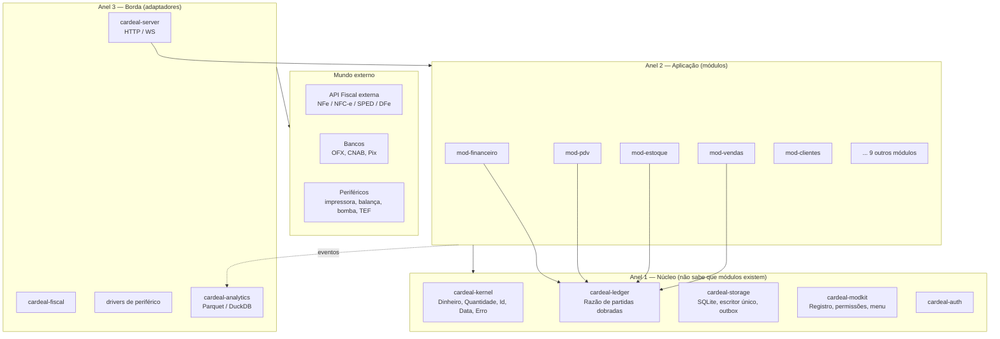
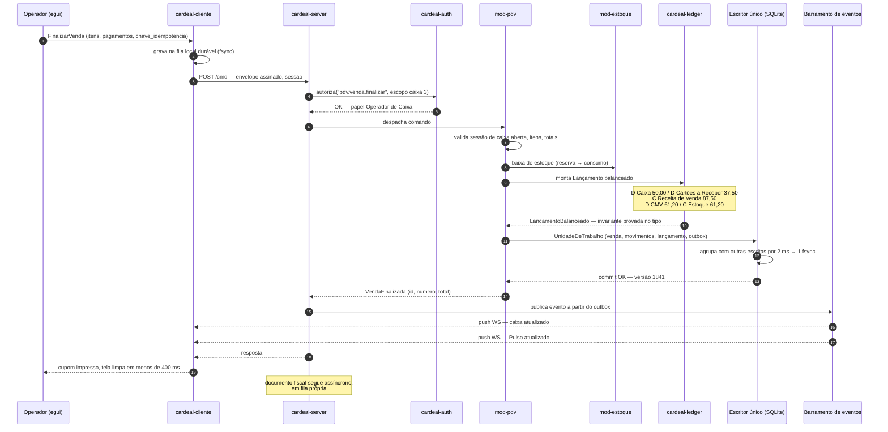
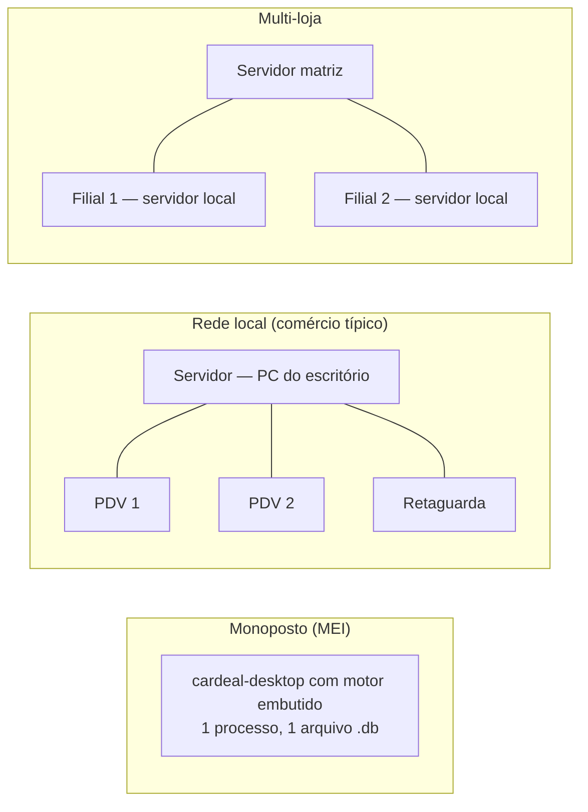

# 01 — Arquitetura geral

## 1. Visão em três anéis



**Regra de dependência (verificada em CI):** as setas só apontam para dentro.
`cardeal-kernel` não depende de nada do projeto. Nenhum crate do núcleo conhece o nome de nenhum módulo.
Módulos não dependem uns dos outros diretamente — comunicam-se por **portas** (traits) e **eventos**.

## 2. Mapa de crates

```
crates/
├── cardeal-kernel/      Tipos fundamentais. Zero I/O, zero async, zero dependência pesada.
│                        Dinheiro, Quantidade, Preco, Id (UUIDv7), Data/Instante, Documento
│                        (CPF/CNPJ/IE), Erro, Resultado, políticas de arredondamento.
│
├── cardeal-ledger/      O Razão. Plano de contas, Lançamento, Partida, invariante de
│                        balanceamento, estados Previsto/Confirmado/Realizado/Estornado,
│                        motor de projeção, consultas de saldo e fluxo de caixa.
│
├── cardeal-storage/     SQLite. Escritor único com group commit, pool de leitores, migrações
│                        versionadas por módulo, outbox transacional, backup online,
│                        verificação de integridade, criptografia opcional.
│
├── cardeal-modkit/      O sistema de módulos. Trait Modulo, Manifesto, Registro, grafo de
│                        dependências, resolução de perfil, contribuições de menu, catálogo
│                        de permissões, despacho de comandos e consultas.
│
├── cardeal-auth/        Usuários, papéis, permissões efetivas, sessões, dispositivos,
│                        Argon2id, CA interna e emissão de certificados de terminal.
│
├── cardeal-protocol/    Contratos compartilhados entre servidor e cliente. Envelopes de
│                        comando/consulta/evento, códigos de erro, versionamento.
│
├── cardeal-server/      O motor. Composição: monta o registro de módulos, abre o banco, sobe
│                        HTTP/WS, agendador, barramento de eventos, descoberta mDNS.
│
├── cardeal-cliente/     SDK do cliente. Conexão, cache local, fila de saída (outbox) para modo
│                        autônomo, reconexão, assinatura de eventos em tempo real.
│
├── cardeal-ui/          Design system "Rubro" sobre egui: tokens, tipografia tabular,
│                        componentes (grade densa, campo monetário, seletor de conta,
│                        linha do tempo, sidebar retrátil).
│
├── cardeal-desktop/     Aplicativo. Shell, roteamento de telas, atalhos, paleta de comandos.
│
├── cardeal-analytics/   Projeção colunar: outbox → Parquet particionado → DuckDB. Esquema estrela.
│
├── cardeal-fiscal/      Cliente da API fiscal externa. Fila durável, idempotência, contingência.
│
├── cardeal-testkit/     Fixtures, banco em memória, relógio controlável, gerador de cenários,
│                        harness de teste de queda de energia.
│
└── modulos/
    ├── mod-financeiro/  submódulos: caixa, bancos, pagar, receber, conciliacao, projecao,
    │                    dre, centro-custo, cobranca, cheques
    ├── mod-clientes/    Pessoas (cliente, fornecedor, transportadora), endereços, crédito
    ├── mod-estoque/     Produtos, saldos, movimentos, custo médio, lotes, inventário
    ├── mod-vendas/      Orçamento, pedido, condição de pagamento, tabela de preço, comissão
    ├── mod-pdv/         Frente de caixa, sessão de caixa, sangria, suprimento, modo autônomo
    ├── mod-compras/     Cotação, pedido, entrada por XML, rateio de frete
    ├── mod-crm/         Funil, oportunidade, atividade, histórico
    ├── mod-agenda/      Compromissos, recursos, disponibilidade
    ├── mod-os/          Ordem de serviço, laudo, orçamento, garantia
    ├── mod-alugueis/    Contrato, período, devolução, faturamento recorrente
    ├── mod-combustivel/ Bombas, tanques, encerrante, aferição, LMC
    ├── mod-hotelaria/   Mapa de quartos, reserva, folio, diária, consumo
    ├── mod-industria/   Ficha técnica, ordem de produção, apontamento
    └── mod-contabil/    Mapeamento gerencial → contábil, exportação ECD/ECF
```

## 3. O caminho de um comando

Exemplo real: o operador aperta **F2** no PDV para finalizar uma venda de R$ 87,50
(R$ 50,00 em dinheiro, R$ 37,50 no cartão de débito).



Pontos que essa sequência demonstra:

- **Autorização no servidor, nunca na UI.** A UI esconde botões por conveniência; a decisão é do servidor.
- **Uma única transação** cobre venda, estoque, razão e outbox. Ou tudo acontece, ou nada acontece.
- **O fiscal é assíncrono.** A venda está fechada, o caixa está certo e o cupom saiu antes de a SEFAZ
  responder. Ver [doc 10](10-modulo-fiscal.md).
- **A fila local do cliente é gravada antes do envio.** Se a energia cair entre a tecla e o commit, a venda
  é reapresentada na volta com a mesma chave de idempotência.

## 4. Comandos e consultas (CQRS leve)

Separamos os dois caminhos, mas **sem** event sourcing generalizado e **sem** bancos separados —
essa é a dose de CQRS que se paga:

| | Comandos | Consultas |
|---|---|---|
| Rota | Escritor único, transação, validação de invariantes | Pool de leitores, `query_only=1` |
| Entrada | `enum Comando` tipado, com chave de idempotência | `enum Consulta` tipada + paginação por cursor |
| Saída | Evento(s) de domínio no outbox | Projeção somente leitura, serializada direto para a UI |
| Concorrência | Serializado por natureza (um escritor) | Snapshot MVCC do WAL, sem bloqueio |
| Falha | Rollback total, erro de domínio tipado | Sem efeito colateral |

O event sourcing *existe*, mas restrito ao lugar onde ele é intrinsecamente correto: **o Razão**.
Lançamentos são imutáveis e apenas se acumulam; corrigir é estornar.
Ver [ADR-0005](adr/0005-event-sourcing-restrito-ao-razao.md).

## 5. Portas e adaptadores

Cada dependência externa entra por um trait, com pelo menos duas implementações (a real e a de teste).
É isso que torna o sistema testável sem infraestrutura.

| Porta | Adaptador de produção | Adaptador de teste |
|---|---|---|
| `PortaFiscal` | `ApiFiscalHttp` | `FiscalSimulado` (autoriza, rejeita, dá timeout sob demanda) |
| `PortaImpressora` | `EscPos`, spooler do Windows | `ImpressoraMemoria` (captura o cupom em texto) |
| `PortaTef` | TEF discado, TEF integrado | `TefSimulado` |
| `PortaBomba` | Concentradores de posto | `BombaSimulada` |
| `PortaRelogio` | `RelogioSistema` | `RelogioControlado` (viaja no tempo em testes) |
| `PortaArmazenamento` | `SqliteStorage` | `SqliteStorage` em memória |
| `PortaBanco` | OFX, CNAB240, Pix | `ExtratoFixture` |

## 6. Modos de implantação



O **mesmo binário** atende os três. Em monoposto o motor sobe como thread dentro do desktop e o transporte
vira chamada direta em memória — sem socket, sem serialização. Ver
[ADR-0009](adr/0009-transporte-in-process.md). É isso que permite o MEI rodar em 55 MB.

## 7. Sequência de boot do motor

1. Lê configuração — `cardeal.toml`, variáveis de ambiente, argumentos (nesta ordem de precedência).
2. Abre o banco. Executa verificação de integridade incremental e recuperação de WAL se necessário.
3. Aplica migrações pendentes do núcleo, depois dos módulos em ordem topológica de dependência.
4. Monta o `Registro`: para cada módulo compilado chama `registrar()`, coletando comandos, consultas,
   permissões, entradas de menu, tarefas agendadas e assinaturas de evento.
5. Resolve o **perfil ativo do tenant** e calcula o conjunto efetivo de módulos habilitados.
6. Reprocessa o outbox pendente (eventos não entregues do último desligamento).
7. Reconcilia documentos fiscais em estado transitório.
8. Sobe HTTP/WS, anuncia via mDNS, inicia o agendador.
9. Emite `MotorPronto` com o tempo total de boot. Meta: **< 300 ms** com 50 mil lançamentos.

## 8. Onde cada preocupação mora

| Preocupação | Lugar único de verdade |
|---|---|
| Aritmética monetária e arredondamento | `cardeal-kernel::dinheiro` |
| Invariante "débito igual a crédito" | `cardeal-ledger::LancamentoBalanceado` |
| Durabilidade e ordem de escrita | `cardeal-storage::Escritor` |
| Quem pode fazer o quê | `cardeal-auth::autorizar` |
| Que módulos existem e o que expõem | `cardeal-modkit::Registro` |
| Cor, espaçamento, tipografia | `cardeal-ui::tokens` |
| Estado de um documento fiscal | `cardeal-fiscal::MaquinaDeEstados` |

Se você precisou duplicar uma dessas em dois lugares, a arquitetura foi violada.
