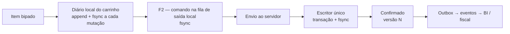
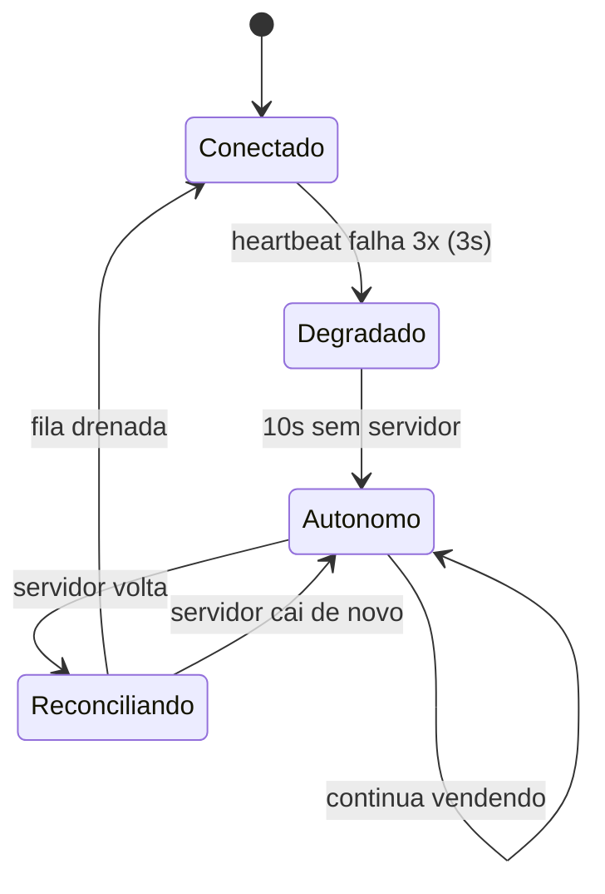

# 03 — Pilar II: Resiliência e segurança multiusuário

> Duas perguntas guiam todo este documento:
> **(a)** Se a energia cair exatamente agora, o que o cliente perde?
> **(b)** Se a internet cair por três dias, o que o cliente deixa de fazer?
>
> As respostas alvo são **"nada"** e **"apenas transmitir documentos fiscais"**.

## 1. Taxonomia das falhas que tratamos

| Falha | Frequência real no varejo BR | Resposta do Cardeal |
|---|---|---|
| Queda de energia no PC do terminal | Semanal em muitas regiões | Log durável de venda em andamento; recuperação na volta |
| Queda de energia no servidor | Semanal | WAL + fsync no commit; nenhuma transação confirmada se perde |
| Queda da rede local (switch, cabo, Wi-Fi) | Diária | Terminal entra em **modo autônomo** e continua vendendo |
| Queda da internet | Diária | Irrelevante para operar; só o fiscal entra em fila/contingência |
| SEFAZ fora do ar | Semanal | Contingência fiscal (offline NFC-e / SVC), transmissão posterior |
| Disco corrompendo | Raro, catastrófico | Verificação de integridade no boot, backup rotativo, restauração guiada |
| Erro humano (lançamento errado) | Diária | Nada é apagado; estorno com trilha de auditoria |
| Dois usuários editando o mesmo registro | Diária | Bloqueio otimista com versão; conflito explicado ao usuário |
| Terminal roubado/perdido | Raro | Revogação de dispositivo; dados locais criptografados |

## 2. Durabilidade: o que significa "confirmado"

O Cardeal define um contrato explícito, que aparece na UI:

> **Uma operação só é "confirmada" quando o `fsync` do commit retornou.**
> Até lá, a UI mostra o estado *enviando*. Depois, mostra *confirmado* com o número da versão.

Nunca dizemos ao usuário que algo foi salvo antes disso. É a diferença entre um sistema que perde
uma venda por semestre e um que não perde nenhuma.

### 2.1 A cadeia de durabilidade de uma venda



Corte a energia em qualquer ponto:

| Corte em | O que acontece na volta |
|---|---|
| A → B | Perde-se o último item bipado. O carrinho volta com os anteriores. |
| B → C | Carrinho inteiro recuperado. Tela: *"Venda em andamento recuperada — 7 itens, R$ 84,10. Continuar ou cancelar?"* |
| C → D | Comando reenviado automaticamente com a mesma chave de idempotência. |
| D → E | Servidor pode ter ou não commitado. O reenvio com a chave resolve: se já existe, devolve o mesmo resultado. |
| E → F | O `fsync` ou completou (venda existe) ou não (não existe). Nunca "meia venda". |
| F → G | Outbox é reprocessado no boot. Eventos podem chegar tarde, nunca se perdem. |

O diário do carrinho é um arquivo por terminal, formato append-only com CRC32 por registro:
registro truncado por corte de energia é descartado na leitura, os anteriores permanecem válidos.

### 2.2 Idempotência

Todo comando carrega uma `ChaveIdempotencia` (UUIDv7 gerado no cliente, estável em retentativas).

```sql
CREATE TABLE nucleo_idempotencia (
    chave        BLOB PRIMARY KEY,      -- UUIDv7
    dispositivo  BLOB NOT NULL,
    comando      TEXT NOT NULL,
    resposta     BLOB NOT NULL,         -- resposta serializada, devolvida em replay
    criado_em    INTEGER NOT NULL
) STRICT;
```

Retenção: 72 horas (configurável), limpa por tarefa agendada. Reenviar um comando já processado
**nunca** cria efeito duplicado; devolve a resposta original.

## 3. Modo autônomo (terminal sem servidor)

O caso mais importante do varejo: o servidor caiu, o cabo soltou, o switch queimou — e há fila no caixa.

### 3.1 Como funciona



Cada terminal mantém um **posto avançado**: um SQLite local com o subconjunto necessário para vender.

| Dado | Sincronizado | Volume típico |
|---|---|---|
| Produtos, códigos de barras, preços, tributação | Contínuo (push por evento) | 8.000 SKUs ≈ 3 MB |
| Clientes (cadastro básico + limite de crédito) | Contínuo | 5.000 ≈ 1,5 MB |
| Formas de pagamento, condições | Contínuo | trivial |
| Faixa de numeração reservada para o terminal | Na abertura de caixa | ver 3.2 |
| Certificado e configuração fiscal | Na abertura de caixa | trivial |

Em modo autônomo o terminal **pode**: vender à vista e a prazo, consultar preço e estoque
(saldo do último sync, marcado como *estimado*), abrir e fechar caixa, sangria, suprimento,
emitir NFC-e em contingência offline, imprimir.

Em modo autônomo o terminal **não pode**: alterar cadastro, dar desconto acima do limite pré-autorizado,
consultar posição consolidada de outras lojas, fechar o dia contábil.

### 3.2 Numeração sem conflito

O erro clássico de sistemas offline é dois terminais gerarem o mesmo número. Resolvemos com
**faixas reservadas**, alocadas na abertura de caixa:

```
Terminal 1 → NFC-e série 1, números 4001..5000
Terminal 2 → NFC-e série 2, números 4001..5000
Venda interna → id UUIDv7 (nunca colide) + numero_terminal legível
```

Cada terminal tem sua **série fiscal própria** — prática consagrada e aceita pela SEFAZ. Números não
usados na faixa são inutilizados ou devolvidos na reconciliação. Se a faixa esgota em modo autônomo,
o terminal avisa com 100 números de antecedência.

### 3.3 Reconciliação

Quando o servidor volta, o terminal drena a fila em ordem, com a mesma chave de idempotência.
Conflitos possíveis e a política de cada um:

| Conflito | Política | Justificativa |
|---|---|---|
| Estoque ficou negativo (venda offline de item que acabou) | **Aceita a venda**, registra `MovimentoDivergente`, alerta o gestor | A mercadoria saiu fisicamente. Negar seria mentir sobre a realidade. |
| Cliente teve crédito estourado offline | Aceita, marca o título como `AcimaDoLimite`, notifica | Idem. A venda aconteceu. |
| Preço mudou no servidor durante a janela offline | Vale o preço praticado no terminal | Foi o preço cobrado do consumidor. Gera relatório de divergência. |
| Cadastro editado nos dois lados | Servidor vence; alteração local vira sugestão pendente | Terminal não é fonte de verdade cadastral. |
| Venda já reconciliada (retentativa) | Idempotência devolve o original | — |

**Princípio:** *o mundo físico ganha do banco de dados.* O sistema registra a realidade e sinaliza a
divergência para tratamento humano; nunca reescreve a realidade para caber no modelo.

## 4. Multiusuário: concorrência e integridade

### 4.1 Bloqueio otimista padrão

Toda entidade mutável tem `versao INTEGER NOT NULL`. O `UPDATE` sempre é
`... WHERE id = ? AND versao = ?` e incrementa. Zero linhas afetadas = conflito.

A UI não mostra "erro de concorrência". Mostra:

> **Outra pessoa alterou este cadastro**
> Ana (Retaguarda) alterou o limite de crédito há 40 segundos: R$ 2.000,00 → R$ 3.500,00.
> Você estava alterando o telefone.
> [Aplicar minha alteração por cima] [Ver as duas versões] [Descartar a minha]

Diferença de campo a campo, com nome de quem alterou. Isso é UX, não infraestrutura — e é o que
diferencia um sistema tolerável de um irritante.

### 4.2 Bloqueio pessimista onde é obrigatório

Poucos casos exigem exclusividade real. Todos usam a tabela `nucleo_trava` com TTL e dono:

| Recurso | Por quê |
|---|---|
| Sessão de caixa | Dois operadores não podem operar o mesmo caixa |
| Contagem de inventário em andamento | Congelar movimentação da seção |
| Fechamento de período | Impede lançamento retroativo durante o fechamento |
| Conciliação bancária de um extrato | Evita baixa dupla do mesmo item |

Travas têm TTL (padrão 5 min) renovado por heartbeat. Terminal que morre libera a trava sozinho.
Um administrador pode forçar a liberação — a ação vai para a auditoria.

### 4.3 Serialização de escrita

Não existe deadlock no Cardeal porque **não existem dois escritores**. O escritor único
([doc 07](07-persistencia-sqlite.md)) elimina a classe inteira de problemas de lock ordering,
`SQLITE_BUSY` e transação abortada por contenção. É uma simplificação enorme, comprada ao preço de
um teto de throughput de escrita que está 2 ordens de grandeza acima do que qualquer PME precisa.

## 5. Backup e recuperação

### 5.1 Política padrão (funciona sem ninguém configurar nada)

| Frequência | Método | Destino | Retenção |
|---|---|---|---|
| Contínuo | WAL do SQLite | Mesmo disco | — |
| A cada 15 min | Snapshot incremental via `sqlite3_backup` | `dados/backup/quente/` | 24 h |
| Diário 03:00 | Snapshot completo comprimido (zstd) + verificação | `dados/backup/diario/` | 30 dias |
| Diário | Cópia para destino externo configurável (pasta de rede, pendrive, S3/R2) | externo | 90 dias |
| Mensal | Snapshot selado com hash | externo | 5 anos (obrigação fiscal) |

Todo backup é **verificado**: restaurado em memória e submetido a `integrity_check` +
conferência de balanço do razão. Backup que não restaura não é backup.

### 5.2 Verificação de integridade no boot

```rust
// pseudo-código do que roda em cada boot
let veredito = storage.verificar()?;
match veredito {
    Integro => prosseguir(),
    WalPendente(n) => { recuperar_wal(n)?; prosseguir() }
    CorrupcaoLeve(paginas) => { reparar_indices(paginas)?; alertar_admin(); prosseguir() }
    CorrupcaoGrave => modo_recuperacao_guiada(),  // UI dedicada, não crash
}
```

O modo de recuperação guiada é uma **tela**, não um traceback: lista os backups disponíveis com data,
tamanho, número de lançamentos e resultado da verificação, e explica em português o que será perdido
em cada opção.

### 5.3 Prova de consistência contábil

Uma tarefa diária (e um botão em Diagnóstico) roda a **prova do razão**:

1. Soma de todos os débitos = soma de todos os créditos (global e por empresa).
2. Saldo de cada conta = soma das partidas até a data.
3. Saldo de caixa do razão = soma dos fechamentos de caixa.
4. Saldo de estoque do razão = valor do inventário a custo médio.
5. Contas a receber em aberto no razão = soma dos títulos em aberto.

Divergência gera alerta com o lançamento suspeito identificado. Isso pega bug de módulo novo
antes de o contador pegar.

## 6. Segurança

Detalhes em [doc 08](08-seguranca-permissoes.md). Resumo do que a resiliência exige:

- **Terminal é identidade.** Cada PC registra um `Dispositivo` com par de chaves; o servidor emite um
  certificado assinado pela CA interna gerada no primeiro boot. Nenhum PC desconhecido conecta.
- **TLS na LAN por padrão**, com pinning do certificado da CA no cliente. Sem CA pública, sem
  configuração pelo usuário.
- **Dados locais do posto avançado criptografados** (SQLCipher opcional, chave derivada do certificado
  do dispositivo) — terminal roubado não vira base de clientes vazada.
- **Revogação imediata:** desligar um dispositivo na retaguarda invalida sessão e certificado; o
  terminal, ao reconectar, apaga o posto avançado.
- **Auditoria imutável:** toda ação sensível grava autor, dispositivo, horário, valores antes/depois.
  A tabela de auditoria é append-only e entra na verificação de integridade.

## 7. Teste de queda de energia (é teste automatizado, não exercício de fé)

`cargo xtask teste-energia` roda em CI, semanalmente e antes de cada release:

1. Sobe o motor num diretório temporário.
2. Dispara carga contínua (vendas, baixas, lançamentos) por um número aleatório de milissegundos.
3. Mata o processo com `SIGKILL` / `TerminateProcess` — sem chance de limpeza.
4. Reabre o banco e valida:
   - `integrity_check` limpo;
   - a prova do razão fecha;
   - toda venda que recebeu confirmação existe;
   - nenhuma venda existe pela metade (sem itens, sem lançamento, ou sem baixa de estoque);
   - o outbox reprocessa sem duplicar efeito.
5. Repete 500 vezes com sementes diferentes.

Para simular corte de energia **real** (não só morte de processo), o harness opcionalmente usa
`dm-flakey` no Linux ou um driver de dispositivo de bloco simulado, que descarta escritas não
sincronizadas. É assim que se detecta um `fsync` faltando.

Nenhum release sai com esse teste vermelho.
