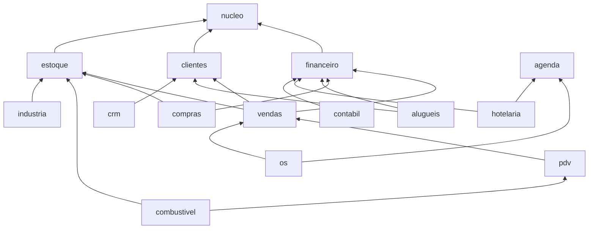
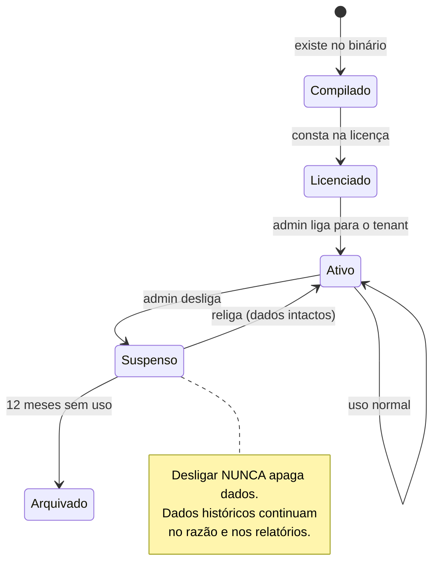

# 04 — Pilar III: Modularidade

> **Meta:** o mesmo executável atende o MEI que vende bolo e o posto com 12 bicos.
> O dono da padaria nunca vê a palavra "encerrante". O gerente do posto nunca vê "mapa de quartos".
> E nenhum dos dois tem uma tela com campos cinzas "disponíveis no plano Premium".

## 1. Os três níveis de modularidade

| Nível | Quando é decidido | Mecanismo | Para quê |
|---|---|---|---|
| **Compilação** | Ao gerar o binário | `features` do Cargo | Build enxuto para terminal dedicado (PDV puro: 40% menor) |
| **Instância** | Na instalação/licença | Manifesto de licença assinado | O que o cliente contratou |
| **Tenant/Empresa** | Em runtime, pelo admin | Perfil + chaves ligadas/desligadas | O que aquela empresa usa hoje |

O padrão de distribuição é **um binário com tudo compilado**, e a modularidade real acontece nos
níveis 2 e 3. O nível 1 existe para casos especiais (terminal embarcado, quiosque).

## 2. O que é um módulo

Um módulo é um crate que implementa `Modulo` e se declara por um `Manifesto`.

```rust
// cardeal-modkit/src/modulo.rs
pub trait Modulo: Send + Sync + 'static {
    /// Identidade e capacidades declaradas. Lido no boot, imutável.
    fn manifesto(&self) -> &Manifesto;

    /// Migrações SQL versionadas deste módulo. Aplicadas em ordem topológica.
    fn migracoes(&self) -> &[Migracao];

    /// Ponto único de registro: comandos, consultas, permissões, menu,
    /// tarefas agendadas, assinaturas de evento, contas padrão do razão.
    fn registrar(&self, r: &mut Registro) -> Resultado<()>;

    /// Chamado quando o módulo é ativado para um tenant (semeia dados iniciais).
    fn ao_ativar(&self, _ctx: &ContextoAtivacao) -> Resultado<()> { Ok(()) }

    /// Verificações de saúde exibidas na tela de Diagnóstico.
    fn diagnostico(&self, _ctx: &ContextoConsulta) -> Vec<Checagem> { Vec::new() }
}
```

```rust
pub struct Manifesto {
    pub id: IdModulo,                    // "estoque"
    pub nome: &'static str,              // "Estoque"
    pub versao: Versao,
    pub descricao: &'static str,
    pub icone: Icone,
    pub depende_de: &'static [IdModulo],       // dependência dura: não ativa sem
    pub melhora_com: &'static [IdModulo],      // dependência mole: liga recursos extras
    pub conflita_com: &'static [IdModulo],
    pub submodulos: &'static [Submodulo],
    pub permissoes: &'static [Permissao],
    pub menu: &'static [EntradaMenu],
    pub contas_requeridas: &'static [ContaPadrao], // contas do razão que o módulo posta
    pub eventos_publicados: &'static [&'static str],
    pub eventos_assinados: &'static [&'static str],
    pub perfis_sugeridos: &'static [IdPerfil],
}
```

### 2.1 Submódulos

Módulos grandes se subdividem. O financeiro é o exemplo canônico — um MEI quer **contas a receber**
e nada mais; uma indústria quer tudo.

```rust
pub const SUBMODULOS: &[Submodulo] = &[
    Submodulo { id: "caixa",        nome: "Caixa",                 essencial: true,  depende_de: &[] },
    Submodulo { id: "receber",      nome: "Contas a Receber",      essencial: true,  depende_de: &[] },
    Submodulo { id: "pagar",        nome: "Contas a Pagar",        essencial: false, depende_de: &[] },
    Submodulo { id: "bancos",       nome: "Contas Bancárias",      essencial: false, depende_de: &[] },
    Submodulo { id: "conciliacao",  nome: "Conciliação Bancária",  essencial: false, depende_de: &["bancos"] },
    Submodulo { id: "projecao",     nome: "Projeção de Fluxo",     essencial: false, depende_de: &["receber"] },
    Submodulo { id: "centro_custo", nome: "Centro de Custo",       essencial: false, depende_de: &[] },
    Submodulo { id: "cobranca",     nome: "Cobrança e Boletos",    essencial: false, depende_de: &["receber", "bancos"] },
    Submodulo { id: "cheques",      nome: "Cheques",               essencial: false, depende_de: &["receber"] },
    Submodulo { id: "dre",          nome: "DRE Gerencial",         essencial: false, depende_de: &[] },
];
```

Submódulo desligado significa: sem menu, sem campos correlatos nos formulários, sem colunas nas
grades, sem permissões no cadastro de papéis, sem contas no plano de contas. **Invisível de verdade.**

### 2.2 Grafo de dependências

Resolvido no boot com ordenação topológica. Ciclo = erro de compilação lógica, o motor recusa subir
com mensagem apontando o ciclo. Ativar um módulo ativa automaticamente suas dependências duras
(com confirmação do admin, mostrando o que será ligado junto).



Note que **tudo converge para `financeiro`**. Não é acidente: é a tese do produto.

## 3. Perfis de empresa

Um perfil é uma **receita curada**: conjunto de módulos, submódulos, plano de contas inicial,
formas de pagamento, layout de PDV e textos de ajuda. É o que faz o sistema chegar funcionando.

```toml
# perfis/posto-combustivel.toml
id = "posto"
nome = "Posto de Combustível"
descricao = "Pista, loja de conveniência e trocador de óleo."

modulos = ["financeiro", "clientes", "estoque", "vendas", "pdv", "compras", "combustivel", "fiscal"]

[submodulos]
financeiro = ["caixa", "receber", "pagar", "bancos", "conciliacao", "projecao", "centro_custo", "dre"]
estoque    = ["saldo", "custo_medio", "tanques", "inventario"]
pdv        = ["frente_caixa", "sangria", "turno", "pista"]

[plano_de_contas]
modelo = "posto"          # inclui contas de combustível por produto ANP

[configuracao]
"estoque.permitir_negativo"       = true    # tanque mede por volume, não por lançamento
"pdv.turno_obrigatorio"           = true
"combustivel.aferição_diaria"     = true
"financeiro.centro_custo_por_bico" = true

[ajuda]
tour_inicial = "posto/tour.md"
```

Perfis disponíveis na primeira instalação: `mei`, `comercio`, `posto`, `industria`, `hotel`,
`locadora`, `assistencia`, `servicos`. O admin escolhe um no assistente de instalação e pode
ajustar tudo depois — o perfil é um **ponto de partida**, não uma jaula.

## 4. Como a UI desaparece

Este é o detalhe que faz a diferença percebida pelo usuário. Nada na UI é escrito "à mão" para um
perfil; tudo deriva do registro.

### 4.1 Menu

A sidebar é **gerada** a partir das `EntradaMenu` dos módulos ativos, ordenadas por `peso`.
Financeiro tem peso 0 — é sempre o primeiro. Módulos sem entrada visível simplesmente não aparecem.

```rust
pub const MENU: &[EntradaMenu] = &[
    EntradaMenu {
        id: "financeiro.pulso",
        rotulo: "Pulso",
        icone: Icone::Pulso,
        peso: 0,
        permissao: "financeiro.pulso.ver",
        requer_submodulo: None,          // sempre presente se o módulo está ativo
        tela: Tela::Pulso,
    },
    EntradaMenu {
        id: "financeiro.conciliacao",
        rotulo: "Conciliação",
        icone: Icone::Conciliar,
        peso: 40,
        permissao: "financeiro.conciliacao.ver",
        requer_submodulo: Some("conciliacao"),   // some se o submódulo está desligado
        tela: Tela::Conciliacao,
    },
];
```

### 4.2 Campos e colunas

Formulários e grades declaram condicionais no mesmo vocabulário:

```rust
campo!(lote, "Lote", requer_submodulo: "estoque.lote");
campo!(centro_custo, "Centro de custo", requer_submodulo: "financeiro.centro_custo");
coluna!(margem, "Margem", requer_permissao: "vendas.ver_custo");
```

Campo condicional ausente **não é renderizado desabilitado** — ele não existe naquele layout, e o
formulário recalcula o grid. Não há espaço vazio nem pista de que exista algo escondido.

### 4.3 Vocabulário adaptativo

O mesmo conceito tem nomes diferentes por perfil. O `Lexico` traduz por perfil ativo:

| Conceito interno | Comércio | Posto | Hotel | Oficina |
|---|---|---|---|---|
| `documento_venda` | Cupom | Cupom | Conta do hóspede | Ordem de serviço |
| `item_estoque` | Produto | Produto/Combustível | Item de frigobar | Peça |
| `parceiro` | Cliente | Cliente | Hóspede | Cliente |
| `local_operacao` | Caixa | Pista/Bico | Recepção | Balcão |

Um arquivo `lexico/<perfil>.toml` por perfil. Isso vale mais para o usuário final do que qualquer
funcionalidade nova: o sistema fala a língua do negócio dele.

## 5. Comunicação entre módulos

O núcleo transacional — `financeiro`, `clientes`, `estoque`, `vendas`, `pdv`, `compras`, `agenda`,
`os`, `orcamentos` — forma a espinha dorsal presente na maioria dos perfis e **pode** depender
diretamente uns dos outros no `Cargo.toml`: são compilados e evoluem juntos, e o acoplamento direto
entre eles não custa modularidade real (nenhum perfil liga `os` sem `estoque`, por exemplo).

Já os módulos verticais de segmento — específicos de um tipo de negócio e feitos para serem
ligados/desligados por perfil sem levar o resto junto (`crm`, `alugueis`, `combustivel`,
`hotelaria`, `industria`, `contabil`) — **não** dependem de nenhum outro módulo no `Cargo.toml`,
nem entre si nem do núcleo. É isso que garante que desligar `mod-hotelaria` não force
`mod-combustivel` a compilar junto, e que o binário de um posto não carregue código de pousada.
Três canais, nesta ordem de preferência, para essa comunicação:

### 5.1 O Razão (preferido)

Se a interação é sobre dinheiro, ela acontece no razão. `mod-pdv` não chama `mod-financeiro`;
ele posta um lançamento. O financeiro lê o razão. Acoplamento zero, consistência garantida pela
mesma transação.

### 5.2 Eventos de domínio

Publicação/assinatura por nome, via outbox transacional. O publicador não sabe quem escuta.

```rust
// mod-vendas publica
ctx.publicar(evento::PedidoFaturado {
    pedido: id, cliente, total, competencia
})?;

// mod-crm assina, sem depender de mod-vendas
r.assinar("vendas.pedido_faturado", |ctx, ev: PedidoFaturado| {
    ctx.crm().registrar_interacao(ev.cliente, Interacao::Compra { valor: ev.total })
});
```

Eventos são **contratos versionados** (`vendas.pedido_faturado.v1`), documentados no manifesto.
Quebrar um evento publicado é breaking change e exige nova versão convivendo com a antiga.

### 5.3 Portas (traits) para consulta síncrona

Quando um módulo precisa *perguntar* algo na hora (PDV precisa do preço e do saldo), o consumidor
declara uma trait e o provedor a implementa. A ligação é feita na composição, no `cardeal-server`.

```rust
// declarado em mod-vendas (o consumidor)
pub trait PortaCatalogo: Send + Sync {
    fn buscar_por_codigo(&self, cod: &str) -> Resultado<Option<ItemCatalogo>>;
    fn saldo_disponivel(&self, item: Id, local: Id) -> Resultado<Quantidade>;
}

// implementado em mod-estoque (o provedor), sem que mod-estoque dependa de mod-vendas:
// a trait vive em um crate de contrato leve, ou o server faz o adaptador.
```

Se `mod-estoque` está desligado, `PortaCatalogo` recebe uma implementação nula que devolve
"sem controle de estoque" — e a UI de vendas simplesmente não mostra saldo. O sistema **degrada
com elegância** em vez de exigir o módulo.

## 6. Ciclo de vida de um módulo



Desligar `mod-alugueis` não some com os aluguéis faturados: eles já viraram lançamentos no razão e
títulos a receber. O que some é a capacidade de criar novos contratos e as telas correspondentes.
Essa propriedade — **desligar é seguro** — é o que dá coragem ao cliente para experimentar.

## 7. Criando um módulo novo (visão geral)

Passo a passo completo em [doc 16](16-onboarding.md). O esqueleto:

```bash
cargo xtask novo-modulo --id fidelidade --nome "Fidelidade"
```

Gera:

```
crates/modulos/mod-fidelidade/
├── Cargo.toml
├── README.md                  ← especificação funcional (obrigatória)
├── migracoes/
│   └── 0001_inicial.sql
└── src/
    ├── lib.rs                 ← impl Modulo, Manifesto
    ├── manifesto.rs
    ├── dominio/               ← tipos e regras puras, sem I/O (testáveis sem banco)
    ├── comandos/              ← um arquivo por comando
    ├── consultas/             ← um arquivo por consulta
    ├── repositorio.rs         ← SQL
    ├── eventos.rs
    └── telas/                 ← UI (feature "ui")
```

E registra o módulo no `cardeal-server`. A partir daí, o módulo aparece no assistente de ativação.

## 8. Regras invioláveis de módulo

1. Um módulo vertical de segmento (`crm`, `alugueis`, `combustivel`, `hotelaria`, `industria`,
   `contabil`) **nunca** depende de outro módulo — vertical ou núcleo — no `Cargo.toml`; usa razão,
   eventos ou portas (§5). Os módulos do núcleo transacional (`financeiro`, `clientes`, `estoque`,
   `vendas`, `pdv`, `compras`, `agenda`, `os`, `orcamentos`) podem depender uns dos outros
   diretamente no `Cargo.toml` — nunca o inverso: núcleo **nunca** depende de um módulo vertical.
2. Um módulo **nunca** lê ou escreve tabela de outro módulo. Prefixo de tabela = prefixo do módulo.
3. Todo efeito financeiro passa pelo razão. Não existe "tabela de saldo" paralela.
4. Todo comando declara sua permissão. Comando sem permissão não compila (verificado por macro).
5. Toda tabela nova entra em uma migração versionada, nunca alterada depois de publicada.
6. Todo módulo tem `README.md` com a especificação funcional escrita **antes** do código.
7. Módulo desligado não pode deixar resto na UI. Testado por `xtask verificar-perfis`, que sobe cada
   perfil e captura a árvore de menu e os formulários resultantes.
