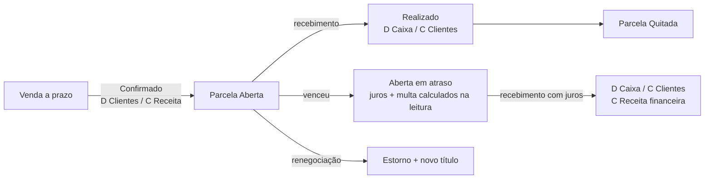

# 05 — O núcleo financeiro: o Razão

> Este é o documento mais importante do projeto. Se você só puder ler um, leia este.
>
> **Tese:** o financeiro não é um módulo que recebe dados dos outros. É o substrato em que os outros
> escrevem. Toda operação de negócio, no instante em que acontece e na mesma transação, vira partida
> dobrada no Razão. Não existe integração, sincronização, job noturno ou conciliação interna —
> porque não existem duas verdades para conciliar.

## 1. Por que partidas dobradas

Poderíamos ter uma tabela `movimento_caixa` com `valor` positivo e negativo. Quase todo ERP de PME faz
isso. Escolhemos partidas dobradas por cinco razões concretas:

1. **Invariante verificável.** Débito = crédito é uma propriedade que pode ser provada continuamente
   sobre toda a base. Um bug em qualquer módulo aparece como desbalanceamento, imediatamente, e não
   como um relatório errado descoberto seis meses depois.
2. **Toda pergunta de gestão vira uma consulta.** DRE, fluxo de caixa, margem por produto, saldo de
   cliente, valor de estoque, resultado por centro de custo — tudo é agregação sobre a mesma tabela
   com filtros diferentes. Não precisamos de uma tabela nova por relatório.
3. **Rastreabilidade nativa.** Todo real que entrou tem contrapartida. "De onde veio esse dinheiro?"
   sempre tem resposta, e ela aponta para o documento de origem.
4. **Estoque, crédito de cliente e dívida com fornecedor são o mesmo mecanismo.** Não precisamos de
   três subsistemas de saldo.
5. **É o vocabulário do contador.** A exportação para ECD/SPED é um mapeamento, não uma reconstrução.

O custo — a curva de aprendizado da equipe — é pago uma vez e amortizado para sempre.
Ver [ADR-0002](adr/0002-partidas-dobradas-como-nucleo.md).

## 2. Dois níveis: gerencial e contábil

| | **Razão Gerencial** | **Contabilidade Fiscal** |
|---|---|---|
| Crate | `cardeal-ledger` (núcleo) | `mod-contabil` (opcional) |
| Sempre ativo | **Sim**, inclusive para MEI | Não, ativado sob demanda |
| Plano de contas | Enxuto, ~60 contas, linguagem do dono | Completo, referencial SPED |
| Regime | Competência **e** caixa, lado a lado | Competência |
| Público | Dono, gerente, BI | Contador, fisco |
| Origem | Escrito pelos módulos | **Derivado** do gerencial por mapeamento |

O gerencial é a fonte. O contábil é uma projeção com um `de → para`. Um MEI nunca liga o contábil e
mesmo assim tem DRE, fluxo de caixa e margem.

## 3. Modelo

### 3.1 Plano de contas

```rust
pub struct Conta {
    pub id: Id,
    pub empresa: Id,
    pub codigo: CodigoConta,        // "1.1.01.001" — hierárquico, ordenável
    pub nome: String,
    pub natureza: Natureza,         // Ativo, Passivo, PatrimonioLiquido, Receita, Despesa
    pub tipo: TipoConta,            // Sintetica (agrupa) | Analitica (recebe partida)
    pub pai: Option<Id>,
    pub aceita_lancamento: bool,    // só analítica aceita
    pub grupo_fluxo: Option<GrupoFluxo>, // classificação para o fluxo de caixa
    pub modulo_origem: Option<IdModulo>, // conta criada por módulo (não editável pelo usuário)
    pub ativa: bool,
    pub versao: u64,
}

pub enum Natureza { Ativo, Passivo, PatrimonioLiquido, Receita, Despesa }

impl Natureza {
    /// Saldo devedor aumenta com débito? (Ativo e Despesa = sim)
    pub const fn devedora(self) -> bool {
        matches!(self, Natureza::Ativo | Natureza::Despesa)
    }
}
```

**Plano gerencial padrão** (semeado na instalação, ajustável):

```
1  ATIVO
   1.1  Disponível
        1.1.01  Caixa                       (por caixa/terminal)
        1.1.02  Bancos                      (por conta bancária)
        1.1.03  Aplicações
        1.1.04  Valores em trânsito         (cartão a compensar, Pix a liquidar)
   1.2  Créditos
        1.2.01  Clientes a receber          (por cliente via contraparte)
        1.2.02  Cartões a receber           (por adquirente/bandeira)
        1.2.03  Cheques a receber
        1.2.04  Adiantamentos a fornecedores
        1.2.05  Impostos a recuperar
   1.3  Estoques
        1.3.01  Mercadorias para revenda
        1.3.02  Matéria-prima
        1.3.03  Produtos em processo
        1.3.04  Produtos acabados
   1.4  Imobilizado
2  PASSIVO
   2.1  Obrigações de curto prazo
        2.1.01  Fornecedores                (por fornecedor via contraparte)
        2.1.02  Impostos a recolher         (por tributo)
        2.1.03  Salários e encargos
        2.1.04  Empréstimos
        2.1.05  Adiantamentos de clientes
        2.1.06  Cartões a repassar (taxas)
3  PATRIMÔNIO LÍQUIDO
   3.1  Capital
   3.2  Lucros acumulados
   3.3  Retiradas / pró-labore
4  RECEITAS
   4.1  Receita de vendas de mercadorias
   4.2  Receita de serviços
   4.3  Receita de aluguéis
   4.4  Descontos concedidos           (redutora)
   4.5  Devoluções de venda            (redutora)
   4.6  Outras receitas
5  CUSTOS E DESPESAS
   5.1  CMV — Custo da mercadoria vendida
   5.2  Custo de serviço prestado
   5.3  Despesas com pessoal
   5.4  Despesas administrativas
   5.5  Despesas comerciais
   5.6  Ocupação (aluguel, energia, água)
   5.7  Taxas de cartão e meios de pagamento
   5.8  Impostos sobre venda
   5.9  Despesas financeiras
```

### 3.2 Lançamento e partida

```rust
/// Cabeçalho. Imutável após confirmação.
pub struct Lancamento {
    pub id: Id,                       // UUIDv7 — ordenável por tempo
    pub empresa: Id,
    pub numero: u64,                  // sequencial por empresa, legível
    pub competencia: Data,            // regime de competência (quando o fato ocorreu)
    pub vencimento: Option<Data>,     // quando deve ser pago/recebido
    pub liquidacao: Option<Data>,     // quando o dinheiro efetivamente andou (regime de caixa)
    pub estado: EstadoLancamento,
    pub origem: Origem,               // módulo + agregado que gerou
    pub historico: String,            // texto legível
    pub estorna: Option<Id>,          // se este lançamento estorna outro
    pub estornado_por: Option<Id>,
    pub criado_em: Instante,
    pub criado_por: Id,               // usuário
    pub dispositivo: Id,
    pub partidas: SmallVec<[Partida; 4]>,
}

pub struct Partida {
    pub conta: Id,
    /// Positivo = débito, negativo = crédito. Um único campo elimina a
    /// classe de bugs "gravei no campo errado".
    pub valor: Dinheiro,
    pub contraparte: Option<Contraparte>, // Cliente(id) | Fornecedor(id) | Funcionario(id) | Socio(id)
    pub centro_custo: Option<Id>,
    pub projeto: Option<Id>,
    pub documento: Option<RefDocumento>,  // NF 12345, cheque 000123, boleto
    pub quantidade: Option<Quantidade>,   // para contas de estoque: dá custo unitário de graça
    pub complemento: Option<String>,
}
```

**Escolha deliberada:** um campo `valor` com sinal em vez de `debito`/`credito` separados.
Débito é positivo, crédito é negativo, o balanceamento é `partidas.iter().map(|p| p.valor).sum() == 0`.
Isso torna o invariante uma linha e elimina lançamentos com valor nos dois campos.

### 3.3 O invariante no sistema de tipos

Um lançamento desbalanceado **não pode existir** — não é validado, é impossível de construir.

```rust
/// Único caminho para persistir. Só o builder validado produz este tipo,
/// e o campo é privado: ninguém constrói por fora do módulo.
pub struct LancamentoBalanceado(Lancamento);

pub struct ConstrutorLancamento { /* ... */ }

impl ConstrutorLancamento {
    pub fn novo(empresa: Id, competencia: Data, historico: impl Into<String>) -> Self { /* ... */ }
    pub fn debitar(self, conta: Id, valor: Dinheiro) -> Self { /* ... */ }
    pub fn creditar(self, conta: Id, valor: Dinheiro) -> Self { /* ... */ }
    pub fn contraparte(self, c: Contraparte) -> Self { /* aplica à última partida */ }
    pub fn centro_custo(self, cc: Id) -> Self { /* ... */ }

    pub fn construir(self) -> Resultado<LancamentoBalanceado> {
        let soma: Dinheiro = self.partidas.iter().map(|p| p.valor).sum();
        if soma != Dinheiro::ZERO {
            return Err(ErroRazao::Desbalanceado {
                diferenca: soma,
                partidas: self.partidas.len(),
            }.into());
        }
        if self.partidas.len() < 2 { return Err(ErroRazao::PartidasInsuficientes.into()); }
        // conta existe, é analítica, está ativa, período não fechado, empresa confere...
        Ok(LancamentoBalanceado(/* ... */))
    }
}

impl Razao {
    /// Assinatura: só aceita o tipo provado.
    pub fn registrar(&self, uow: &mut UnidadeDeTrabalho, l: LancamentoBalanceado) -> Resultado<Id>;
}
```

Uso real, no PDV:

```rust
let lanc = ConstrutorLancamento::novo(empresa, hoje, format!("Venda {numero} — PDV {caixa}"))
    .origem(Origem::modulo("pdv").agregado(venda_id))
    .liquidacao(hoje)
    .debitar(contas.caixa(caixa_id), recebido_dinheiro)
    .debitar(contas.cartoes_a_receber(), recebido_cartao)
    .creditar(contas.receita_venda(), total_bruto)
    .debitar(contas.descontos_concedidos(), desconto)
    .debitar(contas.cmv(), custo_total)
    .creditar(contas.estoque_mercadorias(), custo_total)
    .construir()?;

razao.registrar(&mut uow, lanc)?;
```

### 3.4 Estados: o que faz a projeção funcionar

```rust
pub enum EstadoLancamento {
    /// Ainda não é fato. Recorrência projetada, orçamento, previsão.
    /// Entra no fluxo de caixa futuro; NÃO entra em DRE nem em saldo contábil.
    Previsto,
    /// O fato ocorreu (venda feita, compra recebida), mas o dinheiro não andou.
    /// Entra na DRE por competência e no fluxo futuro pelo vencimento.
    Confirmado,
    /// O dinheiro andou. Entra em tudo, inclusive saldo de caixa/banco.
    Realizado,
    /// Anulado por lançamento de estorno. Permanece na base, some dos saldos.
    Estornado,
}
```

Este enum é o motor de **três visões simultâneas** sobre a mesma tabela:

| Visão | Filtro |
|---|---|
| **Caixa** (o que tenho hoje) | `Realizado`, contas 1.1 |
| **Competência** (quanto ganhei) | `Confirmado + Realizado`, por `competencia` |
| **Projeção** (o que vou ter) | `Previsto + Confirmado + Realizado`, por `vencimento` |

Nenhuma tabela auxiliar. Nenhuma sincronização. É por isso que os números nunca divergem.

## 4. Contas a pagar e a receber

O Razão guarda **o dinheiro**. O `Titulo` guarda **a cobrança** — a parte comercial e operacional que
não é contábil.

```rust
pub struct Titulo {
    pub id: Id,
    pub especie: EspecieTitulo,        // Receber | Pagar
    pub contraparte: Contraparte,
    pub origem: Origem,                // venda, compra, contrato, avulso
    pub emissao: Data,
    pub valor_original: Dinheiro,
    pub parcelas: Vec<Parcela>,
    pub forma_cobranca: FormaCobranca, // Boleto | Pix | Carteira | Débito automático | Cartão
    pub observacao: Option<String>,
}

pub struct Parcela {
    pub numero: u16,
    pub vencimento: Data,
    pub valor: Dinheiro,
    pub lancamento: Id,                // o lançamento Confirmado que a representa no razão
    pub baixas: Vec<Baixa>,            // pagamentos parciais
    pub estado: EstadoParcela,         // Aberta | Parcial | Quitada | Cancelada | Renegociada
    pub nosso_numero: Option<String>,
    pub juros: PoliticaJuros,
    pub multa: Percentual,
    pub desconto_ate: Option<(Data, Dinheiro)>,
}
```

### 4.1 O ciclo de uma parcela



Juros e multa de atraso **não são materializados**: são calculados na consulta, a partir da política e
da data de referência. Isso evita milhares de lançamentos diários de atualização e mantém o razão limpo.
No recebimento, o valor calculado vira lançamento real.

### 4.2 "Além do que já entrou": a projeção

O pedido central do produto — *contas a pagar/receber com futuros e projeções* — é resolvido sem
tabela nova, por três fontes somadas:

```rust
pub struct HorizonteFinanceiro {
    /// 1. Já lançado: parcelas de títulos existentes, estado Confirmado.
    pub comprometido: Vec<FluxoDia>,
    /// 2. Recorrente: gerado em memória por regras (aluguel, folha, energia, assinaturas).
    pub recorrente: Vec<FluxoDia>,
    /// 3. Estatístico: previsão de venda/compra por sazonalidade sobre o histórico do razão.
    pub estimado: Vec<FluxoDia>,
}
```

**Recorrências** são regras, não linhas:

```rust
pub struct Recorrencia {
    pub id: Id,
    pub descricao: String,           // "Aluguel da loja"
    pub especie: EspecieTitulo,
    pub valor: ValorRecorrente,      // Fixo(Dinheiro) | Indexado{base, indice} | Variavel{media_ultimos: u8}
    pub regra: RegraRecorrencia,     // Mensal{dia:10} | Semanal{dia} | Anual{...} | Personalizada(cron)
    pub inicio: Data,
    pub fim: Option<Data>,
    pub conta_contrapartida: Id,
    pub centro_custo: Option<Id>,
    pub gerar_titulo_com_antecedencia: Dias,  // vira Titulo real N dias antes
}
```

Uma recorrência de aluguel gera **zero linhas** no banco. Ao pedir a projeção de 12 meses, o motor
materializa 12 `FluxoDia` em memória (custo: microssegundos). Só quando falta `gerar_titulo_com_antecedencia`
para o vencimento é que vira `Titulo` de verdade, aparecendo em Contas a Pagar para conferência.

**Estimativa estatística** (submódulo `projecao`): média móvel + índice de sazonalidade por dia da
semana e dia do mês, calculada sobre os últimos 13 meses do razão. Simples, explicável e auditável —
a tela mostra a fórmula e os dados usados. Nada de caixa-preta. Modelos mais sofisticados
(ver [doc 11](11-analytics-bi.md)) são opcionais e sempre exibidos com intervalo de confiança.

### 4.3 A consulta que sustenta o Pulso

```sql
-- Fluxo de caixa diário, do passado ao futuro, em uma única varredura.
WITH movimento AS (
    SELECT
        COALESCE(l.liquidacao, l.vencimento, l.competencia) AS dia,
        l.estado,
        c.grupo_fluxo,
        SUM(p.valor)                                        AS valor
    FROM razao_partida p
    JOIN razao_lancamento l ON l.id = p.lancamento
    JOIN razao_conta      c ON c.id = p.conta
    WHERE l.empresa = :empresa
      AND l.estado <> 'Estornado'
      AND c.grupo_fluxo IS NOT NULL             -- só contas que representam caixa
      AND COALESCE(l.liquidacao, l.vencimento, l.competencia) BETWEEN :de AND :ate
    GROUP BY dia, l.estado, c.grupo_fluxo
)
SELECT dia,
       SUM(CASE WHEN estado = 'Realizado'  THEN valor ELSE 0 END) AS realizado,
       SUM(CASE WHEN estado = 'Confirmado' THEN valor ELSE 0 END) AS comprometido,
       SUM(CASE WHEN estado = 'Previsto'   THEN valor ELSE 0 END) AS previsto
FROM movimento
GROUP BY dia
ORDER BY dia;
```

Índice que a sustenta:
`CREATE INDEX razao_lancamento_fluxo ON razao_lancamento(empresa, liquidacao, vencimento, competencia, estado)`.
Em base de 5 milhões de partidas, 13 meses de fluxo saem em **< 25 ms**.

## 5. O receituário: como cada módulo posta

Esta tabela é o contrato de integração de todo o sistema. Cada módulo declara seus lançamentos aqui e
os testa com `testkit::assert_lancamento!`.

| Evento de negócio | Débito | Crédito | Estado |
|---|---|---|---|
| **Venda no PDV, dinheiro** | Caixa | Receita de vendas | Realizado |
| **Venda no PDV, cartão débito** | Cartões a receber | Receita de vendas | Realizado |
| **Taxa da adquirente** | Taxas de cartão (5.7) | Cartões a receber | Realizado |
| **Compensação do cartão** | Bancos | Cartões a receber | Realizado |
| **Venda a prazo** | Clientes a receber | Receita de vendas | Confirmado |
| **Recebimento da parcela** | Caixa/Bancos | Clientes a receber | Realizado |
| **Juros de atraso recebidos** | Caixa/Bancos | Receita financeira | Realizado |
| **Baixa de estoque (toda venda)** | CMV (5.1) | Estoque (1.3) | igual à venda |
| **Desconto concedido** | Descontos concedidos (4.4) | Receita de vendas | igual à venda |
| **Devolução de venda** | Devoluções (4.5) + Estoque | Caixa/Clientes + CMV | Realizado |
| **Compra de mercadoria (NF entrada)** | Estoque | Fornecedores | Confirmado |
| **Frete sobre compra (rateado)** | Estoque | Fornecedores/Caixa | Confirmado |
| **Pagamento a fornecedor** | Fornecedores | Bancos | Realizado |
| **ICMS/PIS/COFINS sobre venda** | Impostos sobre venda (5.8) | Impostos a recolher (2.1.02) | Confirmado |
| **Crédito de imposto na compra** | Impostos a recuperar (1.2.05) | Estoque | Confirmado |
| **Recolhimento de imposto** | Impostos a recolher | Bancos | Realizado |
| **Folha de pagamento** | Despesas com pessoal | Salários a pagar | Confirmado |
| **Pagamento da folha** | Salários a pagar | Bancos | Realizado |
| **Aluguel a pagar (recorrência)** | Ocupação (5.6) | Fornecedores | Previsto → Confirmado |
| **Ordem de serviço faturada** | Clientes a receber | Receita de serviços | Confirmado |
| **Peça aplicada na OS** | Custo de serviço | Estoque | Confirmado |
| **Diária de hotel** | Hóspedes a receber | Receita de hospedagem | Confirmado |
| **Consumo de frigobar** | Hóspedes a receber | Receita de vendas | Confirmado |
| **Aluguel de equipamento faturado** | Clientes a receber | Receita de aluguéis | Confirmado |
| **Abastecimento na pista (à vista)** | Caixa | Receita de vendas | Realizado |
| **Perda por evaporação (posto)** | Perdas (5.x) | Estoque combustível | Realizado |
| **Produção acabada (indústria)** | Produtos acabados | Produtos em processo | Realizado |
| **Consumo de MP na produção** | Produtos em processo | Matéria-prima | Realizado |
| **Sangria de caixa** | Bancos/Cofre | Caixa | Realizado |
| **Suprimento de caixa** | Caixa | Bancos/Cofre | Realizado |
| **Quebra de caixa no fechamento** | Quebra de caixa (5.x) | Caixa | Realizado |
| **Retirada do sócio** | Retiradas (3.3) | Bancos | Realizado |

Novo módulo? Sua primeira tarefa é escrever sua linha nesta tabela e o teste que a prova.

## 6. Correção: estorno, nunca `UPDATE`

```rust
impl Razao {
    /// Cria um lançamento espelhado com sinais invertidos, marca o original
    /// como Estornado e vincula os dois. Nada é apagado.
    pub fn estornar(
        &self, uow: &mut UnidadeDeTrabalho,
        original: Id, motivo: &str, competencia: Data,
    ) -> Resultado<Id>;
}
```

Regras:
- Lançamento em período fechado só pode ser estornado com estorno em período aberto.
- Estorno exige permissão específica (`razao.estornar`) e motivo obrigatório com no mínimo 10 caracteres.
- Estornar um estorno é permitido (e registrado), mas a UI avisa.
- O histórico do estorno referencia o número do original, e vice-versa.

## 7. Fechamento de período

```rust
pub struct FechamentoPeriodo {
    pub empresa: Id,
    pub ate: Data,
    pub fechado_por: Id,
    pub fechado_em: Instante,
    pub hash_saldos: [u8; 32],   // BLAKE3 dos saldos de todas as contas na data
}
```

Após o fechamento, nenhum lançamento com `competencia <= ate` pode ser criado ou estornado sem
reabertura explícita (permissão de administrador, registrada em auditoria). O `hash_saldos` permite
provar, a qualquer momento, que o passado não foi alterado — detecta adulteração até por fora do
sistema, direto no arquivo.

## 8. Multiempresa e consolidação

Toda tabela do razão tem `empresa`. Matriz e filiais são empresas distintas com planos de contas
espelhados (mesmo `codigo`). A consolidação é uma consulta com `IN (:empresas)` agrupando por `codigo`.

Operações entre empresas do grupo (transferência de mercadoria entre filiais) geram lançamentos
espelhados nas duas, com `Origem` apontando para a mesma transferência — e um relatório de
eliminação de intercompany para a consolidação.

## 9. Desempenho

| Operação | Alvo | Como |
|---|---|---|
| Registrar lançamento | < 50 µs (fora do fsync) | Sem alocação além das partidas; `SmallVec` inline |
| Saldo de uma conta em data | < 5 ms em 5M partidas | Índice `(conta, competencia)` + snapshots mensais |
| Fluxo de 13 meses | < 25 ms | Índice de fluxo, agregação única |
| DRE do mês | < 15 ms | Índice `(empresa, competencia, conta)` |
| Prova de balanço global | < 2 s em 5M partidas | Varredura sequencial, roda de madrugada |

**Snapshots de saldo:** ao fechar cada mês, gravamos `razao_saldo_mensal(conta, ano_mes, saldo)`.
Saldo em qualquer data = último snapshot + partidas desde então. Transforma varredura histórica em
leitura pontual. O snapshot é derivado — pode ser recalculado do zero a qualquer momento, e a
verificação diária faz exatamente isso por amostragem.

## 10. Por que isso vira BI de graça

O razão é, por construção, uma **tabela fato** já normalizada:

| Dimensão do BI | Coluna da partida |
|---|---|
| Tempo | `competencia`, `vencimento`, `liquidacao` |
| Conta / natureza | `conta` → hierarquia do plano |
| Cliente / fornecedor | `contraparte` |
| Centro de custo | `centro_custo` |
| Projeto | `projeto` |
| Origem (módulo, documento) | `origem` |
| Quantidade | `quantidade` (dá preço e custo unitário) |
| Valor | `valor` |

Exportar para Parquet é um `SELECT` direto, sem transformação. Ver [doc 11](11-analytics-bi.md).
É isso que o produto chama de *"o tsunami de dados concentrado no financeiro"*: ele não precisa ser
construído — ele é o efeito colateral inevitável de todo módulo postar no mesmo lugar.
