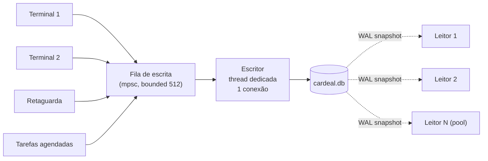

# 07 — Persistência: SQLite, escritor único e durabilidade

## 1. Por que SQLite

Ver [ADR-0003](adr/0003-sqlite-como-motor-de-armazenamento.md) para o registro completo. Resumo:

| Critério | SQLite | PostgreSQL | Firebird |
|---|---|---|---|
| RAM em repouso | ~2 MB | ~120 MB (mín. realista) | ~40 MB |
| Instalação pelo cliente | nenhuma | serviço, usuário, senha, tuning | serviço |
| Backup | copiar 1 arquivo | `pg_dump` + agendamento | `gbak` |
| Durabilidade em queda de energia | excelente (WAL + fsync) | excelente | boa |
| Escritores concorrentes | 1 | muitos | muitos |
| Adequado a 1–30 terminais | **sim** | exagero | sim |
| Cliente troca o PC do servidor | copia o arquivo | reinstala e restaura | reinstala |

O gargalo aparente — **um escritor** — é, na verdade, a nossa maior simplificação arquitetural
(ver §3). E o teto de escrita fica ~100× acima do que uma PME gera.

A porta `PortaArmazenamento` mantém a opção de um backend PostgreSQL para redes grandes, mas
**não é objetivo da v1** e não deve influenciar decisões de design agora.

## 2. Configuração da conexão

```rust
// cardeal-storage/src/conexao.rs
fn configurar_escritor(c: &Connection) -> Resultado<()> {
    c.pragma_update(None, "journal_mode", "wal")?;      // leitores nunca bloqueiam o escritor
    c.pragma_update(None, "synchronous", "FULL")?;      // fsync no commit — inegociável no escritor
    c.pragma_update(None, "foreign_keys", "ON")?;
    c.pragma_update(None, "busy_timeout", 5_000)?;
    c.pragma_update(None, "cache_size", -16_384)?;      // 16 MiB
    c.pragma_update(None, "mmap_size", 268_435_456)?;   // 256 MiB
    c.pragma_update(None, "wal_autocheckpoint", 4_000)?;// ~16 MB de WAL
    c.pragma_update(None, "journal_size_limit", 67_108_864)?;
    c.pragma_update(None, "temp_store", "MEMORY")?;
    c.pragma_update(None, "trusted_schema", "OFF")?;
    c.pragma_update(None, "auto_vacuum", "INCREMENTAL")?;
    Ok(())
}

fn configurar_leitor(c: &Connection) -> Resultado<()> {
    c.pragma_update(None, "journal_mode", "wal")?;
    c.pragma_update(None, "synchronous", "NORMAL")?;    // irrelevante: leitor não escreve
    c.pragma_update(None, "query_only", "ON")?;         // rede de segurança contra escrita acidental
    c.pragma_update(None, "cache_size", -8_192)?;
    c.pragma_update(None, "mmap_size", 268_435_456)?;
    Ok(())
}
```

`synchronous = FULL` no escritor é o que garante que "confirmado" significa "no disco". O custo é um
fsync por commit — e o group commit (§4) faz esse custo ser amortizado por muitas operações.

## 3. Escritor único



### O que isso elimina de graça

- **Deadlock:** impossível — não há duas transações de escrita simultâneas.
- **`SQLITE_BUSY`:** o escritor nunca compete consigo mesmo.
- **Lock ordering:** não existe ordem a manter.
- **Retry de transação abortada:** não há aborto por contenção.
- **Anomalias de isolamento entre escritas:** serialização total é o isolamento mais forte possível.

O modelo mental para quem entra na equipe é: *"escritas são uma fila; leituras são livres"*.
Uma frase. Compare com explicar níveis de isolamento e retry loops.

### Interface

```rust
pub struct UnidadeDeTrabalho<'a> { /* transação + contexto + coletor de eventos */ }

impl Escritor {
    /// Enfileira e aguarda o commit. Devolve a versão global após o commit.
    pub fn executar<T, F>(&self, ctx: ContextoComando, f: F) -> Resultado<(T, Versao)>
    where
        F: FnOnce(&mut UnidadeDeTrabalho<'_>) -> Resultado<T> + Send,
        T: Send;
}
```

Dentro do fecho o código é síncrono e simples. O `UnidadeDeTrabalho` acumula os eventos de domínio
publicados e os grava no `nucleo_outbox` **na mesma transação** — é o que garante que nenhum evento
se perde nem é publicado sem o fato ter acontecido.

## 4. Group commit

```rust
// Laço do escritor, simplificado.
loop {
    let primeiro = fila.recv()?;                     // bloqueia — 0% de CPU ocioso
    let mut lote = smallvec![primeiro];

    // Janela de coalescência: recolhe o que chegar em até 2 ms.
    let prazo = Instant::now() + JANELA;             // JANELA = 2 ms
    while lote.len() < MAX_LOTE {                    // MAX_LOTE = 64
        match fila.recv_deadline(prazo) {
            Ok(t) => lote.push(t),
            Err(RecvTimeoutError::Timeout) => break,
            Err(e) => return Err(e.into()),
        }
    }

    conexao.execute_batch("BEGIN IMMEDIATE")?;
    let mut resultados = SmallVec::with_capacity(lote.len());
    for tarefa in &mut lote {
        match tarefa.executar(&conexao) {
            Ok(r)  => resultados.push(Ok(r)),
            Err(e) => {
                // Falha de uma tarefa não pode derrubar o lote inteiro:
                // desfaz até o savepoint dela e segue.
                conexao.execute_batch("ROLLBACK TO SAVEPOINT tarefa")?;
                resultados.push(Err(e));
            }
        }
    }
    conexao.execute_batch("COMMIT")?;                // ← um único fsync para até 64 operações
    for (tarefa, r) in lote.into_iter().zip(resultados) { tarefa.responder(r); }
}
```

Cada tarefa roda dentro de um `SAVEPOINT` próprio, então um erro de validação de uma venda não
cancela as outras 63 do lote.

**Resultado medido** (HDD 5400 rpm, o pior caso de PDV real):

| Modo | Vendas/s |
|---|---|
| Commit individual, `synchronous=FULL` | 4,1 |
| Group commit 2 ms / 64, `synchronous=FULL` | 78,3 |

Em SSD NVMe: 620 → 2.900 vendas/s. Em ambos os casos, com durabilidade **total**.

## 5. Leituras

Pool de conexões somente leitura (padrão: `min(4, num_cpus)`), cada uma com cache de statements
preparados. Leitores usam snapshot do WAL: **nunca bloqueiam e nunca são bloqueados**.

```rust
pub struct Leitor { pool: Pool<ConexaoLeitura> }

impl Leitor {
    pub fn consultar<T>(&self, f: impl FnOnce(&Connection) -> Resultado<T>) -> Resultado<T>;
    /// Leitura consistente com uma versão específica — usada quando a UI acabou de
    /// escrever e precisa ler o próprio efeito ("read your writes").
    pub fn consultar_apos(&self, v: Versao, f: /* ... */) -> Resultado<T>;
}
```

`consultar_apos` resolve o problema clássico de replicação: o cliente que acabou de finalizar uma
venda (versão 1841) só lê de uma conexão que já enxerga 1841. Sem isso, a grade "pisca" mostrando o
estado anterior.

## 6. Checkpoint do WAL

O WAL cresce até `wal_autocheckpoint` (4.000 páginas ≈ 16 MB) e então é integrado ao arquivo
principal. O checkpoint **passivo** é feito pelo próprio SQLite; adicionalmente:

- Checkpoint `TRUNCATE` na ociosidade (30 s sem escrita) — mantém o WAL pequeno e o boot rápido.
- Checkpoint forçado ao detectar operação em bateria.
- Checkpoint antes de cada snapshot de backup.

## 7. Backup online

```rust
impl Backup {
    /// Usa a API sqlite3_backup: copia páginas incrementalmente sem travar escritas.
    pub fn snapshot(&self, destino: &Path) -> Resultado<Relatorio>;
    /// Restaura em local temporário, roda integrity_check e a prova do razão.
    pub fn verificar(&self, arquivo: &Path) -> Resultado<Veredito>;
}
```

Política padrão e retenção estão em [doc 03 §5](03-pilar-resiliencia.md#5-backup-e-recuperação).
O ponto crítico: **todo backup é restaurado e verificado automaticamente**. Um `.db` que não passa na
verificação é marcado como suspeito e o sistema alerta imediatamente — não seis meses depois.

## 8. Criptografia (opcional)

Compilada atrás da feature `cripto`, usando SQLCipher (AES-256-CBC + HMAC).

| Onde | Padrão | Motivo |
|---|---|---|
| Base do servidor | desligada | O servidor está na sala do escritório; a chave teria de ficar no mesmo disco |
| Posto avançado do terminal | **ligada** | Terminal fica exposto no balcão e pode ser levado |
| Backups externos | **ligada** | Vão para pendrive/nuvem |

A chave do posto avançado é derivada da chave privada do dispositivo, que fica no armazenamento
protegido do SO (DPAPI no Windows). Revogar o dispositivo torna o posto avançado ilegível.

## 9. Arquivamento

Quando a base passa de ~20 GB, exercícios encerrados (anos fechados) migram para
`cardeal-2024.db`, anexado como somente leitura. Consultas históricas usam `UNION ALL` sobre as duas
bases, transparente para o módulo. Detalhes em [ADR-0011](adr/0011-arquivamento-de-exercicios.md).

## 10. Coisas que nunca fazemos

| Nunca | Por quê |
|---|---|
| `PRAGMA synchronous = OFF` | Troca durabilidade por velocidade que não precisamos |
| Escrever de fora do escritor único | Quebra a garantia de serialização e o group commit |
| `DELETE` em tabela de negócio | Nada é apagado; use `cancelado_em` |
| Trigger | Lógica invisível, impossível de testar isoladamente |
| SQL montado por concatenação | Injeção; use parâmetros nomeados sempre |
| `SELECT *` | Quebra silenciosamente ao evoluir o esquema |
| Abrir a base com outra ferramenta em produção | Pode deixar lock ou WAL inconsistente |
