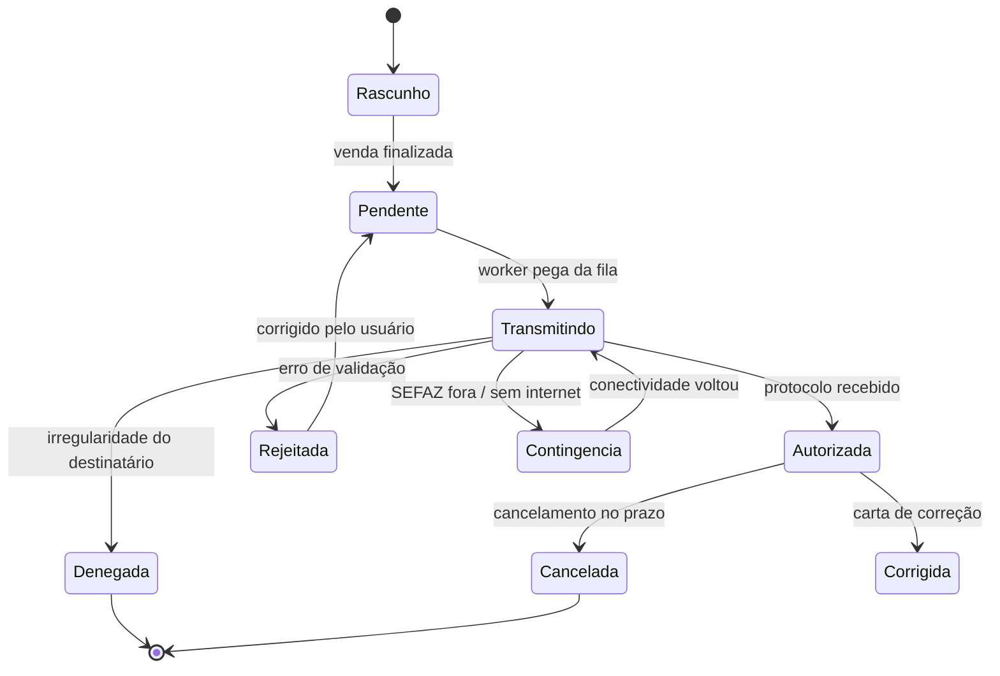
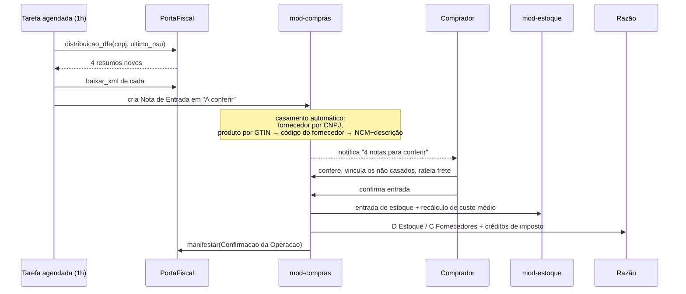

# 10 — Módulo fiscal (via API externa)

## 1. Decisão: não implementamos emissor

Assinatura XML ICP-Brasil, comunicação SOAP com 27 SEFAZs, acompanhamento de notas técnicas mensais,
esquemas XSD, contingência SVC-AN/SVC-RS, SPED Fiscal/Contribuições/ECD/ECF, EFD-Reinf, NFS-e com
5.570 padrões municipais — **isso é um produto inteiro**, e não é o nosso.

O Cardeal integra com uma **API fiscal externa** (Focus NFe, NFe.io, Tecnospeed, WebmaniaBR, PlugNotas,
ou um serviço próprio da operação) atrás de uma porta única. Ver
[ADR-0006](adr/0006-fiscal-via-api-externa.md).

O que **é** nosso: o modelo de dados fiscal, a máquina de estados dos documentos, a fila durável, a
contingência, a conciliação com o razão e a experiência do usuário.

## 2. A porta

```rust
#[async_trait]
pub trait PortaFiscal: Send + Sync {
    // Saída
    async fn emitir(&self, doc: &DocumentoFiscal) -> Resultado<RetornoEmissao>;
    async fn consultar(&self, chave: &ChaveAcesso) -> Resultado<SituacaoFiscal>;
    async fn cancelar(&self, chave: &ChaveAcesso, justificativa: &str) -> Resultado<RetornoCancelamento>;
    async fn carta_correcao(&self, chave: &ChaveAcesso, texto: &str) -> Resultado<RetornoCce>;
    async fn inutilizar(&self, faixa: FaixaNumeracao, justificativa: &str) -> Resultado<RetornoInutilizacao>;

    // Entrada (compras)
    async fn distribuicao_dfe(&self, cnpj: &Cnpj, desde: Nsu) -> Resultado<Vec<ResumoDfe>>;
    async fn baixar_xml(&self, chave: &ChaveAcesso) -> Resultado<XmlNota>;
    async fn manifestar(&self, chave: &ChaveAcesso, m: Manifestacao) -> Resultado<()>;

    // Obrigações
    async fn gerar_sped(&self, tipo: TipoSped, periodo: Periodo) -> Resultado<ArquivoSped>;

    // Apoio
    async fn consultar_cadastro(&self, doc: &Documento) -> Resultado<CadastroContribuinte>;
    async fn calcular_tributos(&self, base: &BaseCalculo) -> Resultado<Tributos>;
    async fn status_servico(&self, uf: Uf) -> Resultado<StatusSefaz>;
}
```

Adaptadores: `ApiFiscalHttp` (produção, configurável por provedor), `FiscalSimulado` (testes e
homologação — sabe autorizar, rejeitar com códigos reais, dar timeout e ficar offline sob comando).

Documentos suportados: **NF-e (55)**, **NFC-e (65)**, **NFS-e**, **CT-e (57)**, **MDF-e (58)**,
**SAT-CF-e** (São Paulo), **manifestação do destinatário**, **SPED Fiscal / Contribuições / ECD / ECF**.

## 3. O princípio que governa tudo: fiscal é assíncrono

> **A venda nunca espera a SEFAZ.**

A operação comercial é concluída, o caixa é atualizado, o razão é lançado e o cupom é impresso.
O documento fiscal é um **agregado separado**, com ciclo de vida próprio.



### Por que isso importa

Um sistema que trava a venda esperando a SEFAZ tem fila no caixa toda vez que a Receita tem soluço.
Um sistema que não trava vende normalmente e resolve o fiscal em segundo plano. É a diferença entre
o cliente reclamar da SEFAZ e o cliente reclamar do **seu** sistema.

## 4. Contingência

| Situação | Modo | Ação |
|---|---|---|
| Sem internet, NFC-e | **Offline** | Emite com `tpEmis=9`, imprime cupom com aviso, transmite em até 24 h |
| SEFAZ da UF fora, NF-e | **SVC** | Redireciona para SEFAZ Virtual de Contingência |
| API fiscal fora, mas internet OK | **Fila** | Acumula; a venda continua normal |
| Certificado vencido | **Bloqueio suave** | Avisa há 30 dias; ao vencer, permite venda mas não emissão, com alerta permanente |
| Faixa de numeração esgotada | **Bloqueio** | Avisa 100 números antes |

A UI mostra o estado fiscal como uma faixa discreta e permanente no topo, nunca como um popup que
interrompe o operador:

```
🟢 Fiscal em dia                                    (verde, sutil)
🟡 3 documentos na fila — transmitindo              (âmbar)
🟠 Contingência offline — 12 pendentes, há 41 min   (laranja)
🔴 2 rejeitadas exigem correção                     (vermelho, clicável)
```

## 5. Entrada de notas de compra

Fluxo de baixa e conferência de NF de fornecedor — uma das rotinas mais custosas do dia a dia:



O **casamento de produto** é o gargalo real. Cascata de estratégias:

1. GTIN/EAN igual → casamento certo.
2. Código do produto no fornecedor (aprendido de entradas anteriores) → certo.
3. NCM + similaridade de descrição (trigrama) acima de 0,82 → sugestão forte.
4. Nada → o usuário vincula uma vez; o sistema **aprende** e nunca mais pergunta.

Após 3 meses de uso, tipicamente >95% das linhas casam sozinhas.

## 6. Tributação

O cálculo é delegado à API fiscal (que mantém as tabelas atualizadas), mas o Cardeal guarda o
**perfil tributário** para não fazer chamada por item em tela:

```rust
pub struct PerfilTributario {
    pub id: Id,
    pub nome: String,                 // "Revenda tributada 18%"
    pub origem: OrigemMercadoria,     // 0..8 da tabela da NFe
    pub cst_icms: CstIcms,
    pub cfop_dentro_uf: Cfop,
    pub cfop_fora_uf: Cfop,
    pub aliquota_icms: Percentual,
    pub reducao_base: Percentual,
    pub mva_st: Option<Percentual>,
    pub cst_pis: CstPis,
    pub cst_cofins: CstCofins,
    pub aliquota_pis: Percentual,
    pub aliquota_cofins: Percentual,
    pub cest: Option<Cest>,
    pub beneficio_fiscal: Option<CodigoBeneficio>,
}
```

Um perfil é associado a um grupo de produtos, não a cada produto. Trocar a alíquota de uma categoria
inteira é uma edição, não uma migração de dados.

O cálculo local é a **estimativa** (mostrada no PDV em tempo real, sem rede); a API fiscal é a
**autoridade** no momento da emissão. Divergência entre os dois gera alerta de perfil desatualizado.

## 7. Conciliação fiscal × razão

Tarefa diária que compara:

| Fiscal | Razão |
|---|---|
| Soma das NF-e/NFC-e autorizadas do dia | Receita de vendas do dia |
| ICMS destacado | Conta 2.1.02 ICMS a recolher |
| PIS/COFINS destacados | Contas correspondentes |
| Notas canceladas | Estornos correspondentes |
| Notas de entrada confirmadas | Lançamentos de compra |

Divergência gera alerta com o documento específico. Isso pega, no mesmo dia, o problema que o
contador só descobriria no mês seguinte.

## 8. Configuração

```toml
[fiscal]
provedor = "focus"                  # focus | nfeio | tecnospeed | plugnotas | simulado
url      = "https://api.focusnfe.com.br"
token    = "${CARDEAL_FISCAL_TOKEN}"   # nunca no arquivo
ambiente = "producao"                  # producao | homologacao
timeout_ms = 15000
tentativas = 5
backoff = "exponencial"

[fiscal.certificado]
origem = "arquivo"                  # arquivo | windows_store | nuvem
caminho = "certificados/empresa.pfx"
alerta_vencimento_dias = 30

[fiscal.series]
nfe  = { serie = 1, proximo = 1 }
nfce = [
  { terminal = "PDV1", serie = 1 },
  { terminal = "PDV2", serie = 2 },
]
```

Trocar de provedor é trocar uma linha e reiniciar. A porta protege todo o resto do sistema dessa
decisão — que é exatamente o objetivo de uma arquitetura de portas e adaptadores.

## 9. O que fica no nosso lado

| Nosso | Do provedor |
|---|---|
| Modelo de dados dos documentos | Assinatura e transmissão |
| Máquina de estados e fila durável | Comunicação com SEFAZ |
| Contingência e retentativa | Esquemas XSD e notas técnicas |
| Numeração e séries por terminal | Geração do XML final |
| Casamento de produto na entrada | Distribuição DFe |
| Conciliação com o razão | Montagem dos arquivos SPED |
| Toda a experiência do usuário | — |

Se o provedor sair do ar, perdemos a capacidade de **transmitir** — nunca a de **vender**, **cobrar**
ou **fechar o caixa**.
