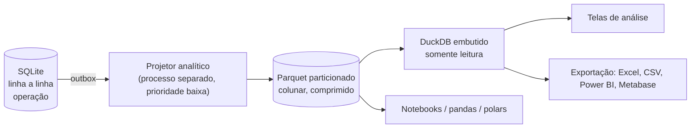

# 11 — Analytics, BI e inteligência de negócio

> O razão já é uma tabela fato. Este documento é sobre como transformá-la em resposta sem
> comprometer o desempenho da operação.

## 1. Separação OLTP / OLAP



**Por que não consultar o SQLite direto para tudo:** uma agregação de 3 anos de vendas por categoria
varre milhões de linhas e polui o cache de páginas que a operação precisa. Rodar isso em hora de pico
faz o PDV lentificar. Separar é a única forma de garantir que **analisar nunca atrapalha vender**.

**Por que DuckDB e Parquet:** ambos embutidos (sem servidor, sem instalação), colunar (agregações
100× mais rápidas), compressão de 8–12× e formato aberto — o cliente pode levar os dados para
qualquer ferramenta. Ver [ADR-0007](adr/0007-duckdb-e-parquet-para-analitico.md).

## 2. Esquema estrela

Fatos:

| Tabela fato | Grão | Origem |
|---|---|---|
| `fato_partida` | uma partida de lançamento | `razao_partida` (cópia direta, sem transformação) |
| `fato_venda_item` | um item vendido | `venda_item` + contexto |
| `fato_movimento_estoque` | uma movimentação | `estoque_movimento` |
| `fato_titulo_parcela` | uma parcela e suas baixas | `financeiro_parcela` |
| `fato_atendimento` | uma interação (OS, CRM, agenda) | módulos correspondentes |

Dimensões: `dim_tempo`, `dim_conta`, `dim_produto`, `dim_cliente`, `dim_fornecedor`,
`dim_vendedor`, `dim_filial`, `dim_centro_custo`, `dim_forma_pagamento`.

`dim_produto` e `dim_cliente` são **SCD tipo 2** (guardam histórico de atributos): "quanto vendemos
para clientes que *na época* eram categoria Ouro?" é uma pergunta que só o tipo 2 responde.

Particionamento no disco:

```
dados/analytics/
├── fato_partida/empresa=<id>/ano=2026/mes=03/parte-0.parquet
├── fato_venda_item/empresa=<id>/ano=2026/mes=03/parte-0.parquet
└── dim_produto/versao=2026-03-01.parquet
```

O particionamento por ano/mês permite *partition pruning*: uma consulta do trimestre lê 3 arquivos,
não 36.

## 3. Atualização

| Camada | Latência | Como |
|---|---|---|
| Mês corrente | ~5 s | Projetor consome o outbox continuamente e reescreve o arquivo do mês |
| Meses fechados | imutável | Escrito uma vez, selado com hash |
| Dimensões | ~5 s | Upsert com versionamento SCD2 |

O projetor roda em prioridade de thread abaixo do normal e cede a CPU quando o motor está sob carga:
**analisar nunca atrapalha vender** não é slogan, é escalonamento.

Reconstrução total (`cargo xtask analytics --reconstruir`) lê o razão do zero. Como o Parquet é
derivado, apagá-lo nunca perde dado — propriedade que dá liberdade total para evoluir o esquema
analítico.

## 4. As perguntas que o sistema já responde

### 4.1 Financeiras (razão puro, sem OLAP)

- Fluxo de caixa diário/semanal/mensal, realizado × comprometido × previsto
- DRE gerencial por período, comparativo mês a mês e ano a ano
- Resultado por centro de custo, projeto e filial
- Prazo médio de recebimento (PMR) e de pagamento (PMP)
- Ciclo financeiro e necessidade de capital de giro
- Inadimplência por faixa de atraso, por cliente, por vendedor
- Composição de receita: à vista × prazo × cartão × Pix
- Custo efetivo dos meios de pagamento (taxa + prazo de compensação)

### 4.2 Comerciais

- Curva ABC de produtos, clientes e fornecedores
- Margem por produto, categoria, vendedor, filial — margem real (após CMV, taxas e impostos)
- Ticket médio, itens por cupom, evolução por hora do dia e dia da semana
- Cesta de compras: quais produtos aparecem juntos (regras de associação)
- Ruptura: produtos com saldo zero e histórico de venda
- Encalhe: cobertura em dias, produtos sem giro há N dias, capital parado
- Elasticidade: efeito de mudanças de preço sobre volume

### 4.3 Preditivas (submódulo `inteligencia`)

| Modelo | Técnica | Por que essa |
|---|---|---|
| Previsão de fluxo de caixa 90 dias | Decomposição sazonal + média móvel ponderada | Explicável ao dono; ele consegue conferir |
| Previsão de demanda por SKU | Croston para itens intermitentes, Holt-Winters para os regulares | Padrão da indústria para varejo |
| Ponto de pedido e lote econômico | Estoque de segurança por nível de serviço | Fórmula clássica, auditável |
| Risco de inadimplência | Regressão logística sobre histórico de pagamento | Coeficientes visíveis, sem caixa-preta |
| Propensão a churn | Recência-Frequência-Valor + regras | Simples e acionável |
| Detecção de anomalia | Desvio robusto (MAD) sobre séries | Alimenta os alertas do Pulso |

**Regra de ouro:** nenhum número aparece sem que o usuário possa clicar e ver **de onde veio**.
Toda previsão mostra a série histórica, o método e o intervalo de confiança. Um ERP que dá um número
mágico que o dono não entende é um ERP que o dono não usa.

## 5. Exportação e ferramentas externas

| Destino | Formato | Uso |
|---|---|---|
| Excel / LibreOffice | XLSX com formatação e fórmulas | O contador e o dono |
| Power BI / Metabase / Superset | Parquet ou ODBC (DuckDB) | Analista |
| Python / R | Parquet lido por polars/pandas | Ciência de dados |
| Contador | SPED via API fiscal, ou CSV padrão | Obrigação |
| Backup analítico | Diretório Parquet inteiro | Portabilidade total |

Exportação em massa é permissão separada (`relatorio.exportar_massa`), auditada e notificada ao
administrador — ver [doc 08](08-seguranca-permissoes.md).

## 6. A tela de perguntas

Interface de exploração sem SQL, para o gestor:

```
┌──────────────────────────────────────────────────────────────┐
│  Quero ver   [ margem            ▾]                          │
│  por         [ categoria         ▾]  [+ vendedor        ▾]   │
│  no período  [ últimos 90 dias   ▾]                          │
│  onde        [ filial = Matriz   ▾]                          │
│  comparado a [ mesmo período do ano anterior ▾]              │
│                                                              │
│  [Gráfico] [Tabela] [Exportar]        Ver SQL gerado ▸       │
└──────────────────────────────────────────────────────────────┘
```

O "Ver SQL gerado" é intencional: o usuário avançado aprende, confia e depois consulta direto.
Cada resposta pode virar um **cartão fixado no Pulso** — é assim que o dashboard do sistema é
construído pelo próprio usuário, sem nunca ter existido uma tela chamada "Dashboard".

## 7. Desempenho alvo

| Consulta | Volume | Alvo |
|---|---|---|
| Curva ABC de 12 meses | 4 M itens | < 300 ms |
| DRE comparativo de 24 meses | 13 M partidas | < 250 ms |
| Cesta de compras, 90 dias | 1,1 M cupons | < 2 s |
| Previsão de demanda, 8.000 SKUs | 3 anos | < 8 s (tarefa noturna) |
| Reconstrução total do analítico | 13 M partidas | < 4 min |
