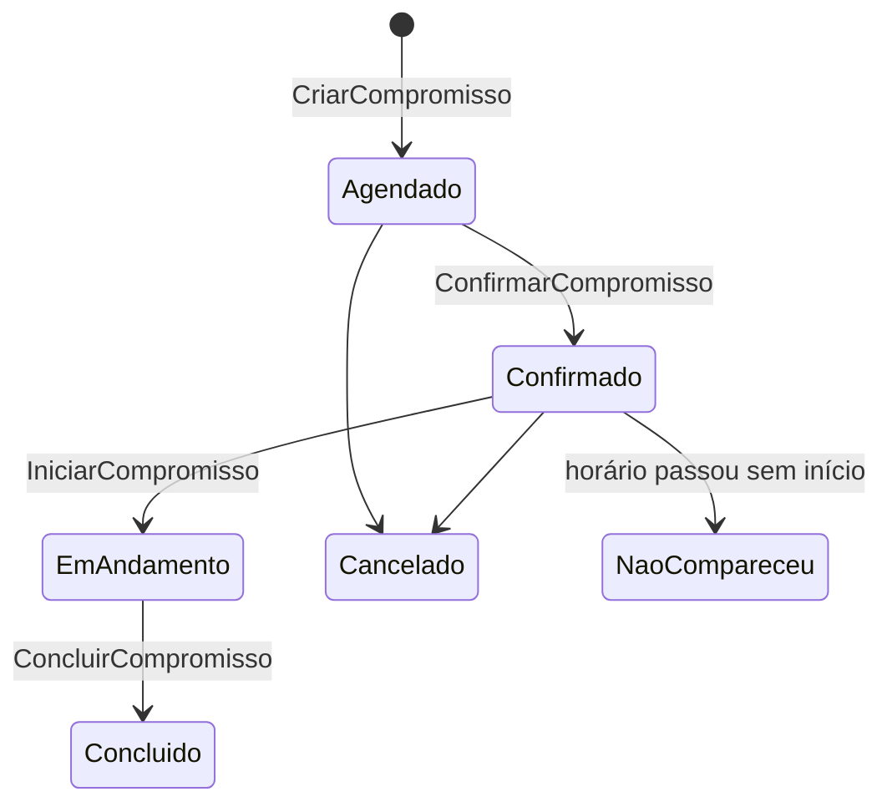

# Módulo Agenda

> Compromissos e recursos — sala, técnico, equipamento — com conflito detectado na hora de marcar,
> nunca descoberto na hora de usar.

## 1. Escopo

### Faz

- Mantém **compromisso** com início/fim, tipo (interno ou com cliente) e recursos vinculados.
- Mantém **recurso** (sala, técnico, equipamento, pessoa) com **disponibilidade** recorrente.
- Detecta **conflito de agenda** na criação — dois compromissos não reservam o mesmo recurso no
  mesmo intervalo, salvo permissão explícita de sobreposição.
- Dispara **lembretes** por antecedência configurável.

### Não faz

- **Não lança dinheiro.** Ver §7.
- **Não sabe o motivo de negócio do compromisso.** `os` (visita técnica) e `hotelaria` (arrumação,
  manutenção de quarto) criam compromissos através do comando `CriarCompromisso` informando
  `origem_modulo`/`origem_id`; `agenda` não interpreta esse contexto.
- **Não gerencia escala de funcionário nem ponto.** `Recurso` do tipo `Pessoa`/`Tecnico` é só uma
  agenda de disponibilidade para fins de compromisso — não é RH.

## 2. Submódulos

| id | nome | essencial | depende de | o que some da UI quando desligado |
|---|---|---|---|---|
| `compromisso` | Compromissos | sim | — | Não pode ser desligado. |
| `recurso` | Recursos e Disponibilidade | não | `compromisso` | Compromisso vira só data/hora, sem vínculo de sala/técnico/equipamento. |
| `lembrete` | Lembretes | não | `compromisso` | Notificações automáticas somem; agenda vira só consulta. |

## 3. Entidades

| Entidade | Campos principais | Observações |
|---|---|---|
| **Compromisso** | `id`, `empresa`, `titulo`, `tipo`(`Interno`,`Cliente`), `cliente`, `inicio`(Instante), `fim`(Instante), `estado`(`Agendado`,`Confirmado`,`EmAndamento`,`Concluido`,`Cancelado`,`NaoCompareceu`), `origem_modulo`, `origem_id`, `criado_por`, `versao` | |
| **Recurso** | `id`, `empresa`, `nome`, `tipo`(`Sala`,`Tecnico`,`Equipamento`,`Pessoa`), `capacidade`(Quantidade), `ativo` | |
| **CompromissoRecurso** | `compromisso`, `recurso` | junção, `PRIMARY KEY(compromisso, recurso)` |
| **DisponibilidadeRecurso** | `id`, `recurso`, `dia_semana`(Quantidade inteiro 0–6), `hora_inicio`, `hora_fim`(minutos desde 00:00) | regra recorrente; ausência de regra = recurso sempre disponível |
| **Lembrete** | `id`, `compromisso`, `antecedencia_minutos`(Quantidade inteiro), `canal`(`App`,`Email`,`Sms`), `enviado_em`(Instante nulo) | |

## 4. Máquinas de estado



## 5. Comandos

| Comando | Permissão | Risco | O que faz | Erros possíveis |
|---|---|---|---|---|
| `CriarRecurso` | `agenda.recurso.gerenciar` | Baixo | | `NomeDuplicado` |
| `DefinirDisponibilidade` | `agenda.recurso.gerenciar` | Baixo | | `IntervaloInvalido` |
| `CriarCompromisso` | `agenda.compromisso.criar` | Baixo | Verifica sobreposição por recurso antes de gravar | `ConflitoDeAgenda`, `RecursoIndisponivel` |
| `ConfirmarCompromisso` | `agenda.compromisso.confirmar` | Baixo | | `CompromissoCancelado` |
| `IniciarCompromisso` / `ConcluirCompromisso` | `agenda.compromisso.confirmar` | Baixo | | `EstadoInvalido` |
| `CancelarCompromisso` | `agenda.compromisso.cancelar` | Médio | | `CompromissoConcluido` |
| `RegistrarNaoComparecimento` | (tarefa agendada) | Baixo | Marca `NaoCompareceu` para compromissos vencidos sem início | — |

## 6. Consultas

| Consulta | Permissão | Uso na UI | Índice que a sustenta |
|---|---|---|---|
| `AgendaDoRecurso` | `agenda.compromisso.ver` | Calendário por sala/técnico | `agenda_compromisso_recurso(recurso, inicio)` |
| `DisponibilidadeNoPeriodo` | `agenda.compromisso.ver` | Sugestão de horário livre | `agenda_disponibilidade(recurso, dia_semana)` |
| `ConflitosDeAgenda` | `agenda.compromisso.ver` | Alerta na criação | consulta de sobreposição de intervalo (`inicio < :fim AND fim > :inicio`) |
| `ProximosCompromissos` | `agenda.compromisso.ver` | "Exige ação hoje" | `agenda_compromisso(empresa, inicio)` |

## 7. Receituário contábil

**Este módulo não lança dinheiro.** Nenhum comando de `agenda` produz `Lancamento`. `os` e
`hotelaria` chamam `CriarCompromisso` para reservar técnico/quarto, mas o valor cobrado pelo serviço
e o título a receber correspondente são lançados por eles próprios, no seu próprio receituário
(ver `os.md` §7 e `hotelaria.md` §7) — `agenda` só garante que o recurso estava livre.

## 8. Eventos

**Publicados:** `agenda.compromisso_criado.v1`, `agenda.compromisso_confirmado.v1`,
`agenda.compromisso_cancelado.v1`, `agenda.conflito_detectado.v1`, `agenda.lembrete_disparado.v1`.

**Assinados:** nenhum — `agenda` é acionado por **comando** direto de `os`/`hotelaria`
(sincronamente, porque a reserva de horário precisa de resposta imediata: livre ou não), não por
evento assíncrono.

## 9. Permissões

| Chave | Descrição | Risco |
|---|---|---|
| `agenda.recurso.gerenciar` | Cadastrar recurso e disponibilidade | Médio |
| `agenda.compromisso.ver` | Consultar agenda | Baixo |
| `agenda.compromisso.criar` | Criar compromisso | Baixo |
| `agenda.compromisso.confirmar` | Confirmar/iniciar/concluir | Baixo |
| `agenda.compromisso.cancelar` | Cancelar compromisso | Médio |

## 10. Telas

```
┌───────────────────────────────────────────────────────────────────────────────────────┐
│  Agenda · Técnicos                          quinta-feira, 03/set    [◂ dia] [hoje] [▸] │
├───────────────┬───────────────────────────┬───────────────────────────┬───────────────┤
│ Hora           │ Carlos                    │ Ana                       │ Sala 1        │
├───────────────┼───────────────────────────┼───────────────────────────┼───────────────┤
│ 09:00–10:00    │ 🔧 OS #331 — João Silva   │                            │               │
│ 10:00–11:00    │ 🔧 OS #331 — João Silva   │ 🔧 OS #340 — Ana Costa    │               │
│ 14:00–15:00    │                            │                            │ Reunião       │
└───────────────┴───────────────────────────┴───────────────────────────┴───────────────┘
```

```
┌─────────────────────────────────────────────────────────┐
│  ⚠ Conflito de agenda                                     │
│  Carlos já tem "OS #331" das 09:00 às 11:00.               │
│  [Escolher outro horário]  [Escolher outro técnico]        │
└─────────────────────────────────────────────────────────┘
```

## 11. Regras de negócio críticas

1. **`CriarCompromisso` recusa sobreposição no mesmo recurso por padrão.** Only quem tem permissão
   de exceção explícita pode forçar — e a exceção fica registrada.
2. **Compromisso fora da `DisponibilidadeRecurso` exige confirmação explícita** (ex.: técnico fora
   do horário padrão) — nunca é bloqueado silenciosamente nem aceito silenciosamente.
3. **Cancelamento nunca apaga.** O compromisso permanece com `estado = Cancelado`, visível no
   histórico do recurso.
4. **Lembrete nunca dispara duas vezes** — idempotente por `(compromisso, canal)` com `enviado_em`
   preenchido na primeira entrega.

## 12. Comportamento offline

**Funciona:** ver agenda do último sincronismo; criar compromisso local (entra na fila, verificação
de conflito é refeita no servidor na reconexão).
**Não funciona:** verificar disponibilidade de recursos de outra filial; confirmar compromisso que
depende de recurso administrado por outro terminal.
**Conflito na reconciliação:** se dois terminais offline marcam o mesmo recurso no mesmo horário, o
primeiro a chegar ao servidor vence; o segundo é aceito como compromisso com `ConflitoDeAgenda`
sinalizado para remarcação humana — nunca apagado silenciosamente, seguindo o princípio geral do
[doc 03 §3.3](../03-pilar-resiliencia.md#33-reconciliação).

## 13. Tabelas

```sql
CREATE TABLE agenda_recurso (
    id          BLOB PRIMARY KEY,
    empresa     BLOB    NOT NULL,
    nome        TEXT    NOT NULL,
    tipo        TEXT    NOT NULL CHECK (tipo IN ('Sala','Tecnico','Equipamento','Pessoa')),
    capacidade  INTEGER,
    ativo       INTEGER NOT NULL DEFAULT 1 CHECK (ativo IN (0,1))
) STRICT;

CREATE TABLE agenda_disponibilidade (
    id           BLOB PRIMARY KEY,
    recurso      BLOB    NOT NULL REFERENCES agenda_recurso(id),
    dia_semana   INTEGER NOT NULL CHECK (dia_semana BETWEEN 0 AND 6),
    hora_inicio  INTEGER NOT NULL,
    hora_fim     INTEGER NOT NULL
) STRICT;
CREATE INDEX agenda_disponibilidade_recurso ON agenda_disponibilidade(recurso, dia_semana);

CREATE TABLE agenda_compromisso (
    id             BLOB PRIMARY KEY,
    empresa        BLOB    NOT NULL,
    titulo         TEXT    NOT NULL,
    tipo           TEXT    NOT NULL CHECK (tipo IN ('Interno','Cliente')),
    cliente        BLOB,
    inicio         INTEGER NOT NULL,
    fim            INTEGER NOT NULL,
    estado         TEXT    NOT NULL CHECK (estado IN ('Agendado','Confirmado','EmAndamento','Concluido','Cancelado','NaoCompareceu')),
    origem_modulo  TEXT,
    origem_id      BLOB,
    criado_por     BLOB    NOT NULL,
    versao         INTEGER NOT NULL DEFAULT 1,
    CHECK (fim > inicio)
) STRICT;
CREATE INDEX agenda_compromisso_periodo ON agenda_compromisso(empresa, inicio, fim) WHERE estado NOT IN ('Cancelado');

CREATE TABLE agenda_compromisso_recurso (
    compromisso  BLOB NOT NULL REFERENCES agenda_compromisso(id),
    recurso      BLOB NOT NULL REFERENCES agenda_recurso(id),
    PRIMARY KEY (compromisso, recurso)
) STRICT, WITHOUT ROWID;
CREATE INDEX agenda_compromisso_recurso_inv ON agenda_compromisso_recurso(recurso, compromisso);

CREATE TABLE agenda_lembrete (
    id                    BLOB PRIMARY KEY,
    compromisso           BLOB    NOT NULL REFERENCES agenda_compromisso(id),
    antecedencia_minutos  INTEGER NOT NULL,
    canal                 TEXT    NOT NULL CHECK (canal IN ('App','Email','Sms')),
    enviado_em            INTEGER
) STRICT;
CREATE INDEX agenda_lembrete_pendente ON agenda_lembrete(compromisso) WHERE enviado_em IS NULL;
```
