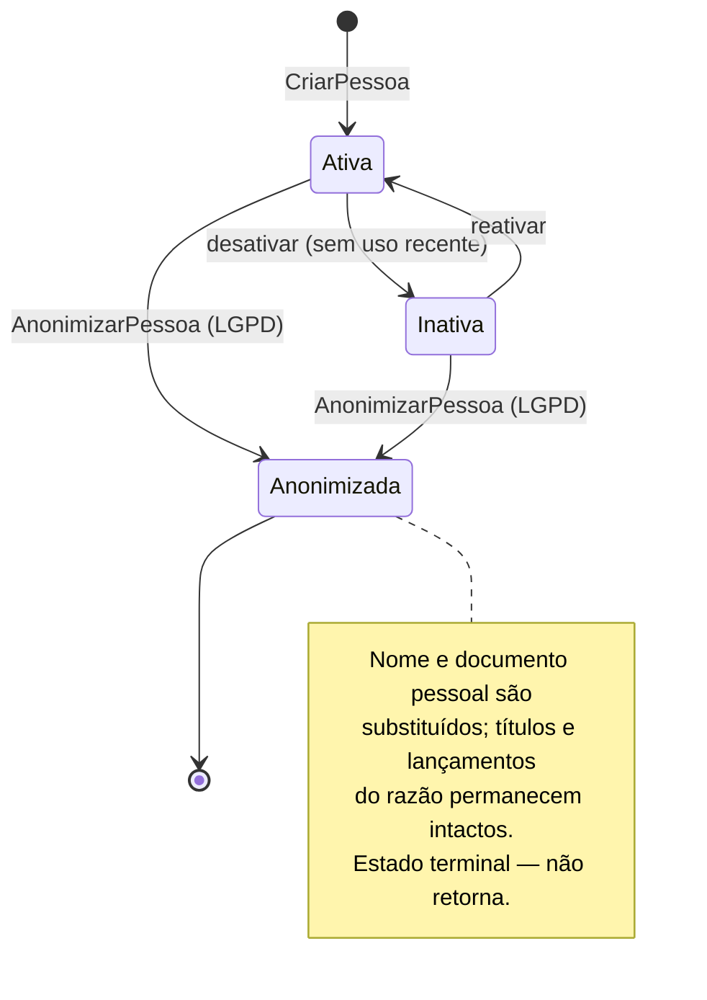
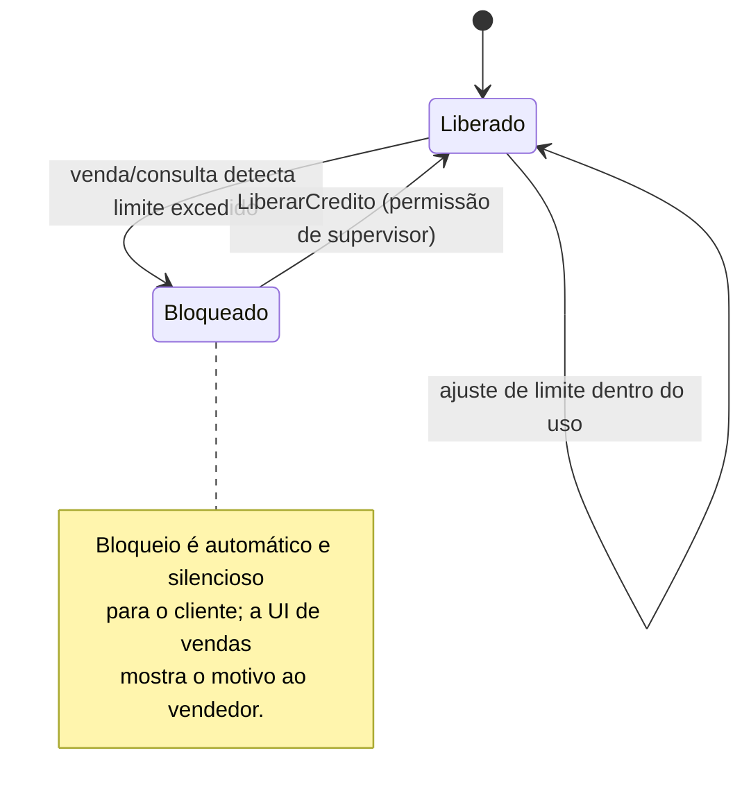

# Módulo Clientes

> O cadastro único de pessoas do Cardeal: cliente, fornecedor, transportadora, funcionário e sócio
> são papéis da mesma pessoa, nunca cadastros separados.

## 1. Escopo

### Faz

- Mantém o cadastro único de **Pessoa** (física ou jurídica) com **papéis** múltiplos e simultâneos
  (`Cliente`, `Fornecedor`, `Transportadora`, `Funcionario`, `Socio`, `Vendedor`).
- Valida CPF/CNPJ (dígito verificador) e consulta o cadastro na SEFAZ via `PortaFiscal` para
  pré-preencher razão social, endereço e situação cadastral.
- Detecta e resolve **duplicidade** — por documento (certeza) e por similaridade de nome (sugestão).
- Mantém **limite de crédito** por cliente, com bloqueio automático e liberação por supervisor.
- Calcula um **score interno de pagamento** a partir do histórico de baixas do financeiro (via evento,
  nunca por leitura direta de tabela de outro módulo).
- Mantém **carteira de vendedor** (quais clientes pertencem a qual vendedor) e o vínculo opcional de
  cliente a **tabela de preço** (a tabela em si é do módulo `vendas`; aqui só guardamos o vínculo).
- Implementa a **anonimização LGPD**, preservando o fato financeiro.

### Não faz

- **Não lança dinheiro.** Limite de crédito, quando estourado, apenas sinaliza; quem decide bloquear
  a venda é `vendas`/`pdv`, lendo esse sinal. O `Titulo` e a baixa pertencem a `financeiro`.
- **Não guarda tabela de preço nem regra de desconto.** Isso é `vendas` (submódulo `tabela_preco`).
  Este módulo guarda apenas qual tabela um cliente usa por padrão.
- **Não guarda histórico de venda/OS/aluguel.** Isso é responsabilidade de cada módulo de origem; o
  "histórico unificado do cliente" que a UI mostra é uma **agregação de leitura** sobre eventos de
  vários módulos, não uma tabela deste módulo (essa agregação de UI vive em `crm`, quando ativo).
- **Não emite documento fiscal nem verifica regularidade fiscal em tempo de venda além do que a SEFAZ
  já respondeu na última consulta de cadastro.** Isso é `mod-fiscal`.
- **Não faz folha de pagamento.** O papel `Funcionario` é só identidade (nome, documento, contato)
  para uso em OS, comissão e centro de custo — não há cálculo de salário aqui.

## 2. Submódulos

| id | nome | essencial | depende de | o que some da UI quando desligado |
|---|---|---|---|---|
| `cadastro` | Cadastro de Pessoas | sim | — | Não pode ser desligado: todo módulo de vendas/compras/OS depende dele. |
| `credito` | Limite de Crédito | não | `cadastro` | Campo "Limite de crédito" e bloqueio automático somem; venda a prazo não é mais restringida por crédito. |
| `dedup` | Deduplicação Assistida | não | `cadastro` | Alertas de "cadastro parecido" somem; cadastro passa a aceitar duplicidade silenciosa. |
| `carteira` | Carteira de Vendedor | não | `cadastro` | Campo "Vendedor responsável" some da ficha e dos filtros de relatório. |
| `score` | Score de Pagamento | não | `credito` | Selo de score ("bom pagador" / "atenção") some da ficha e da tela de venda. |

## 3. Entidades

### Pessoa

| Campo | Tipo | Obrigatório | Regra |
|---|---|---|---|
| `id` | Id | sim | UUIDv7 |
| `empresa` | Id | sim | |
| `tipo` | enum(`Fisica`,`Juridica`) | sim | define quais documentos são exigidos |
| `nome` | String | sim | nome civil ou razão social |
| `nome_fantasia` | String | não | só `Juridica` |
| `data_nascimento_abertura` | Data | não | nascimento (PF) ou abertura (PJ) |
| `ativo` | enum(`Sim`,`Nao`) | sim | inativo não aparece em busca padrão, mas nada é apagado |
| `anonimizado_em` | Instante | não | preenchido pela anonimização LGPD |
| `observacao` | String | não | |
| `versao` | Quantidade (inteiro) | sim | bloqueio otimista |
| `criado_em` | Instante | sim | |

### PapelPessoa

| Campo | Tipo | Obrigatório | Regra |
|---|---|---|---|
| `id` | Id | sim | |
| `pessoa` | Id | sim | |
| `papel` | enum(`Cliente`,`Fornecedor`,`Transportadora`,`Funcionario`,`Socio`,`Vendedor`) | sim | uma pessoa pode ter vários papéis, sem duplicar registro |
| `ativo_desde` | Data | sim | |
| `ativo` | enum(`Sim`,`Nao`) | sim | papel pode ser desativado sem desativar a pessoa |

### Endereco

| Campo | Tipo | Obrigatório | Regra |
|---|---|---|---|
| `id` | Id | sim | |
| `pessoa` | Id | sim | |
| `tipo` | enum(`Cobranca`,`Entrega`,`Comercial`,`Residencial`) | sim | |
| `logradouro`, `numero`, `complemento`, `bairro` | String | sim exceto complemento | |
| `cidade`, `uf` | String | sim | `uf` validado contra a lista de 27 UFs |
| `cep` | String | sim | 8 dígitos |
| `principal` | enum(`Sim`,`Nao`) | sim | um único principal por `tipo` |

### Contato

| Campo | Tipo | Obrigatório | Regra |
|---|---|---|---|
| `id` | Id | sim | |
| `pessoa` | Id | sim | |
| `tipo` | enum(`Telefone`,`Celular`,`Email`,`Whatsapp`) | sim | |
| `valor` | String | sim | validação de formato por `tipo` |
| `principal` | enum(`Sim`,`Nao`) | sim | |

### DocumentoPessoa

| Campo | Tipo | Obrigatório | Regra |
|---|---|---|---|
| `id` | Id | sim | |
| `pessoa` | Id | sim | |
| `tipo` | enum(`Cpf`,`Cnpj`,`Rg`,`Ie`,`Im`,`Passaporte`) | sim | |
| `numero` | String | sim | dígito verificador validado no domínio para `Cpf`/`Cnpj` |
| `orgao_emissor` | String | não | `Rg` |
| `validado_sefaz_em` | Instante | não | preenchido por `ConsultarCadastroSefaz` |
| `UNIQUE(empresa, tipo, numero)` | | | impede dois cadastros com o mesmo CPF/CNPJ |

### LimiteCredito

| Campo | Tipo | Obrigatório | Regra |
|---|---|---|---|
| `id` | Id | sim | |
| `pessoa` | Id | sim | papel `Cliente` |
| `limite` | Dinheiro | sim | |
| `situacao` | enum(`Liberado`,`Bloqueado`) | sim | ver §4 |
| `motivo_bloqueio` | String | não | obrigatório quando `Bloqueado` |
| `bloqueado_em` | Instante | não | |
| `liberado_por` | Id | não | usuário supervisor |
| `revisado_em` | Instante | sim | |
| `versao` | Quantidade (inteiro) | sim | |

`disponivel` **não é uma coluna**: é calculado na consulta como
`limite − soma(financeiro_parcela.valor − valor_baixado) das parcelas em aberto do cliente`, lido do
financeiro via consulta de agregação — nunca duplicado aqui.

### HistoricoCredito

| Campo | Tipo | Obrigatório | Regra |
|---|---|---|---|
| `id` | Id | sim | |
| `pessoa` | Id | sim | |
| `data` | Data | sim | |
| `evento` | enum(`PagamentoEmDia`,`PagamentoComAtraso`,`Inadimplencia`,`TituloRenegociado`) | sim | derivado de eventos do financeiro |
| `dias_atraso` | Quantidade (inteiro) | não | |
| `score_resultante` | Quantidade (inteiro) | sim | 0–1000, recalculado a cada evento |

### TabelaPrecoVinculada

| Campo | Tipo | Obrigatório | Regra |
|---|---|---|---|
| `pessoa` | Id | sim | papel `Cliente` |
| `tabela_preco` | Id | sim | referência opaca à entidade `TabelaPreco` de `vendas` — sem FK entre módulos |
| `vigente_desde` | Data | sim | |

### Carteira (vínculo Vendedor × Cliente)

| Campo | Tipo | Obrigatório | Regra |
|---|---|---|---|
| `vendedor` | Id | sim | pessoa com papel `Vendedor` |
| `cliente` | Id | sim | pessoa com papel `Cliente` |
| `desde` | Data | sim | |
| `PRIMARY KEY(vendedor, cliente)` | | | um cliente pode ter só um vendedor titular por vez |

## 4. Máquinas de estado





## 5. Comandos

| Comando | Permissão | Risco | O que faz | Erros possíveis |
|---|---|---|---|---|
| `CriarPessoa` | `clientes.pessoa.criar` | Baixo | Cria `Pessoa` + documento principal; dispara verificação de duplicidade | `DocumentoInvalido`, `DocumentoDuplicado` |
| `EditarPessoa` | `clientes.pessoa.editar` | Baixo | Atualiza dados cadastrais | `VersaoDesatualizada` |
| `AdicionarPapel` | `clientes.papel.gerenciar` | Baixo | Acrescenta papel a uma pessoa existente | `PapelJaExiste` |
| `RemoverPapel` | `clientes.papel.gerenciar` | Médio | Desativa papel; recusa se houver título em aberto naquele papel | `PapelComPendencia` |
| `ConsultarCadastroSefaz` | `clientes.pessoa.consultar_sefaz` | Baixo | Chama `PortaFiscal::consultar_cadastro`, sugere preenchimento | `DocumentoInvalido`, `ServicoIndisponivel` |
| `SugerirMesclagem` | (automático, sem permissão de usuário) | Baixo | Roda no `CriarPessoa`, gera sugestão por similaridade de nome (trigrama ≥ 0,85) | — |
| `MesclarPessoas` | `clientes.duplicidade.mesclar` | Alto | Une duas pessoas em uma, preservando o histórico das duas | `PessoaJaMesclada` |
| `DefinirLimiteCredito` | `clientes.credito.definir_limite` | Médio | Cria/edita `LimiteCredito` | `LimiteNegativo` |
| `BloquearCredito` | (automático, disparado por `vendas`/`financeiro` via evento) | Médio | Marca `Bloqueado`, motivo do sistema | — |
| `LiberarCredito` | `clientes.credito.liberar` | Alto | Exige senha/PIN de supervisor; registra quem liberou e motivo | `SemPermissaoSupervisor` |
| `VincularVendedor` | `clientes.carteira.gerenciar` | Baixo | Define a carteira do cliente | `VendedorInexistente` |
| `VincularTabelaPreco` | `clientes.tabela_preco.vincular` | Baixo | Grava a referência opaca | — |
| `AnonimizarPessoa` | `clientes.lgpd.anonimizar` | Crítico | Substitui nome/documento por identificadores anônimos; preserva `financeiro_titulo` | `PessoaComProcessoAtivo` |
| `ExportarDadosDoTitular` | `clientes.lgpd.exportar` | Alto | Gera JSON com tudo que o sistema tem daquele documento | `DocumentoNaoEncontrado` |

## 6. Consultas

| Consulta | Permissão | Uso na UI | Índice que a sustenta |
|---|---|---|---|
| `BuscarPessoa` | `clientes.pessoa.ver` | `Ctrl+K`, F6 do PDV, campo de busca de qualquer módulo | `clientes_pessoa_busca` (FTS por nome) + `clientes_documento(numero)` |
| `FichaDaPessoa` | `clientes.pessoa.ver` | Tela de cadastro completa | `clientes_pessoa(id)` |
| `PapeisDaPessoa` | `clientes.pessoa.ver` | Abas da ficha | `clientes_papel(pessoa)` |
| `DuplicidadesSugeridas` | `clientes.duplicidade.mesclar` | Fila de conferência de cadastro | `clientes_pessoa_busca` por trigrama |
| `LimiteDisponivel` | `clientes.credito.ver` | Selo na tela de venda/PDV | `clientes_limite_credito(pessoa)` + agregação em `financeiro_parcela` |
| `ScoreDePagamento` | `clientes.credito.ver` | Selo "bom pagador" na ficha | `clientes_historico_credito(pessoa, data DESC)` |
| `CarteiraDoVendedor` | `clientes.carteira.ver` | Painel do vendedor | `clientes_carteira(vendedor)` |
| `PessoasPorPapel` | `clientes.pessoa.ver` | Listas de clientes/fornecedores | `clientes_papel(papel, ativo)` |

## 7. Receituário contábil

**Este módulo não lança dinheiro.** Nenhum comando de `clientes` produz `Lancamento`. A relação com
o financeiro acontece em duas direções, sempre por evento — nunca por leitura direta de tabela:

| Direção | Mecanismo | O que acontece |
|---|---|---|
| `clientes` → `financeiro` | O `Titulo` criado por `vendas`/`os`/`alugueis` referencia `contraparte_id` apontando para `clientes_pessoa.id`. `clientes` não participa dessa escrita. | — |
| `financeiro` → `clientes` | Assina `financeiro.parcela_baixada.v1` e `financeiro.baixa_estornada.v1` | Grava `HistoricoCredito`, recalcula `score_resultante` e, se a baixa quitou uma parcela vencida, tenta `LiberarCredito` automaticamente se a situação normalizou |
| `vendas`/`pdv` → `clientes` | Consulta síncrona `LimiteDisponivel` antes de confirmar venda a prazo (não é evento — é leitura direta, permitida entre módulos via consulta pública) | Se estourado, `vendas` decide bloquear ou pedir autorização; `clientes` só informa o número |

Se um dia este módulo precisar registrar uma provisão de perda por inadimplência (crédito podre), a
linha correta seria `D Despesas com pessoal/Provisão para devedores duvidosos (5.x) · C Clientes a
receber (1.2.01)` — mas essa decisão pertence ao `financeiro` (ele que teria a linha no receituário do
[doc 05 §5](../05-nucleo-financeiro.md#5-o-receituário-como-cada-módulo-posta)), disparada por leitura do score aqui calculado.

## 8. Eventos

**Publicados**

- `clientes.pessoa_criada.v1` — `{ pessoa, tipo, documento_principal }`
- `clientes.papel_adicionado.v1` — `{ pessoa, papel }`
- `clientes.credito_bloqueado.v1` — `{ pessoa, motivo }`
- `clientes.credito_liberado.v1` — `{ pessoa, liberado_por, motivo }`
- `clientes.duplicidade_sugerida.v1` — `{ pessoa_a, pessoa_b, similaridade }`
- `clientes.cadastro_mesclado.v1` — `{ pessoa_mantida, pessoa_absorvida }`
- `clientes.pessoa_anonimizada.v1` — `{ pessoa }`

**Assinados**

- `financeiro.parcela_baixada.v1` → atualiza `HistoricoCredito` e o score.
- `financeiro.baixa_estornada.v1` → reverte o efeito no score.
- `financeiro.titulo_lancado.v1` → reavalia `LimiteDisponivel` e dispara `BloquearCredito` se estourou.

## 9. Permissões

| Chave | Descrição | Risco |
|---|---|---|
| `clientes.pessoa.ver` | Consultar cadastro de pessoas | Baixo |
| `clientes.pessoa.criar` | Criar pessoa | Baixo |
| `clientes.pessoa.editar` | Editar dados cadastrais | Baixo |
| `clientes.pessoa.consultar_sefaz` | Consultar cadastro na SEFAZ | Baixo |
| `clientes.papel.gerenciar` | Adicionar/remover papel | Médio |
| `clientes.duplicidade.mesclar` | Mesclar cadastros duplicados | Alto |
| `clientes.credito.ver` | Ver limite e score de crédito | Baixo |
| `clientes.credito.definir_limite` | Definir limite de crédito | Médio |
| `clientes.credito.liberar` | Liberar cliente bloqueado por crédito | Alto |
| `clientes.carteira.ver` | Ver carteira de vendedor | Baixo |
| `clientes.carteira.gerenciar` | Definir vendedor responsável | Médio |
| `clientes.tabela_preco.vincular` | Vincular tabela de preço ao cliente | Baixo |
| `clientes.lgpd.anonimizar` | Anonimizar dados pessoais | Crítico |
| `clientes.lgpd.exportar` | Exportar dados do titular | Alto |

## 10. Telas

### Ficha da pessoa

```
┌───────────────────────────────────────────────────────────────────────────────────────┐
│  ← Voltar   Mercado Bom Preço LTDA              [Cliente] [Fornecedor]   [Ctrl+S Salvar]│
├───────────────────────────────────────────────────────────────────────────────────────┤
│  [Dados] [Endereços] [Contatos] [Crédito] [Histórico]                                  │
├───────────────────────────────────────────────────────────────────────────────────────┤
│  Razão social   [Mercado Bom Preço LTDA_______________]  CNPJ [12.345.678/0001-90] ✓   │
│  Nome fantasia  [Mercado Bom Preço____________________]  IE   [123.456.789.110]        │
│                                                                                        │
│  🟢 Situação cadastral SEFAZ: Ativa (consultado há 3 dias)     [Consultar novamente]  │
│                                                                                        │
│  Vendedor responsável: [Carlos Mendes ▾]     Tabela de preço: [Atacado ▾]             │
└───────────────────────────────────────────────────────────────────────────────────────┘
```

### Dedup ao cadastrar

```
┌─────────────────────────────────────────────────────────────┐
│  ⚠ Encontramos um cadastro parecido                         │
│                                                                │
│  Você está criando: "Mercado Bom Preço Ltda"                 │
│  Já existe:          "Mercado Bom Preço LTDA" — CNPJ igual   │
│                       Cliente desde 12/03/2023                │
│                                                                │
│  [Usar o cadastro existente]  [Criar mesmo assim]  [Cancelar]│
└─────────────────────────────────────────────────────────────┘
```

### Limite de crédito e liberação por supervisor

```
┌───────────────────────────────────────────────────────────────────────────────────────┐
│  Crédito · Mercado Bom Preço LTDA                                                     │
├───────────────────────────────────────────────────────────────────────────────────────┤
│  Limite:        R$ 5.000,00        Score: 812/1000  ▓▓▓▓▓▓▓▓░░  Bom pagador           │
│  Em aberto:     R$ 5.340,00        🔴 Bloqueado — limite excedido em R$ 340,00        │
│                                                                                        │
│  Últimos 6 meses: 11 pagamentos em dia, 1 com 3 dias de atraso                        │
│                                                                                        │
│  Para liberar, informe a senha do supervisor:                                         │
│  Motivo:  [Cliente antigo, autorizado pelo gerente_____________]                      │
│  Senha:   [••••••••]                                          [F2 Liberar]  [Esc]    │
└───────────────────────────────────────────────────────────────────────────────────────┘
```

## 11. Regras de negócio críticas

1. **Uma pessoa é única por documento dentro da empresa.** `UNIQUE(empresa, tipo, numero)` em
   `DocumentoPessoa` é a garantia física; a sugestão por similaridade de nome é apenas assistência —
   nunca bloqueia, porque nomes fantasia legitimamente se parecem.
2. **Papéis coexistem na mesma pessoa.** Um sócio que também é cliente da própria loja é uma pessoa
   com dois `PapelPessoa`, nunca dois cadastros.
3. **Mesclagem nunca apaga.** `MesclarPessoas` transfere referências (papéis, endereços, contatos)
   para a pessoa mantida e marca a absorvida como `Inativa` com ponteiro para a mantida — histórico
   auditável dos dois lados.
4. **Bloqueio de crédito é automático; liberação é sempre manual e auditada.** O sistema nunca
   libera sozinho, mesmo que o cliente pague — quem decide reabrir o crédito é uma pessoa com
   permissão, ainda que o pagamento tenha zerado o saldo (regra de negócio explícita, não bug).
5. **Score é sempre derivado, nunca editável diretamente.** Não existe comando `DefinirScore`;
   editar o número à mão destruiria a única garantia de que ele reflete comportamento real.
6. **Anonimização nunca toca o razão.** LGPD elimina dado pessoal identificável (nome, documento,
   contato); o `Titulo`, a `Baixa` e o `Lancamento` permanecem intactos porque a guarda fiscal de 5
   anos é uma obrigação legal que prevalece — isso é explicado ao titular na resposta ao pedido
   (ver [doc 08 §6](../08-seguranca-permissoes.md#6-lgpd)).
7. **`RemoverPapel` recusa se há pendência.** Não se remove o papel `Fornecedor` de quem ainda tem
   título em aberto — o papel fica "inativo" só depois de zerado.
8. **CNPJ e CPF são validados por dígito verificador no domínio, sem I/O.** A consulta à SEFAZ é uma
   confirmação adicional, não a única validação — o cadastro tem que funcionar sem rede.

## 12. Comportamento offline

**Funciona em modo autônomo:**
- Buscar e ver pessoas do cache sincronizado (produtos, clientes básicos e limite de crédito são os
  três conjuntos sincronizados continuamente para o posto avançado — ver
  [doc 03 §3.1](../03-pilar-resiliencia.md#31-como-funciona)).
- Cadastro rápido de cliente novo direto no PDV (nome + documento), que entra na fila de saída local.

**Não funciona em modo autônomo:**
- Editar cadastro existente (nome, endereço, papéis).
- Consultar SEFAZ, mesclar duplicados, anonimizar, liberar crédito bloqueado.
- Ver score de pagamento atualizado (mostra o último valor sincronizado, marcado como estimado).

**Política de conflito na reconciliação:** cadastro é território do servidor. Uma edição feita
offline (ex.: cliente cadastrado no balcão) é enviada como sugestão; se o mesmo documento já existe
no servidor, a criação vira uma atualização de contato/observação, nunca sobrescreve o cadastro
central — "servidor vence; alteração local vira sugestão pendente", conforme a tabela de políticas do
[doc 03 §3.3](../03-pilar-resiliencia.md#33-reconciliação).

## 13. Tabelas

```sql
CREATE TABLE clientes_pessoa (
    id                    BLOB PRIMARY KEY,
    empresa               BLOB    NOT NULL,
    tipo                  TEXT    NOT NULL CHECK (tipo IN ('Fisica','Juridica')),
    nome                  TEXT    NOT NULL,
    nome_fantasia         TEXT,
    data_nascimento_abertura INTEGER,
    ativo                 INTEGER NOT NULL DEFAULT 1 CHECK (ativo IN (0,1)),
    anonimizado_em        INTEGER,
    observacao            TEXT,
    versao                INTEGER NOT NULL DEFAULT 1,
    criado_em             INTEGER NOT NULL,
    criado_por            BLOB    NOT NULL
) STRICT;
CREATE INDEX clientes_pessoa_nome ON clientes_pessoa(empresa, nome) WHERE ativo = 1;

CREATE TABLE clientes_papel (
    id          BLOB PRIMARY KEY,
    empresa     BLOB    NOT NULL,
    pessoa      BLOB    NOT NULL REFERENCES clientes_pessoa(id),
    papel       TEXT    NOT NULL CHECK (papel IN ('Cliente','Fornecedor','Transportadora','Funcionario','Socio','Vendedor')),
    ativo_desde INTEGER NOT NULL,
    ativo       INTEGER NOT NULL DEFAULT 1 CHECK (ativo IN (0,1)),
    UNIQUE (pessoa, papel)
) STRICT;
CREATE INDEX clientes_papel_tipo ON clientes_papel(empresa, papel) WHERE ativo = 1;

CREATE TABLE clientes_endereco (
    id           BLOB PRIMARY KEY,
    empresa      BLOB    NOT NULL,
    pessoa       BLOB    NOT NULL REFERENCES clientes_pessoa(id),
    tipo         TEXT    NOT NULL CHECK (tipo IN ('Cobranca','Entrega','Comercial','Residencial')),
    logradouro   TEXT    NOT NULL,
    numero       TEXT    NOT NULL,
    complemento  TEXT,
    bairro       TEXT    NOT NULL,
    cidade       TEXT    NOT NULL,
    uf           TEXT    NOT NULL,
    cep          TEXT    NOT NULL,
    principal    INTEGER NOT NULL DEFAULT 0 CHECK (principal IN (0,1))
) STRICT;
CREATE INDEX clientes_endereco_pessoa ON clientes_endereco(pessoa, tipo);

CREATE TABLE clientes_contato (
    id         BLOB PRIMARY KEY,
    empresa    BLOB    NOT NULL,
    pessoa     BLOB    NOT NULL REFERENCES clientes_pessoa(id),
    tipo       TEXT    NOT NULL CHECK (tipo IN ('Telefone','Celular','Email','Whatsapp')),
    valor      TEXT    NOT NULL,
    principal  INTEGER NOT NULL DEFAULT 0 CHECK (principal IN (0,1))
) STRICT;
CREATE INDEX clientes_contato_pessoa ON clientes_contato(pessoa);

CREATE TABLE clientes_documento (
    id                  BLOB PRIMARY KEY,
    empresa             BLOB    NOT NULL,
    pessoa              BLOB    NOT NULL REFERENCES clientes_pessoa(id),
    tipo                TEXT    NOT NULL CHECK (tipo IN ('Cpf','Cnpj','Rg','Ie','Im','Passaporte')),
    numero              TEXT    NOT NULL,
    orgao_emissor       TEXT,
    validado_sefaz_em   INTEGER,
    UNIQUE (empresa, tipo, numero)
) STRICT;

CREATE TABLE clientes_limite_credito (
    id                BLOB PRIMARY KEY,
    empresa           BLOB    NOT NULL,
    pessoa            BLOB    NOT NULL REFERENCES clientes_pessoa(id),
    limite            INTEGER NOT NULL,
    situacao          TEXT    NOT NULL CHECK (situacao IN ('Liberado','Bloqueado')),
    motivo_bloqueio   TEXT,
    bloqueado_em      INTEGER,
    liberado_por      BLOB,
    revisado_em       INTEGER NOT NULL,
    versao            INTEGER NOT NULL DEFAULT 1,
    UNIQUE (pessoa)
) STRICT;

CREATE TABLE clientes_historico_credito (
    id                BLOB PRIMARY KEY,
    empresa           BLOB    NOT NULL,
    pessoa            BLOB    NOT NULL REFERENCES clientes_pessoa(id),
    data              INTEGER NOT NULL,
    evento            TEXT    NOT NULL CHECK (evento IN ('PagamentoEmDia','PagamentoComAtraso','Inadimplencia','TituloRenegociado')),
    dias_atraso       INTEGER,
    score_resultante  INTEGER NOT NULL
) STRICT;
CREATE INDEX clientes_historico_pessoa ON clientes_historico_credito(pessoa, data DESC);

CREATE TABLE clientes_tabela_preco_vinculada (
    pessoa           BLOB    NOT NULL REFERENCES clientes_pessoa(id),
    tabela_preco     BLOB    NOT NULL,
    vigente_desde    INTEGER NOT NULL,
    PRIMARY KEY (pessoa)
) STRICT, WITHOUT ROWID;

CREATE TABLE clientes_carteira (
    empresa   BLOB    NOT NULL,
    vendedor  BLOB    NOT NULL REFERENCES clientes_pessoa(id),
    cliente   BLOB    NOT NULL REFERENCES clientes_pessoa(id),
    desde     INTEGER NOT NULL,
    PRIMARY KEY (vendedor, cliente)
) STRICT, WITHOUT ROWID;
CREATE INDEX clientes_carteira_cliente ON clientes_carteira(cliente);
```
