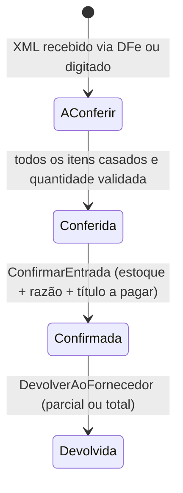
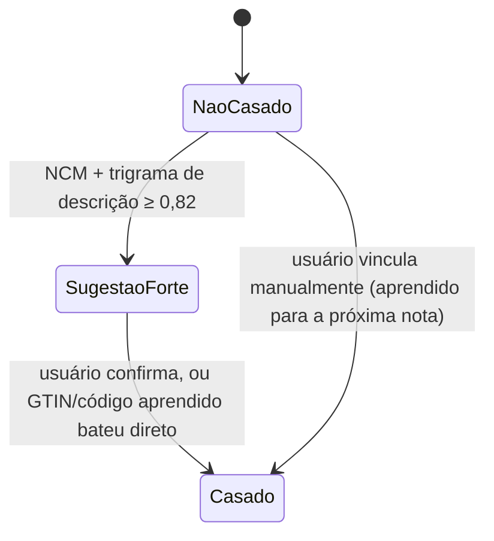

# Módulo Compras

> Da cotação à mercadoria conferida na prateleira, com o custo certo — frete e impostos rateados,
> sem exigir que o comprador redigite uma nota fiscal inteira.

## 1. Escopo

### Faz

- Mantém **cotação** com múltiplos fornecedores e comparação de preço/prazo.
- Mantém **pedido de compra** e seu acompanhamento de recebimento parcial.
- Processa **entrada por XML da NF-e** (via distribuição DFe do `PortaFiscal`) em "A conferir".
- Faz o **casamento de produto em cascata**: GTIN → código do fornecedor aprendido → NCM + trigrama
  de descrição → vínculo manual (que o sistema aprende e nunca mais pergunta).
- **Rateia** frete, seguro e despesas acessórias no custo unitário de cada item da nota.
- Processa **conferência** (quantidade recebida × pedida) e **devolução ao fornecedor**.

### Não faz

- **Não guarda saldo nem calcula custo médio.** Confirmar a entrada é um comando que chama
  `estoque.RegistrarEntrada`; o custo médio pós-entrada é responsabilidade de `estoque`.
- **Não assina nem transmite XML.** Recebe o XML já autorizado via `PortaFiscal::baixar_xml`; emissão
  e assinatura são do provedor externo (ver [doc 10](../10-modulo-fiscal.md)).
- **Não paga o fornecedor.** Confirmar a entrada gera o `Titulo` a pagar por evento; a baixa é do
  `financeiro`.
- **Não decide o que comprar.** A sugestão de ponto de pedido vem de `estoque`; `compras` só
  transforma a sugestão (ou uma decisão manual) em cotação/pedido.

## 2. Submódulos

| id | nome | essencial | depende de | o que some da UI quando desligado |
|---|---|---|---|---|
| `pedido_compra` | Pedido de Compra | sim | — | Não pode ser desligado: é o agregado central. |
| `cotacao` | Cotação | não | `pedido_compra` | Etapa de cotação some; pedido é criado direto. |
| `entrada_xml` | Entrada por XML | não | `pedido_compra` | Só entrada manual digitada fica disponível. |
| `casamento_produto` | Casamento Automático | não | `entrada_xml` | Toda linha de nota exige vínculo manual, sempre. |
| `rateio` | Rateio de Despesas | não | `entrada_xml` | Frete/seguro somem do custo; ficam como despesa avulsa. |
| `devolucao` | Devolução ao Fornecedor | não | `entrada_xml` | Botão "Devolver" some da nota confirmada. |

## 3. Entidades

| Entidade | Campos principais | Observações |
|---|---|---|
| **Cotacao** | `id`, `empresa`, `data`, `estado`(`Aberta`,`Recebida`,`Decidida`,`Cancelada`), `fornecedor_vencedor` | |
| **ItemCotacao** | `id`, `cotacao`, `fornecedor`, `produto`, `quantidade`(Quantidade), `preco_unitario`(Preco), `prazo_entrega_dias`(Quantidade inteiro) | uma linha por fornecedor × produto cotado |
| **PedidoCompra** | `id`, `empresa`, `fornecedor`, `cotacao_origem`, `data`, `previsao_entrega`(Data), `condicao_pagamento`, `estado`(`Rascunho`,`Enviado`,`ParcialmenteRecebido`,`Recebido`,`Cancelado`), `total`(Dinheiro), `versao` | |
| **ItemPedidoCompra** | `id`, `pedido_compra`, `produto`, `quantidade`(Quantidade), `preco_unitario`(Preco), `quantidade_recebida`(Quantidade) | |
| **NotaEntrada** | `id`, `empresa`, `fornecedor`, `pedido_compra_origem`, `chave_acesso`(String, 44 dígitos), `numero`, `serie`, `data_emissao`(Data), `valor_produtos`, `valor_frete`, `valor_seguro`, `valor_outras_despesas`, `valor_total`(Dinheiro), `estado`(`AConferir`,`Conferida`,`Confirmada`,`Devolvida`), `versao` | |
| **ItemNotaEntrada** | `id`, `nota_entrada`, `produto_casado`, `codigo_fornecedor`, `descricao_fornecedor`, `ncm`, `quantidade`(Quantidade), `valor_unitario`(Preco), `valor_rateio`(Dinheiro), `custo_final_unitario`(Preco), `estado_casamento`(`NaoCasado`,`SugestaoForte`,`Casado`) | `custo_final_unitario` já inclui o rateio |
| **RegraCasamentoAprendida** | `empresa`, `fornecedor`, `codigo_fornecedor`, `produto`, `aprendido_em`(Instante) | `PRIMARY KEY(empresa, fornecedor, codigo_fornecedor)` |
| **DevolucaoFornecedor** | `id`, `empresa`, `nota_entrada_origem`, `fornecedor`, `data`, `motivo`, `valor_total`(Dinheiro), `estado`(`Solicitada`,`Concluida`) | |

## 4. Máquinas de estado





## 5. Comandos

| Comando | Permissão | Risco | O que faz | Erros possíveis |
|---|---|---|---|---|
| `CriarCotacao` | `compras.cotacao.criar` | Baixo | | — |
| `RegistrarPropostaFornecedor` | `compras.cotacao.editar` | Baixo | | `CotacaoDecidida` |
| `DecidirCotacao` | `compras.cotacao.decidir` | Médio | Marca vencedor, sugere `PedidoCompra` | — |
| `CriarPedidoCompra` | `compras.pedido.criar` | Baixo | | — |
| `ImportarNotaEntrada` | `compras.entrada.importar` | Baixo | Baixa XML via `PortaFiscal`, roda casamento em cascata | `ChaveJaImportada`, `XmlInvalido` |
| `VincularProdutoManual` | `compras.entrada.conferir` | Baixo | Casa a linha e grava `RegraCasamentoAprendida` | — |
| `RatearDespesas` | `compras.entrada.conferir` | Baixo | Distribui frete/seguro/outras por valor ou por peso, sem perder centavo | `ReferenciaInvalida` |
| `ConferirQuantidade` | `compras.entrada.conferir` | Baixo | Compara com `ItemPedidoCompra.quantidade` | `QuantidadeDivergente` (aviso) |
| `ConfirmarEntrada` | `compras.entrada.confirmar` | Alto | `estoque.RegistrarEntrada` por item + `Lancamento` + publica evento | `ItemNaoCasado`, `NotaJaConfirmada` |
| `DevolverAoFornecedor` | `compras.devolucao.criar` | Alto | Estorna proporcionalmente estoque e razão | `ValorSuperaOriginal` |

## 6. Consultas

| Consulta | Permissão | Uso na UI | Índice que a sustenta |
|---|---|---|---|
| `NotasAConferir` | `compras.entrada.ver` | Fila "4 notas para conferir" no Pulso | `compras_nota_entrada(empresa, estado)` |
| `CotacoesAbertas` | `compras.cotacao.ver` | Painel de cotação | `compras_cotacao(empresa, estado)` |
| `PedidosPendentesDeRecebimento` | `compras.pedido.ver` | Painel de recebimento | `compras_pedido_compra(empresa, estado)` |
| `SugestaoDeCasamento` | `compras.entrada.conferir` | Tela de conferência | `compras_regra_casamento(fornecedor, codigo_fornecedor)` |

## 7. Receituário contábil

| Evento de negócio | Débito | Crédito | Estado |
|---|---|---|---|
| Confirmação de entrada (NF de compra) | Estoque (1.3.01) | Fornecedores (2.1.01) | Confirmado |
| Frete/seguro/outras despesas rateados | Estoque (já embutido no custo unitário) | Fornecedores/Caixa (conforme quem cobrou) | Confirmado |
| Crédito de ICMS/PIS/COFINS na compra | Impostos a recuperar (1.2.05) | Estoque | Confirmado |
| Devolução ao fornecedor (nota ainda não paga) | Fornecedores | Estoque | Confirmado (estorno proporcional) |
| Devolução ao fornecedor (nota já paga) | Adiantamentos a fornecedores (1.2.04) | Estoque | Realizado |

## 8. Eventos

**Publicados:** `compras.nota_confirmada.v1` (assinado por `financeiro`, que gera o `Titulo` a
pagar), `compras.entrada_a_conferir.v1`, `compras.devolucao_concluida.v1`.

**Assinados:** `estoque.abaixo_ponto_pedido.v1` → sugere criação de cotação/pedido no radar.

## 9. Permissões

| Chave | Descrição | Risco |
|---|---|---|
| `compras.cotacao.ver` / `.criar` / `.editar` / `.decidir` | Ciclo de cotação | Baixo/Baixo/Baixo/Médio |
| `compras.pedido.ver` / `.criar` | Pedido de compra | Baixo |
| `compras.entrada.ver` / `.importar` / `.conferir` | Entrada de nota | Baixo |
| `compras.entrada.confirmar` | Confirmar entrada (gera estoque e título) | Alto |
| `compras.devolucao.criar` | Devolver ao fornecedor | Alto |

## 10. Telas

```
┌───────────────────────────────────────────────────────────────────────────────────────┐
│  Conferência · NF 45.982 · Distribuidora Alfa                     [F2 Confirmar entrada]│
├──────────────────┬──────────────────────────┬─────────┬────────────┬──────────────────┤
│ Código fornecedor │ Descrição (nota)          │  Qtd    │ Casamento  │ Custo final      │
├──────────────────┼──────────────────────────┼─────────┼────────────┼──────────────────┤
│ REF-8821          │ REFRIG COLA PET 2L         │  120 UN │ ✓ Casado   │      4,32        │
│ REF-8822          │ REFRIG GUARANA PET 2L      │   60 UN │ 🟡 91% Guaraná 2L  [confirmar]│
│ NOVO-001          │ ENERGETICO LATA 250ML      │  200 UN │ ⚠ sem correspondência [vincular]│
├──────────────────┴──────────────────────────┴─────────┴────────────┴──────────────────┤
│  Frete: R$ 180,00 · rateado por valor           Total da nota: R$ 3.400,00            │
└───────────────────────────────────────────────────────────────────────────────────────┘
```

## 11. Regras de negócio críticas

1. **`ConfirmarEntrada` recusa nota com item ainda `NaoCasado`.** Toda linha precisa apontar para um
   `Produto` antes de virar estoque — impede lançar "REF-8821" como se fosse um SKU.
2. **Vínculo manual é aprendido e nunca mais perguntado** para o mesmo fornecedor + código —
   `RegraCasamentoAprendida` é consultada antes de qualquer heurística de similaridade.
3. **Rateio de frete nunca perde centavo.** Usa `Dinheiro::ratear` proporcional ao valor (ou peso,
   quando configurado) de cada item.
4. **Nota confirmada é imutável; correção é devolução.** Mesma regra do razão — nada de `UPDATE` em
   nota já confirmada.
5. **Chave de acesso é única por empresa.** Reimportar a mesma NF-e (`ImportarNotaEntrada`) é
   idempotente — nunca duplica entrada.

## 12. Comportamento offline

**Funciona:** consultar pedidos e notas já sincronizados; conferir quantidade recebida contra o
pedido local.
**Não funciona:** importar XML via DFe (depende de rede e do provedor fiscal), confirmar entrada
(prefere coordenação com o servidor para não duplicar custo médio em corrida), devolução ao
fornecedor.
**Conflito na reconciliação:** confirmação de entrada é sempre coordenada pelo servidor — não há
caminho de `ConfirmarEntrada` em modo autônomo, então não há conflito possível nesse comando.

## 13. Tabelas

```sql
CREATE TABLE compras_cotacao (
    id        BLOB PRIMARY KEY,
    empresa   BLOB    NOT NULL,
    data      INTEGER NOT NULL,
    estado    TEXT    NOT NULL CHECK (estado IN ('Aberta','Recebida','Decidida','Cancelada')),
    fornecedor_vencedor BLOB
) STRICT;

CREATE TABLE compras_item_cotacao (
    id                    BLOB PRIMARY KEY,
    cotacao               BLOB    NOT NULL REFERENCES compras_cotacao(id),
    fornecedor            BLOB    NOT NULL,
    produto               BLOB    NOT NULL,
    quantidade            INTEGER NOT NULL,
    preco_unitario        INTEGER NOT NULL,
    prazo_entrega_dias    INTEGER NOT NULL
) STRICT;

CREATE TABLE compras_pedido_compra (
    id                   BLOB PRIMARY KEY,
    empresa              BLOB    NOT NULL,
    fornecedor           BLOB    NOT NULL,
    cotacao_origem       BLOB REFERENCES compras_cotacao(id),
    data                 INTEGER NOT NULL,
    previsao_entrega     INTEGER,
    condicao_pagamento   BLOB    NOT NULL,
    estado               TEXT    NOT NULL CHECK (estado IN ('Rascunho','Enviado','ParcialmenteRecebido','Recebido','Cancelado')),
    total                INTEGER NOT NULL DEFAULT 0,
    versao               INTEGER NOT NULL DEFAULT 1
) STRICT;
CREATE INDEX compras_pedido_estado ON compras_pedido_compra(empresa, estado);

CREATE TABLE compras_item_pedido_compra (
    id                    BLOB PRIMARY KEY,
    pedido_compra         BLOB    NOT NULL REFERENCES compras_pedido_compra(id),
    produto               BLOB    NOT NULL,
    quantidade            INTEGER NOT NULL,
    preco_unitario        INTEGER NOT NULL,
    quantidade_recebida   INTEGER NOT NULL DEFAULT 0
) STRICT;

CREATE TABLE compras_nota_entrada (
    id                    BLOB PRIMARY KEY,
    empresa               BLOB    NOT NULL,
    fornecedor            BLOB    NOT NULL,
    pedido_compra_origem  BLOB REFERENCES compras_pedido_compra(id),
    chave_acesso          TEXT,
    numero                TEXT    NOT NULL,
    serie                 TEXT    NOT NULL,
    data_emissao          INTEGER NOT NULL,
    valor_produtos        INTEGER NOT NULL,
    valor_frete           INTEGER NOT NULL DEFAULT 0,
    valor_seguro          INTEGER NOT NULL DEFAULT 0,
    valor_outras_despesas INTEGER NOT NULL DEFAULT 0,
    valor_total           INTEGER NOT NULL,
    estado                TEXT    NOT NULL CHECK (estado IN ('AConferir','Conferida','Confirmada','Devolvida')),
    versao                INTEGER NOT NULL DEFAULT 1,
    UNIQUE (empresa, chave_acesso)
) STRICT;
CREATE INDEX compras_nota_estado ON compras_nota_entrada(empresa, estado);

CREATE TABLE compras_item_nota_entrada (
    id                     BLOB PRIMARY KEY,
    nota_entrada           BLOB    NOT NULL REFERENCES compras_nota_entrada(id),
    produto_casado         BLOB,
    codigo_fornecedor      TEXT    NOT NULL,
    descricao_fornecedor   TEXT    NOT NULL,
    ncm                    TEXT    NOT NULL,
    quantidade             INTEGER NOT NULL,
    valor_unitario         INTEGER NOT NULL,
    valor_rateio           INTEGER NOT NULL DEFAULT 0,
    custo_final_unitario   INTEGER,
    estado_casamento       TEXT    NOT NULL CHECK (estado_casamento IN ('NaoCasado','SugestaoForte','Casado'))
) STRICT;
CREATE INDEX compras_item_nota_casamento ON compras_item_nota_entrada(nota_entrada, estado_casamento);

CREATE TABLE compras_regra_casamento (
    empresa           BLOB    NOT NULL,
    fornecedor        BLOB    NOT NULL,
    codigo_fornecedor TEXT    NOT NULL,
    produto           BLOB    NOT NULL,
    aprendido_em      INTEGER NOT NULL,
    PRIMARY KEY (empresa, fornecedor, codigo_fornecedor)
) STRICT, WITHOUT ROWID;

CREATE TABLE compras_devolucao_fornecedor (
    id                   BLOB PRIMARY KEY,
    empresa              BLOB    NOT NULL,
    nota_entrada_origem  BLOB    NOT NULL REFERENCES compras_nota_entrada(id),
    fornecedor           BLOB    NOT NULL,
    data                 INTEGER NOT NULL,
    motivo               TEXT    NOT NULL,
    valor_total          INTEGER NOT NULL,
    estado               TEXT    NOT NULL CHECK (estado IN ('Solicitada','Concluida'))
) STRICT;
```
