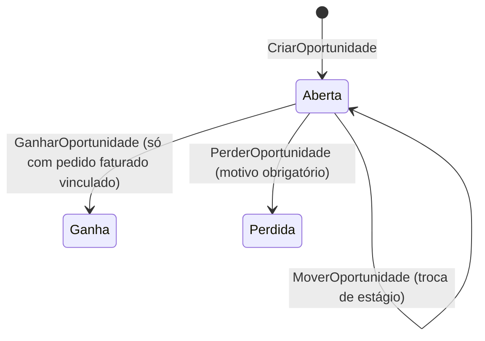

# Módulo CRM

> O funil de vendas e o histórico unificado do cliente — construído sobre eventos dos módulos que
> realmente vendem, nunca uma segunda fonte de verdade sobre o que foi vendido.

## 1. Escopo

### Faz

- Mantém **funil** com estágios configuráveis e **oportunidade** com valor estimado e probabilidade.
- Mantém **atividade** (ligação, reunião, e-mail, tarefa) vinculada a cliente ou oportunidade.
- Constrói o **histórico unificado do cliente** — uma linha do tempo somente leitura, alimentada por
  eventos de `vendas`, `os`, `alugueis`, `hotelaria` e do próprio CRM.
- Acompanha **metas** de vendedor e de empresa, comparando meta contra realizado (via evento).

### Não faz

- **Não lança dinheiro.** Nenhum comando de `crm` produz `Lancamento`. Ver §7.
- **Não vende.** Uma oportunidade "ganha" não fatura nada sozinha — ela fecha *porque* um pedido foi
  faturado em `vendas` (ou serviço em `os`), nunca o contrário.
- **Não é o cadastro de pessoa.** Cliente e vendedor são referências a `clientes_pessoa`; CRM não
  duplica nome, documento nem contato.
- **Não define preço, comissão ou desconto.** Isso é de `vendas`.

## 2. Submódulos

| id | nome | essencial | depende de | o que some da UI quando desligado |
|---|---|---|---|---|
| `funil` | Funil e Oportunidade | sim | — | Não pode ser desligado: é o núcleo do módulo. |
| `atividade` | Atividades | não | — | Agenda de ligações/tarefas some da ficha do cliente. |
| `historico` | Histórico Unificado | não | — | Aba "Histórico" da ficha do cliente volta a mostrar só o que `clientes` sabe. |
| `metas` | Metas | não | `funil` | Painel de metas some do menu. |

## 3. Entidades

| Entidade | Campos principais | Observações |
|---|---|---|
| **Funil** | `id`, `empresa`, `nome`, `ativo` | uma empresa pode ter mais de um funil (ex.: "Novos clientes", "Recompra") |
| **EstagioFunil** | `id`, `funil`, `nome`, `ordem`(Quantidade inteiro), `probabilidade_padrao`(Percentual) | |
| **Oportunidade** | `id`, `empresa`, `funil`, `estagio`, `cliente`, `vendedor`, `titulo`(String), `valor_estimado`(Dinheiro), `probabilidade`(Percentual), `data_prevista_fechamento`(Data), `estado`(`Aberta`,`Ganha`,`Perdida`), `motivo_perda`, `versao` | |
| **Atividade** | `id`, `empresa`, `oportunidade`, `cliente`, `tipo`(`Ligacao`,`Reuniao`,`Email`,`Tarefa`), `assunto`(String), `data_hora`(Instante), `concluida`(enum), `responsavel` | `oportunidade` opcional — atividade pode ser só de relacionamento |
| **InteracaoHistorico** | `id`, `cliente`, `tipo`(`Compra`,`Servico`,`Atividade`,`Reclamacao`), `origem_modulo`, `origem_id`, `data`(Data), `resumo`(String), `valor`(Dinheiro nulo) | append-only, populada só por evento — nunca por comando de usuário |
| **Meta** | `id`, `empresa`, `vendedor` (nulo = meta da empresa), `periodo_de`/`periodo_ate`(Data), `valor_meta`(Dinheiro), `valor_realizado`(Dinheiro) | `valor_realizado` é somado a partir de `vendas.pedido_faturado.v1`, nunca digitado |

## 4. Máquinas de estado



## 5. Comandos

| Comando | Permissão | Risco | O que faz | Erros possíveis |
|---|---|---|---|---|
| `CriarFunil` / `CriarEstagioFunil` | `crm.funil.gerenciar` | Baixo | | `NomeDuplicado` |
| `CriarOportunidade` | `crm.oportunidade.criar` | Baixo | | — |
| `MoverOportunidade` | `crm.oportunidade.mover` | Baixo | Troca de estágio, ajusta probabilidade sugerida | `OportunidadeFechada` |
| `GanharOportunidade` | `crm.oportunidade.ganhar` | Médio | Só aceita se houver `origem_id` de pedido faturado vinculado | `SemPedidoVinculado` |
| `PerderOportunidade` | `crm.oportunidade.perder` | Baixo | Exige `motivo_perda` | `MotivoObrigatorio` |
| `CriarAtividade` | `crm.atividade.criar` | Baixo | | — |
| `ConcluirAtividade` | `crm.atividade.concluir` | Baixo | | `AtividadeJaConcluida` |
| `DefinirMeta` | `crm.meta.definir` | Médio | | `PeriodoSobreposto` |

## 6. Consultas

| Consulta | Permissão | Uso na UI | Índice que a sustenta |
|---|---|---|---|
| `OportunidadesPorFunil` | `crm.oportunidade.ver` | Kanban do funil | `crm_oportunidade(funil, estagio)` |
| `AtividadesDoDia` | `crm.atividade.ver` | "Exige ação hoje" do vendedor | `crm_atividade(responsavel, data_hora)` |
| `HistoricoUnificadoDoCliente` | `crm.historico.ver` | Aba "Histórico" da ficha do cliente | `crm_interacao_historico(cliente, data DESC)` |
| `ApuracaoDeMeta` | `crm.meta.ver` | Painel de metas | `crm_meta(vendedor, periodo_de)` |

## 7. Receituário contábil

**Este módulo não lança dinheiro.** Nenhum comando de `crm` produz `Lancamento`. A relação com o
financeiro é sempre por evento, numa única direção:

| Direção | Mecanismo | O que acontece |
|---|---|---|
| `vendas`/`os`/`alugueis` → `crm` | Assina `vendas.pedido_faturado.v1`, `os.ordem_faturada.v1`, `alugueis.fatura_gerada.v1` (quando os módulos correspondentes estão ativos) | Grava `InteracaoHistorico`, tenta `GanharOportunidade` automaticamente se havia oportunidade aberta para aquele cliente, soma em `Meta.valor_realizado` |
| `financeiro` → `crm` | *(não assina)* | Score de crédito e inadimplência pertencem a `clientes`, não a `crm` — ver `clientes.md` §7 |

Se o produto um dia quiser um "valor de pipeline ponderado" na DRE gerencial, a decisão de lançar
algo caberia ao `financeiro`, nunca ao `crm` — pipeline é expectativa, não fato, e o Razão só
registra fato (`Confirmado`/`Realizado`) ou, no máximo, previsão explícita via `Recorrencia`
(ver [doc 05 §3.4](../05-nucleo-financeiro.md#34-estados-o-que-faz-a-projeção-funcionar)).

## 8. Eventos

**Publicados:** `crm.oportunidade_criada.v1`, `crm.oportunidade_ganha.v1`, `crm.oportunidade_perdida.v1`,
`crm.atividade_criada.v1`.

**Assinados:** `vendas.pedido_faturado.v1`, `os.ordem_faturada.v1`, `alugueis.fatura_gerada.v1`,
`clientes.pessoa_criada.v1` (para sugerir a primeira atividade de boas-vindas).

## 9. Permissões

| Chave | Descrição | Risco |
|---|---|---|
| `crm.funil.gerenciar` | Criar/editar funil e estágios | Médio |
| `crm.oportunidade.ver` / `.criar` / `.mover` | Ciclo de oportunidade | Baixo |
| `crm.oportunidade.ganhar` / `.perder` | Fechar oportunidade | Médio/Baixo |
| `crm.atividade.ver` / `.criar` / `.concluir` | Ciclo de atividade | Baixo |
| `crm.historico.ver` | Ver histórico unificado | Baixo |
| `crm.meta.ver` / `.definir` | Metas | Baixo/Médio |

## 10. Telas

```
┌───────────────────────────────────────────────────────────────────────────────────────┐
│  Funil · Novos Clientes                                          [Ctrl+N Oportunidade]│
├─────────────────┬─────────────────┬─────────────────┬─────────────────────────────────┤
│ Contato (4)      │ Proposta (2)     │ Negociação (1)   │ Ganhas este mês (7)             │
│ R$ 12.400        │ R$ 8.900         │ R$ 3.100         │ R$ 22.750                       │
├─────────────────┼─────────────────┼─────────────────┼─────────────────────────────────┤
│ Padaria Sol      │ Mercado Sul       │ Distrib. Vale    │                                 │
│ R$ 3.200 · 20%   │ R$ 5.400 · 50%    │ R$ 3.100 · 80%   │                                 │
└─────────────────┴─────────────────┴─────────────────┴─────────────────────────────────┘
```

## 11. Regras de negócio críticas

1. **Oportunidade só é "ganha" com um pedido faturado de verdade vinculado.** Não existe fechar
   oportunidade só editando um valor — o CRM segue o fato, nunca o antecipa.
2. **`InteracaoHistorico` nunca é editada nem criada por comando de usuário.** É sempre efeito de
   evento — a integridade da linha do tempo depende disso.
3. **Perder oportunidade sempre exige motivo.** É o dado mais valioso do funil para o dono entender
   por que perde vendas.
4. **`Meta.valor_realizado` nunca é digitado.** Editar a meta é editar o alvo (`valor_meta`); o
   realizado é sempre soma de evento.

## 12. Comportamento offline

**Funciona:** criar e mover oportunidade, criar e concluir atividade — tudo fica pendente de
sincronização como qualquer comando de escrita.
**Não funciona:** `GanharOportunidade` automática por evento (o evento de faturamento só chega depois
da reconciliação); ver histórico unificado atualizado com dados de outros terminais.
**Conflito na reconciliação:** sem conflito estrutural — `InteracaoHistorico` é só-adição por evento,
e mover oportunidade de estágio usa bloqueio otimista padrão (`versao`), com a UI de conflito do
[doc 03 §4.1](../03-pilar-resiliencia.md#41-bloqueio-otimista-padrão) quando dois vendedores mexem na
mesma oportunidade ao mesmo tempo.

## 13. Tabelas

```sql
CREATE TABLE crm_funil (
    id       BLOB PRIMARY KEY,
    empresa  BLOB    NOT NULL,
    nome     TEXT    NOT NULL,
    ativo    INTEGER NOT NULL DEFAULT 1 CHECK (ativo IN (0,1))
) STRICT;

CREATE TABLE crm_estagio_funil (
    id                   BLOB PRIMARY KEY,
    funil                BLOB    NOT NULL REFERENCES crm_funil(id),
    nome                 TEXT    NOT NULL,
    ordem                INTEGER NOT NULL,
    probabilidade_padrao INTEGER NOT NULL   -- Percentual, escala 1e-6
) STRICT;

CREATE TABLE crm_oportunidade (
    id                        BLOB PRIMARY KEY,
    empresa                   BLOB    NOT NULL,
    funil                     BLOB    NOT NULL REFERENCES crm_funil(id),
    estagio                   BLOB    NOT NULL REFERENCES crm_estagio_funil(id),
    cliente                   BLOB    NOT NULL,
    vendedor                  BLOB    NOT NULL,
    titulo                    TEXT    NOT NULL,
    valor_estimado            INTEGER NOT NULL,
    probabilidade             INTEGER NOT NULL,
    data_prevista_fechamento  INTEGER,
    estado                    TEXT    NOT NULL CHECK (estado IN ('Aberta','Ganha','Perdida')),
    motivo_perda              TEXT,
    versao                    INTEGER NOT NULL DEFAULT 1
) STRICT;
CREATE INDEX crm_oportunidade_funil ON crm_oportunidade(funil, estagio) WHERE estado = 'Aberta';
CREATE INDEX crm_oportunidade_cliente ON crm_oportunidade(cliente);

CREATE TABLE crm_atividade (
    id             BLOB PRIMARY KEY,
    empresa        BLOB    NOT NULL,
    oportunidade   BLOB REFERENCES crm_oportunidade(id),
    cliente        BLOB    NOT NULL,
    tipo           TEXT    NOT NULL CHECK (tipo IN ('Ligacao','Reuniao','Email','Tarefa')),
    assunto        TEXT    NOT NULL,
    data_hora      INTEGER NOT NULL,
    concluida      INTEGER NOT NULL DEFAULT 0 CHECK (concluida IN (0,1)),
    responsavel    BLOB    NOT NULL
) STRICT;
CREATE INDEX crm_atividade_responsavel ON crm_atividade(responsavel, data_hora) WHERE concluida = 0;

CREATE TABLE crm_interacao_historico (
    id             BLOB PRIMARY KEY,
    empresa        BLOB    NOT NULL,
    cliente        BLOB    NOT NULL,
    tipo           TEXT    NOT NULL CHECK (tipo IN ('Compra','Servico','Atividade','Reclamacao')),
    origem_modulo  TEXT    NOT NULL,
    origem_id      BLOB,
    data           INTEGER NOT NULL,
    resumo         TEXT    NOT NULL,
    valor          INTEGER
) STRICT;
CREATE INDEX crm_historico_cliente ON crm_interacao_historico(cliente, data DESC);

CREATE TABLE crm_meta (
    id               BLOB PRIMARY KEY,
    empresa          BLOB    NOT NULL,
    vendedor         BLOB,
    periodo_de       INTEGER NOT NULL,
    periodo_ate      INTEGER NOT NULL,
    valor_meta       INTEGER NOT NULL,
    valor_realizado  INTEGER NOT NULL DEFAULT 0,
    UNIQUE (empresa, vendedor, periodo_de)
) STRICT;
```
