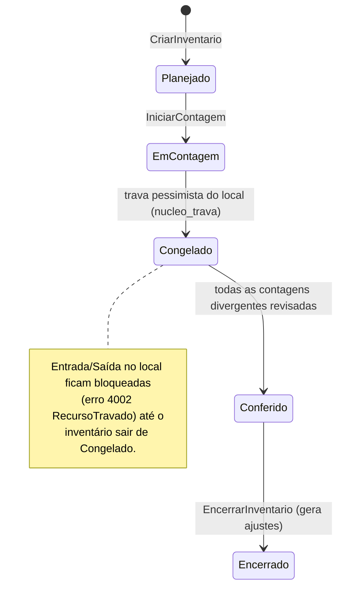
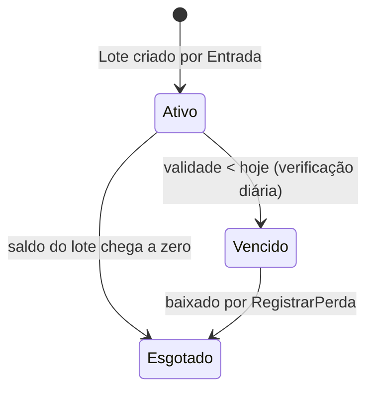

# Módulo Estoque

> A verdade física do que existe, onde existe e quanto custou — para toda venda, compra, produção ou
> serviço que consome mercadoria.

## 1. Escopo

### Faz

- Mantém o cadastro de **Produto**, variações de grade (cor/tamanho), códigos de barras e unidades
  de medida com conversão.
- Mantém **saldo por local** (loja, depósito, filial, tanque), separando disponível de reservado.
- Calcula o **custo médio ponderado móvel** a cada entrada.
- Controla **lote e validade** quando o produto exige rastreabilidade.
- Executa **inventário** com contagem cega e congelamento de movimentação da seção contada.
- Executa **transferência entre locais/filiais**, com estoque em trânsito.
- Mantém o **perfil tributário** por grupo de produto (estimativa local; a SEFAZ, via `PortaFiscal`,
  é a autoridade no momento da emissão — ver [doc 10 §6](../10-modulo-fiscal.md#6-tributação)).
- Calcula **ponto de pedido** e **curva ABC** por consumo histórico.

### Não faz

- **Não vende.** Reserva e consome saldo a pedido de `vendas`/`pdv`/`os`/`industria`, mas não decide
  preço, desconto nem forma de pagamento.
- **Não compra.** Recebe entradas por comando de `compras` (entrada por XML) ou lançamento manual,
  mas cotação, pedido de compra e negociação com fornecedor são de `compras`.
- **Não lança CMV.** O módulo que consome o estoque (venda, OS, produção) é quem conhece a
  contrapartida certa (Receita de vendas, Custo de serviço, Produtos em processo) e posta o
  lançamento na própria transação, usando o `custo_medio` que este módulo devolve. Ver §7.
- **Não emite nota fiscal.** Perfil tributário aqui é estimativa de tela; cálculo oficial é da API
  fiscal.
- **Não conhece o motivo de negócio da retirada.** Movimento de saída sempre carrega `origem_modulo`
  e `origem_id`, mas o "porquê" comercial vive no módulo de origem.

## 2. Submódulos

| id | nome | essencial | depende de | o que some da UI quando desligado |
|---|---|---|---|---|
| `saldo` | Saldo e Movimento | sim | — | Não pode ser desligado: é a base de tudo no módulo. |
| `custo_medio` | Custo Médio | sim | `saldo` | Sem ele o sistema não sabe o CMV — obrigatório para qualquer módulo que venda. |
| `lote` | Lote | não | `saldo` | Campo "Lote" some de entrada, saída e etiqueta. |
| `validade` | Validade | não | `lote` | Coluna "Vence em" e alerta de vencimento somem. |
| `inventario` | Inventário | não | `saldo` | Menu "Inventário" some. |
| `transferencia` | Transferência entre Locais | não | `multi_local` | Botão "Transferir" some da ficha do produto. |
| `multi_local` | Múltiplos Locais | não | `saldo` | Saldo deixa de ser por local; vira um único saldo por empresa. |
| `tanques` | Tanques (posto) | não | `saldo` | Tela de medição de tanque e aferição por régua somem. |
| `grade` | Grade (cor/tamanho) | não | `saldo` | Produto perde a aba "Variações"; vira SKU único. |

## 3. Entidades

### Produto

| Campo | Tipo | Obrigatório | Regra |
|---|---|---|---|
| `id` | Id | sim | |
| `empresa` | Id | sim | |
| `grupo_produto` | Id | sim | referencia `GrupoProduto` |
| `nome` | String | sim | |
| `ncm` | String | sim | 8 dígitos |
| `cest` | String | não | obrigatório se o NCM exige ST |
| `controla_grade` | enum(`Sim`,`Nao`) | sim | se `Sim`, saldo vive em `Variacao` |
| `controla_lote` | enum(`Sim`,`Nao`) | sim | |
| `controla_validade` | enum(`Sim`,`Nao`) | sim | exige `controla_lote = Sim` |
| `unidade_padrao` | Id | sim | referencia `Unidade` |
| `ponto_pedido` | Quantidade | não | dispara alerta no Pulso quando saldo disponível cruza abaixo |
| `estoque_minimo` / `estoque_maximo` | Quantidade | não | usados na curva ABC e sugestão de compra |
| `fabricante` | String | não | quem fabrica a peça, não quem vende (§5 — cadastro técnico, 2026-09-11) |
| `codigo_fabricante` | String | não | MPN — o part number que bate com o datasheet, diferente do código de barras |
| `categoria_tecnica` | String | não | etiqueta livre de bancada ("IC", "capacitor", "tela", "bateria", "fonte") — não substitui `grupo_produto` |
| `especificacao_tecnica` | String | não | resumo de datasheet em texto livre (tensão, corrente, pinagem…), sem parser |
| `compatibilidade` | String | não | em quais aparelhos/modelos a peça serve, texto livre |
| `garantia_fornecedor_dias` | Quantidade (inteiro) | não | garantia do fornecedor sobre a peça — diferente da garantia que a assistência dá ao cliente |
| `localizacao_fisica` | String | não | prateleira/gaveta — ajuda no balcão |
| `ativo` | enum(`Sim`,`Nao`) | sim | |
| `versao` | Quantidade (inteiro) | sim | |

### Variacao

| Campo | Tipo | Obrigatório | Regra |
|---|---|---|---|
| `id` | Id | sim | |
| `produto` | Id | sim | só existe se `produto.controla_grade = Sim` |
| `cor` | String | não | |
| `tamanho` | String | não | |
| `sku` | String | sim | único dentro do produto |
| `ativo` | enum(`Sim`,`Nao`) | sim | |

### CodigoBarras

| Campo | Tipo | Obrigatório | Regra |
|---|---|---|---|
| `id` | Id | sim | |
| `produto` | Id | sim | |
| `variacao` | Id | não | |
| `gtin` | String | sim | validado por dígito verificador quando tem 8/12/13/14 dígitos |
| `unidade` | Id | sim | a que esse código representa (ex.: caixa com 12 unidades) |
| `UNIQUE(empresa, gtin)` | | | um GTIN nunca aponta para dois produtos |

### Unidade / Conversao

| Campo | Tipo | Obrigatório | Regra |
|---|---|---|---|
| **Unidade** `id`, `sigla`, `nome`, `fracionavel` | Id/String/String/enum | sim | "UN", "KG", "CX", "L" |
| **Conversao** `produto`, `unidade_origem`, `unidade_destino`, `fator` | Id/Id/Id/Quantidade | sim | ex.: 1 CX = 12 UN → `fator = 12,0000` |

### Local

| Campo | Tipo | Obrigatório | Regra |
|---|---|---|---|
| `id` | Id | sim | |
| `empresa` | Id | sim | |
| `nome` | String | sim | "Loja", "Depósito", "Tanque 1" |
| `tipo` | enum(`Loja`,`Deposito`,`Filial`,`Tanque`,`EmTransito`) | sim | `EmTransito` é local técnico para transferência |
| `ativo` | enum(`Sim`,`Nao`) | sim | |

### SaldoLocal

| Campo | Tipo | Obrigatório | Regra |
|---|---|---|---|
| `id` | Id | sim | |
| `produto` | Id | sim | |
| `variacao` | Id | não | sentinela de blob vazio quando `controla_grade = Nao` (ver §13) |
| `local` | Id | sim | |
| `quantidade_disponivel` | Quantidade | sim | pode ficar negativa (ver §11, regra 2) |
| `quantidade_reservada` | Quantidade | sim | nunca negativa |
| `custo_medio` | Preco | sim | escala 1e-6, recalculado a cada entrada |
| `atualizado_em` | Instante | sim | |
| `versao` | Quantidade (inteiro) | sim | bloqueio otimista — todo `Movimento` faz `UPDATE ... WHERE versao = ?` |

### Movimento

| Campo | Tipo | Obrigatório | Regra |
|---|---|---|---|
| `id` | Id | sim | UUIDv7 — a própria ordem é o log |
| `produto`, `variacao`, `local` | Id | produto/local sim | |
| `tipo` | enum(`Entrada`,`Saida`,`TransferenciaSaida`,`TransferenciaEntrada`,`AjustePositivo`,`AjusteNegativo`,`Reserva`,`LiberacaoReserva`,`Producao`,`Perda`) | sim | |
| `quantidade` | Quantidade | sim | sempre positiva; o sinal do efeito vem do `tipo` |
| `custo_unitario` | Preco | não | obrigatório em `Entrada`/`Producao` |
| `lote` | Id | não | |
| `origem_modulo` | String | sim | "compras", "vendas", "estoque" (ajuste manual)... |
| `origem_id` | Id | não | |
| `lancamento` | Id | não | preenchido quando o próprio `estoque` posta o lançamento (§7) |
| `criado_em` | Instante | sim | |
| `criado_por` | Id | sim | |

### Lote

| Campo | Tipo | Obrigatório | Regra |
|---|---|---|---|
| `id` | Id | sim | |
| `produto` | Id | sim | |
| `numero_lote` | String | sim | |
| `fabricacao` | Data | não | |
| `validade` | Data | não | obrigatório se `produto.controla_validade = Sim` |
| `fornecedor` | Id | não | |
| `quantidade_inicial` | Quantidade | sim | |
| `estado` | enum(`Ativo`,`Vencido`,`Esgotado`) | sim | ver §4 |

### Inventario / ContagemItem

| Campo | Tipo | Obrigatório | Regra |
|---|---|---|---|
| **Inventario** `id`, `local`, `descricao`, `estado`, `iniciado_em`, `encerrado_em`, `criado_por` | Id/Id/String/enum/Instante/Instante/Id | sim exceto `encerrado_em` | ver §4 |
| **ContagemItem** `id`, `inventario`, `produto`, `variacao`, `lote`, `quantidade_sistema`, `quantidade_contada`, `divergencia`, `contado_por`, `contado_em` | Id/Id/Id/Id/Id/Quantidade/Quantidade/Quantidade/Id/Instante | sim exceto variação/lote/contagem | `quantidade_sistema` é congelada no início; `divergencia = contada - sistema` |

### GrupoProduto / PerfilTributario

| Campo | Tipo | Obrigatório | Regra |
|---|---|---|---|
| **GrupoProduto** `id`, `codigo`, `nome`, `pai`, `perfil_tributario`, `margem_sugerida` | Id/String/String/Id/Id/Percentual | sim exceto `pai` | hierárquico, como o plano de contas |
| **PerfilTributario** `id`, `nome`, `origem_mercadoria`, `cst_icms`, `cfop_dentro_uf`, `cfop_fora_uf`, `aliquota_icms`, `reducao_base`, `mva_st`, `cst_pis`, `cst_cofins`, `aliquota_pis`, `aliquota_cofins`, `cest`, `beneficio_fiscal` | Id/String/enum(0..8)/String/String/String/Percentual/Percentual/Percentual/String/String/Percentual/Percentual/String/String | sim exceto `mva_st`, `beneficio_fiscal` | espelha [doc 10 §6](../10-modulo-fiscal.md#6-tributação); estimativa local, autoridade é a API fiscal |

## 4. Máquinas de estado





## 5. Comandos

| Comando | Permissão | Risco | O que faz | Erros possíveis |
|---|---|---|---|---|
| `CriarProduto` ✅ | `estoque.produto.criar` | Baixo | Cria `Produto` + unidade padrão; aceita `codigo_barras` opcional já na criação (valida dígito verificador via `Produto::com_codigo_barras`) e `detalhes_tecnicos` opcional (fabricante, MPN, categoria técnica, especificação, compatibilidade, garantia do fornecedor, localização física — 2026-09-11) | `NcmInvalido`, `GtinInvalido` |
| `EditarDetalhesTecnicosProduto` ✅ (novo, 2026-09-11) | `estoque.produto.editar` | Baixo | Edita depois os sete campos técnicos opcionais (substitui por completo — campo não informado vira `None`); não toca nome/NCM/código de barras | — |
| `CriarVariacao` | `estoque.produto.criar` | Baixo | Ainda não implementado | `ProdutoSemGrade` |
| `DefinirCodigoBarras` | `estoque.produto.editar` | Baixo | Ainda não implementado como comando de edição separado — hoje só se define na criação (`CriarProduto`); não há `EditarProduto` de nome/NCM nesta fatia | `GtinDuplicado`, `DigitoInvalido` |
| `CriarLocal` ✅ | `estoque.local.criar` | Baixo | | `NomeDuplicado` |
| `RegistrarEntrada` ✅ | `estoque.movimento.entrada` | Baixo | Cria `Movimento Entrada`, recalcula custo médio | `QuantidadeInvalida` |
| `RegistrarSaida` ✅ | `estoque.movimento.saida` | Médio | Cria `Movimento Saida`, decrementa disponível | `SaldoInsuficiente` (aviso, não bloqueia por padrão — ver regra 2) |
| `ReservarEstoque` | (consulta síncrona de `vendas`, sem permissão de usuário direta) | Baixo | Ainda não implementado | `SaldoInsuficiente` |
| `LiberarReserva` | idem | Baixo | Ainda não implementado | `ReservaInexistente` |
| `TransferirEntreLocais` | `estoque.transferencia.criar` | Médio | Ainda não implementado | `LocalIgual`, `SaldoInsuficiente` |
| `ConfirmarRecebimentoTransferencia` | `estoque.transferencia.confirmar` | Baixo | Ainda não implementado | `TransferenciaJaConfirmada` |
| `AjustarSaldo` ✅ | `estoque.movimento.ajustar` | Alto | Corrige o disponível de um produto/local para `nova_quantidade` (erro de digitação de contagem/entrada), fora do fluxo formal de inventário; **é o único comando de movimento desta fatia que posta no razão** (`receituario::ajuste_manual`, mesma contabilização de `ajuste_de_inventario` — D Estoque/C Outras receitas na sobra, D Perdas/C Estoque na falta), porque não há nenhum outro módulo gerando a contrapartida de uma correção manual. Corrige quantidade, não custo — reabrir/corrigir só o `custo_medio` sem mexer na quantidade fica para quando existir `EditarProduto` | `MotivoObrigatorio` (motivo com menos de 10 caracteres), `QuantidadeInvalida` (`nova_quantidade` igual à atual — nada a corrigir) |
| `RegistrarPerda` | `estoque.movimento.perda` | Médio | Ainda não implementado | `LoteInexistente` |
| `CriarInventario` | `estoque.inventario.criar` | Baixo | Ainda não implementado como comando — o domínio (`Inventario`, contagem cega) já existe e é testado, só falta a amarração ao despacho | — |
| `IniciarContagem` | `estoque.inventario.contar` | Baixo | Ainda não implementado (idem) | `LocalJaEmInventario` |
| `RegistrarContagem` | `estoque.inventario.contar` | Baixo | Ainda não implementado (idem) | — |
| `EncerrarInventario` | `estoque.inventario.encerrar` | Alto | Ainda não implementado (idem) | `ContagensPendentes` |
| `DefinirPontoPedido` ✅ (novo, 2026-09-12) | `estoque.produto.editar` | Baixo | Define/limpa `ponto_pedido` e `estoque_minimo` de um produto — o gatilho que `Produto::abaixo_do_ponto`/`ProdutosAbaixoPontoPedido`/`estoque.abaixo_ponto_pedido.v1` consultam | — |
| `VincularPerfilTributario` | `estoque.tributario.editar` | Médio | Ainda não implementado | — |

> **Nota (2026-09-06) — auditoria de produção:** `CriarProduto` ganhou `codigo_barras`
> opcional (`GTIN`, validado por dígito verificador) e a consulta `ProdutoPorCodigoBarras`
> (§6) — sem isso não havia como bipar um produto no balcão. **`AjustarSaldo`** também saiu
> do papel — reaproveita `SaldoLocal::ajustar` (já existia) e um novo
> `receituario::ajuste_manual` (mesma contabilização de `ajuste_de_inventario`, só muda a
> origem do lançamento) para corrigir um erro de digitação de contagem sem precisar do
> ciclo formal de inventário inteiro. `CriarInventario` e o resto do ciclo de **contagem
> cega** continuam sem comando (o domínio `Inventario` já existe e é testado desde antes) —
> ficou de fora desta rodada por ser uma peça maior (múltiplos itens, trava de local via
> `nucleo_trava`, fluxo de várias etapas); o `AjustarSaldo` cobre o caso do dia a dia (um
> item, um erro, corrige na hora).

> **Nota (2026-09-11) — cadastro técnico de microeletrônica:** pedido do usuário — "state of
> art do que vamos precisar na nossa microeletrônica para operar no mais alto nível no dia a
> dia". `Produto` ganhou sete campos opcionais (migração v3, todos `NULL` por padrão,
> aditiva): `fabricante`, `codigo_fabricante` (MPN), `categoria_tecnica`,
> `especificacao_tecnica`, `compatibilidade`, `garantia_fornecedor_dias`,
> `localizacao_fisica`. Nome e preço continuam sendo o único essencial do cadastro rápido —
> nenhum dos sete é obrigatório. `CriarProduto` aceita `detalhes_tecnicos` opcional na
> criação; `EditarDetalhesTecnicosProduto` (novo) edita depois. Também nesta sessão,
> **`SaldoDisponivelDoProduto`** (nova consulta + `pub fn saldo_disponivel_do_produto`) —
> fecha uma lacuna de auditoria de integração: `mod-os::PecasAguardandoEstoque` cruza peça
> orçada/não aplicada com o saldo real via esta porta pública, sem nunca ler
> `estoque_saldo_local` direto.

## 6. Consultas

| Consulta | Permissão | Uso na UI | Índice que a sustenta |
|---|---|---|---|
| `SaldoPorLocal` | `estoque.saldo.ver` | Ficha do produto, PDV (consulta de preço/saldo) | `estoque_saldo_local(produto, variacao, local)` |
| `SaldoConsolidado` | `estoque.saldo.ver` | Relatório multi-loja | agregação sobre `SaldoPorLocal` por `produto` |
| `SaldoDisponivelDoProduto` ✅ (novo, 2026-09-11) | `estoque.saldo.ver` | Saldo somado entre locais de **um** produto — a porta pública que outro módulo chama para cruzar dados sem ler `estoque_saldo_local` direto (`mod-os::PecasAguardandoEstoque` é o primeiro consumidor) | `estoque_saldo_local(produto)` |
| `MovimentosDoProduto` ✅ (novo, 2026-09-12) | `estoque.movimento.ver` | Aba "Movimentação" da ficha — rastreabilidade peça↔origem (ex.: peça↔OS), opcionalmente filtrada por `origem_modulo` | `estoque_movimento_produto`/`estoque_movimento_origem` |
| `ProdutosAbaixoPontoPedido` ✅ (novo, 2026-09-12; nome Rust `ProdutosAbaixoDoPontoPedido`) | `estoque.compra_sugerida.ver` | "Radar" do Pulso, sugestão de pedido de compra | `estoque_saldo_local` agregado por produto, comparado a `estoque_produto.ponto_pedido` |
| `CurvaAbc` | `estoque.abc.ver` | Relatório de curva ABC | agregação de `estoque_movimento` por valor no período |
| `LotesProximosDoVencimento` | `estoque.lote.ver` | Alerta de validade | `estoque_lote(validade)` índice parcial `WHERE estado = 'Ativo'` |
| `EstoqueEmTransito` | `estoque.transferencia.ver` | Painel de transferências pendentes | `estoque_saldo_local(local) WHERE local = local_em_transito` |
| `PosicaoDoInventario` | `estoque.inventario.ver` | Tela de contagem em andamento | `estoque_contagem_item(inventario)` |

## 7. Receituário contábil

O `estoque` posta diretamente os movimentos que **não têm um módulo de venda/consumo do outro lado**.
Consumo por venda, OS ou produção é lançado pelo módulo que consome — ele chama `RegistrarSaida` (ou
a reserva/consumo equivalente), recebe o `custo_medio` de volta, e constrói o próprio lançamento na
mesma transação (ver exemplo em [doc 05 §3.3](../05-nucleo-financeiro.md#33-o-invariante-no-sistema-de-tipos)
e a sequência completa em [doc 01 §3](../01-arquitetura-geral.md#3-o-caminho-de-um-comando)).

| Evento de negócio | Débito | Crédito | Estado |
|---|---|---|---|
| Ajuste positivo de inventário (sobra na contagem) | Estoque (1.3.01) | Sobra de inventário (4.6 Outras receitas) | Realizado |
| Ajuste negativo de inventário (falta na contagem) | Perdas de estoque (5.x) | Estoque | Realizado |
| Perda por vencimento/quebra | Perdas de estoque (5.x) | Estoque | Realizado |
| Transferência entre locais da mesma empresa | Estoque — local destino | Estoque — local origem | Realizado |
| Transferência entre empresas do grupo (filiais) | Estoque — empresa destino | Estoque — empresa origem | Realizado, com `Origem` espelhada nas duas empresas (ver [doc 05 §8](../05-nucleo-financeiro.md#8-multiempresa-e-consolidação)) |
| Entrada avulsa sem nota de compra (doação, brinde recebido) | Estoque | Outras receitas (4.6) | Confirmado |
| **Baixa de estoque por venda** *(lançada por `vendas`/`pdv`, não por `estoque`)* | CMV (5.1) | Estoque | igual ao lançamento da venda |
| **Peça aplicada em OS** *(lançada por `os`)* | Custo de serviço (5.2) | Estoque | Confirmado |
| **Consumo de matéria-prima na produção** *(lançada por `industria`)* | Produtos em processo | Matéria-prima | Realizado |

## 8. Eventos

**Publicados**

- `estoque.produto_criado.v1` — `{ produto, grupo_produto }`
- `estoque.saldo_alterado.v1` — `{ produto, variacao, local, disponivel, reservado }` (throttled: no
  máximo 1 a cada 500ms por item, para não inundar o barramento em picos de venda)
- `estoque.abaixo_ponto_pedido.v1` — `{ produto, local, disponivel, ponto_pedido }`
- `estoque.inventario_encerrado.v1` — `{ inventario, total_ajustes }`
- `estoque.lote_vencido.v1` — `{ lote, produto, validade }`

**Assinados**

- `compras.nota_confirmada.v1` → `RegistrarEntrada` em lote, um `Movimento` por item da nota.
- `vendas.pedido_faturado.v1` / `pdv.venda_finalizada.v1` → consumo já foi feito de forma síncrona
  durante o comando de venda (via `PortaCatalogo`); o evento aqui só é usado para reconciliar
  vendas feitas em modo autônomo (ver §12).

## 9. Permissões

| Chave | Descrição | Risco |
|---|---|---|
| `estoque.produto.ver` | Consultar produtos | Baixo |
| `estoque.produto.criar` | Cadastrar produto/variação | Baixo |
| `estoque.produto.editar` | Editar produto, código de barras, ponto de pedido | Baixo |
| `estoque.local.criar` | Cadastrar local de estoque | Médio |
| `estoque.saldo.ver` | Ver saldo por local | Baixo |
| `estoque.movimento.ver` | Ver histórico de movimentos | Baixo |
| `estoque.movimento.entrada` | Registrar entrada manual | Baixo |
| `estoque.movimento.saida` | Registrar saída manual | Médio |
| `estoque.movimento.ajustar` | Ajuste de saldo fora de inventário | Alto |
| `estoque.movimento.perda` | Registrar perda | Médio |
| `estoque.transferencia.ver` | Ver transferências | Baixo |
| `estoque.transferencia.criar` | Criar transferência entre locais | Médio |
| `estoque.transferencia.confirmar` | Confirmar recebimento de transferência | Baixo |
| `estoque.inventario.ver` | Ver inventários | Baixo |
| `estoque.inventario.criar` | Criar inventário | Baixo |
| `estoque.inventario.contar` | Registrar contagem | Baixo |
| `estoque.inventario.encerrar` | Encerrar inventário e gerar ajustes | Alto |
| `estoque.lote.ver` | Ver lotes e validade | Baixo |
| `estoque.abc.ver` | Ver curva ABC | Baixo |
| `estoque.compra_sugerida.ver` | Ver produtos abaixo do ponto de pedido | Baixo |
| `estoque.tributario.editar` | Editar perfil tributário | Alto |

As permissões de leitura `estoque.transferencia.ver`, `estoque.inventario.ver` e
`estoque.compra_sugerida.ver` foram acrescentadas junto do manifesto (`mod-estoque`): a §6
já as pressupunha e toda entrada de menu precisa de uma permissão declarada.

## 10. Telas

### Ficha do produto (aba Estoque)

```
┌───────────────────────────────────────────────────────────────────────────────────────┐
│  ← Voltar   Refrigerante Cola 2L               NCM 2202.10.00        [Ctrl+S Salvar]  │
├───────────────────────────────────────────────────────────────────────────────────────┤
│  [Dados] [Preço] [Estoque] [Fiscal] [Movimentação]                                     │
├───────────────────────────────────────────────────────────────────────────────────────┤
│  Local          Disponível   Reservado   Custo médio    Ponto de pedido               │
│  Loja               142 UN       8 UN      R$ 4,32          50 UN                     │
│  Depósito            860 UN       0 UN      R$ 4,18          200 UN                    │
│  ────────────────────────────────────────────────────────────────────────             │
│  Total               1.002 UN     8 UN      R$ 4,19                                    │
│                                                                                        │
│  Lote 2408A · validade 30/11/2026 · 320 UN            🟡 vence em 60 dias             │
│                                                                                        │
│  [Transferir entre locais]  [Ajustar saldo]  [Ver movimentação completa]              │
└───────────────────────────────────────────────────────────────────────────────────────┘
```

### Inventário — contagem cega

```
┌───────────────────────────────────────────────────────────────────────────────────────┐
│  Inventário · Depósito · Congelado desde 14:02          Contados: 340/812   F5 Atualiza│
├───────────────────────────────────────────────────────────────────────────────────────┤
│  🔍 [bipe ou digite o código________________]                                         │
├──────────┬──────────────────────────────────┬────────────┬──────────────────────────┤
│ Código   │ Produto                          │  Contado   │ Situação                 │
├──────────┼──────────────────────────────────┼────────────┼──────────────────────────┤
│ 78912... │ Refrigerante Cola 2L              │   860 UN   │ ✓ registrado              │
│ 78913... │ Refrigerante Guaraná 2L           │      —     │ pendente                  │
└──────────┴──────────────────────────────────┴────────────┴──────────────────────────┘
│  A quantidade do sistema só aparece depois de EncerrarInventario, para não induzir a  │
│  contagem.                                                       [F2 Encerrar seção] │
└───────────────────────────────────────────────────────────────────────────────────────┘
```

### Transferência entre locais

```
┌─────────────────────────────────────────────────────────┐
│  Nova transferência                                       │
├─────────────────────────────────────────────────────────┤
│  De:      [Depósito ▾]        Para: [Loja ▾]              │
│  Produto: [Refrigerante Cola 2L_______]                    │
│  Quantidade: [200] UN     Disponível na origem: 860 UN     │
│                                                             │
│                              [F2 Confirmar]  [Esc Cancelar]│
└─────────────────────────────────────────────────────────┘
```

## 11. Regras de negócio críticas

1. **Custo médio ponderado móvel é recalculado a cada entrada, nunca a cada saída.**
   `novo_custo = (saldo_atual × custo_atual + quantidade_entrada × custo_entrada) ÷ (saldo_atual + quantidade_entrada)`,
   usando `Preco` (escala 1e-6) em toda a conta intermediária — nunca `f64`. Saída sempre usa o
   `custo_medio` vigente no momento da baixa, nunca recalcula.
2. **Saldo pode ficar negativo, e isso é aceito, não corrigido às cegas.** Uma venda offline de um
   item que já zerou é a realidade física acontecendo antes de o sistema saber — o Cardeal registra
   `MovimentoDivergente` e alerta o gestor, mas não recusa a venda (ver
   [doc 03 §3.3](../03-pilar-resiliencia.md#33-reconciliação)). Quando o saldo está negativo e chega
   uma nova entrada, o novo custo médio é calculado tratando o saldo negativo como zero
   (`max(saldo_atual, 0)` na fórmula) — do contrário uma quantidade negativa distorceria o custo para
   baixo ou para cima de forma incorreta; a divergência em unidades física permanece visível no
   relatório de `MovimentoDivergente` para conferência humana.
3. **Reserva não é saída.** `ReservarEstoque` move quantidade de `disponivel` para `reservada` sem
   gerar `Movimento` de saída nem lançamento no razão — só o consumo real (venda finalizada, OS
   concluída) gera a saída física e o CMV.
4. **Inventário em `Congelado` bloqueia movimento no local.** `RegistrarEntrada`/`RegistrarSaida`
   contra um local com `nucleo_trava` ativa de inventário retornam `4002 RecursoTravado` — impede
   contagem de perseguir um alvo que se move.
5. **Contagem de inventário é cega.** `quantidade_sistema` é congelada no início e só é exposta ao
   operador depois de `EncerrarInventario` — pela mesma razão do fechamento de caixa cego (doc
   `financeiro.md` §11, regra 3): medir a realidade, não confirmá-la.
6. **Transferência é duas escritas atômicas na mesma transação.** Saída na origem e entrada no
   destino (via local técnico `EmTransito` quando a distância/tempo de trânsito importa) nunca
   existem uma sem a outra — jamais mercadoria "desaparece" entre dois locais.
7. **Produto com `controla_validade = Sim` sem `controla_lote = Sim` é erro de cadastro** — validade
   só existe presa a um lote; não há como rastrear vencimento de um saldo anônimo.
8. **`AjustarSaldo` fora de inventário sempre exige motivo com no mínimo 10 caracteres** e é
   permissão `Alto` — ajuste manual sem trilha é o caminho mais fácil para esconder desvio.
9. **Ponto de pedido dispara sugestão, nunca compra automática.** O Cardeal nunca gera pedido de
   compra sozinho; ele aparece no radar do Pulso e no relatório de sugestão, sempre com uma pessoa
   confirmando (ver `compras.md`).

## 12. Comportamento offline

**Funciona em modo autônomo:**
- Consultar saldo e preço do último sincronismo, explicitamente marcado como "estimado" na UI.
- Vender e baixar estoque localmente (o `Movimento` é gravado no posto avançado e reenviado com a
  chave de idempotência do comando de venda).
- Registrar perda e ajuste simples (fica pendente de confirmação do servidor).

**Não funciona em modo autônomo:**
- Iniciar ou contar inventário (exige trava pessimista coordenada pelo servidor).
- Transferência entre locais (exige confirmação nos dois lados).
- Ver saldo consolidado de outras lojas/filiais.
- Editar perfil tributário, ponto de pedido, cadastro de produto.

**Política de conflito na reconciliação:** exatamente a política geral do produto — "o mundo físico
ganha do banco de dados". Uma venda offline que levou o saldo a negativo não é desfeita; o sistema
soma o `Movimento` local ao saldo do servidor e sinaliza a divergência, nunca reescreve a venda para
caber num saldo teoricamente positivo. Se dois terminais offline transferem o mesmo item para dois
destinos diferentes (raro, mas possível em partição prolongada), ambos os movimentos são aplicados —
o saldo físico vira negativo na origem e o relatório de divergência aponta o conflito para conferência
humana, nunca decide sozinho qual dos dois "vale".

## 13. Tabelas

```sql
CREATE TABLE estoque_grupo_produto (
    id                  BLOB PRIMARY KEY,
    empresa             BLOB    NOT NULL,
    codigo              TEXT    NOT NULL,
    nome                TEXT    NOT NULL,
    pai                 BLOB REFERENCES estoque_grupo_produto(id),
    perfil_tributario   BLOB,
    margem_sugerida     INTEGER,   -- Percentual, escala 1e-6
    versao              INTEGER NOT NULL DEFAULT 1,
    UNIQUE (empresa, codigo)
) STRICT;

CREATE TABLE estoque_perfil_tributario (
    id                  BLOB PRIMARY KEY,
    empresa             BLOB    NOT NULL,
    nome                TEXT    NOT NULL,
    origem_mercadoria   TEXT    NOT NULL,     -- '0'..'8', tabela da NF-e
    cst_icms            TEXT    NOT NULL,
    cfop_dentro_uf       TEXT    NOT NULL,
    cfop_fora_uf         TEXT    NOT NULL,
    aliquota_icms       INTEGER NOT NULL,     -- Percentual
    reducao_base        INTEGER NOT NULL DEFAULT 0,
    mva_st              INTEGER,
    cst_pis             TEXT    NOT NULL,
    cst_cofins          TEXT    NOT NULL,
    aliquota_pis        INTEGER NOT NULL,
    aliquota_cofins     INTEGER NOT NULL,
    cest                TEXT,
    beneficio_fiscal    TEXT,
    versao              INTEGER NOT NULL DEFAULT 1
) STRICT;

CREATE TABLE estoque_unidade (
    id           BLOB PRIMARY KEY,
    empresa      BLOB NOT NULL,
    sigla        TEXT NOT NULL,
    nome         TEXT NOT NULL,
    fracionavel  INTEGER NOT NULL DEFAULT 0 CHECK (fracionavel IN (0,1)),
    UNIQUE (empresa, sigla)
) STRICT;

CREATE TABLE estoque_produto (
    id                  BLOB PRIMARY KEY,
    empresa             BLOB    NOT NULL,
    grupo_produto       BLOB    NOT NULL REFERENCES estoque_grupo_produto(id),
    nome                TEXT    NOT NULL,
    ncm                 TEXT    NOT NULL,
    cest                TEXT,
    -- Migração v3 (2026-09-11): cadastro técnico de peça de microeletrônica, tudo opcional.
    fabricante                TEXT,
    codigo_fabricante         TEXT,  -- MPN, diferente do código de barras (embalagem)
    categoria_tecnica         TEXT,
    especificacao_tecnica     TEXT,
    compatibilidade           TEXT,
    garantia_fornecedor_dias  INTEGER,
    localizacao_fisica        TEXT,
    controla_grade      INTEGER NOT NULL DEFAULT 0 CHECK (controla_grade IN (0,1)),
    controla_lote       INTEGER NOT NULL DEFAULT 0 CHECK (controla_lote IN (0,1)),
    controla_validade   INTEGER NOT NULL DEFAULT 0 CHECK (controla_validade IN (0,1)),
    unidade_padrao      BLOB    NOT NULL REFERENCES estoque_unidade(id),
    ponto_pedido        INTEGER,     -- Quantidade, escala 1e-4
    estoque_minimo      INTEGER,
    estoque_maximo      INTEGER,
    ativo               INTEGER NOT NULL DEFAULT 1 CHECK (ativo IN (0,1)),
    versao              INTEGER NOT NULL DEFAULT 1,
    CHECK (controla_validade = 0 OR controla_lote = 1)
) STRICT;
CREATE INDEX estoque_produto_grupo ON estoque_produto(empresa, grupo_produto) WHERE ativo = 1;

CREATE TABLE estoque_variacao (
    id       BLOB PRIMARY KEY,
    produto  BLOB    NOT NULL REFERENCES estoque_produto(id),
    cor      TEXT,
    tamanho  TEXT,
    sku      TEXT    NOT NULL,
    ativo    INTEGER NOT NULL DEFAULT 1 CHECK (ativo IN (0,1)),
    UNIQUE (produto, sku)
) STRICT;

CREATE TABLE estoque_codigo_barras (
    id        BLOB PRIMARY KEY,
    empresa   BLOB NOT NULL,
    produto   BLOB NOT NULL REFERENCES estoque_produto(id),
    variacao  BLOB REFERENCES estoque_variacao(id),
    gtin      TEXT NOT NULL,
    unidade   BLOB NOT NULL REFERENCES estoque_unidade(id),
    UNIQUE (empresa, gtin)
) STRICT;

CREATE TABLE estoque_conversao (
    produto           BLOB    NOT NULL REFERENCES estoque_produto(id),
    unidade_origem    BLOB    NOT NULL REFERENCES estoque_unidade(id),
    unidade_destino   BLOB    NOT NULL REFERENCES estoque_unidade(id),
    fator             INTEGER NOT NULL,   -- Quantidade, escala 1e-4
    PRIMARY KEY (produto, unidade_origem, unidade_destino)
) STRICT, WITHOUT ROWID;

CREATE TABLE estoque_local (
    id       BLOB PRIMARY KEY,
    empresa  BLOB    NOT NULL,
    nome     TEXT    NOT NULL,
    tipo     TEXT    NOT NULL CHECK (tipo IN ('Loja','Deposito','Filial','Tanque','EmTransito')),
    ativo    INTEGER NOT NULL DEFAULT 1 CHECK (ativo IN (0,1))
) STRICT;

-- variacao usa sentinela de blob vazio (X'') para "produto sem grade" — mantém a UNIQUE estável
-- porque SQLite trata NULL como distinto em toda comparação, o que quebraria a unicidade.
CREATE TABLE estoque_saldo_local (
    id                     BLOB PRIMARY KEY,
    empresa                BLOB    NOT NULL,
    produto                BLOB    NOT NULL REFERENCES estoque_produto(id),
    variacao               BLOB    NOT NULL DEFAULT (X''),
    local                  BLOB    NOT NULL REFERENCES estoque_local(id),
    quantidade_disponivel  INTEGER NOT NULL DEFAULT 0,   -- Quantidade, escala 1e-4
    quantidade_reservada   INTEGER NOT NULL DEFAULT 0,
    custo_medio            INTEGER NOT NULL DEFAULT 0,   -- Preco, escala 1e-6
    atualizado_em          INTEGER NOT NULL,
    versao                 INTEGER NOT NULL DEFAULT 1,
    UNIQUE (produto, variacao, local)
) STRICT;
CREATE INDEX estoque_saldo_ponto_pedido ON estoque_saldo_local(empresa, produto, local);

CREATE TABLE estoque_movimento (
    id               BLOB PRIMARY KEY,
    empresa          BLOB    NOT NULL,
    produto          BLOB    NOT NULL REFERENCES estoque_produto(id),
    variacao         BLOB    NOT NULL DEFAULT (X''),
    local            BLOB    NOT NULL REFERENCES estoque_local(id),
    tipo             TEXT    NOT NULL CHECK (tipo IN ('Entrada','Saida','TransferenciaSaida','TransferenciaEntrada','AjustePositivo','AjusteNegativo','Reserva','LiberacaoReserva','Producao','Perda')),
    quantidade       INTEGER NOT NULL,   -- Quantidade, escala 1e-4, sempre > 0
    custo_unitario   INTEGER,            -- Preco, escala 1e-6
    lote             BLOB,
    origem_modulo    TEXT    NOT NULL,
    origem_id        BLOB,
    lancamento       BLOB,
    criado_em        INTEGER NOT NULL,
    criado_por       BLOB    NOT NULL
) STRICT;
CREATE INDEX estoque_movimento_produto ON estoque_movimento(produto, criado_em DESC);
CREATE INDEX estoque_movimento_origem ON estoque_movimento(origem_modulo, origem_id);

CREATE TABLE estoque_lote (
    id                  BLOB PRIMARY KEY,
    empresa             BLOB    NOT NULL,
    produto             BLOB    NOT NULL REFERENCES estoque_produto(id),
    numero_lote         TEXT    NOT NULL,
    fabricacao          INTEGER,
    validade            INTEGER,
    fornecedor          BLOB,
    quantidade_inicial  INTEGER NOT NULL,
    estado              TEXT    NOT NULL CHECK (estado IN ('Ativo','Vencido','Esgotado')),
    UNIQUE (produto, numero_lote)
) STRICT;
CREATE INDEX estoque_lote_validade ON estoque_lote(empresa, validade) WHERE estado = 'Ativo';

CREATE TABLE estoque_inventario (
    id            BLOB PRIMARY KEY,
    empresa       BLOB    NOT NULL,
    local         BLOB    NOT NULL REFERENCES estoque_local(id),
    descricao     TEXT    NOT NULL,
    estado        TEXT    NOT NULL CHECK (estado IN ('Planejado','EmContagem','Congelado','Conferido','Encerrado')),
    iniciado_em   INTEGER,
    encerrado_em  INTEGER,
    criado_por    BLOB    NOT NULL
) STRICT;
CREATE INDEX estoque_inventario_local ON estoque_inventario(local) WHERE estado <> 'Encerrado';

CREATE TABLE estoque_contagem_item (
    id                   BLOB PRIMARY KEY,
    inventario           BLOB    NOT NULL REFERENCES estoque_inventario(id),
    produto              BLOB    NOT NULL REFERENCES estoque_produto(id),
    variacao             BLOB    NOT NULL DEFAULT (X''),
    lote                 BLOB,
    quantidade_sistema   INTEGER NOT NULL,
    quantidade_contada   INTEGER,
    divergencia          INTEGER,
    contado_por          BLOB,
    contado_em           INTEGER,
    UNIQUE (inventario, produto, variacao, lote)
) STRICT;
```
