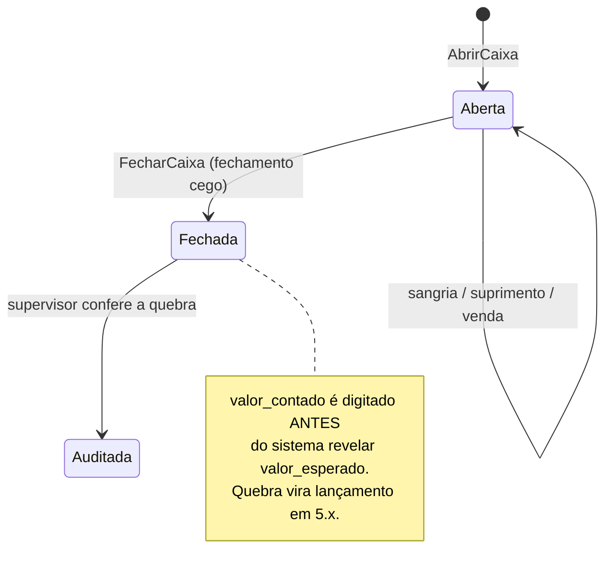
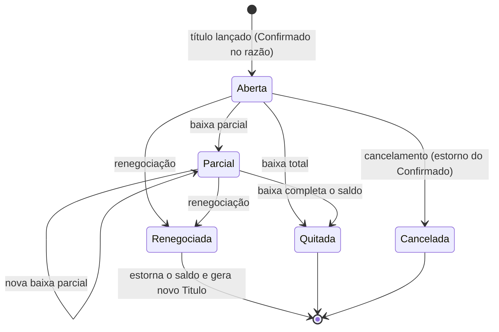
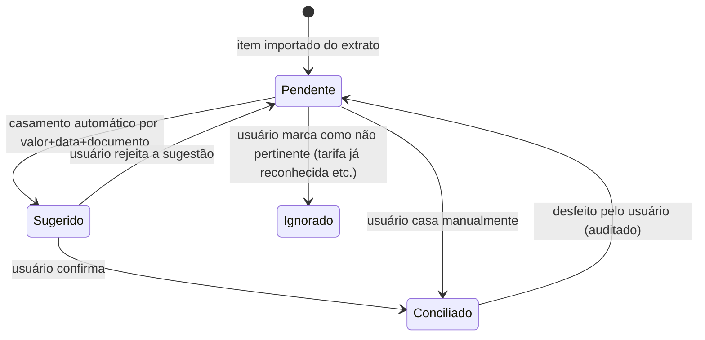

# Módulo Financeiro

> O substrato de dinheiro do Cardeal: caixa, contas a receber e a pagar, bancos, conciliação,
> projeção de fluxo e o Pulso — a tela em que a empresa lê seu próprio caixa.

## 1. Escopo

### Faz

- Mantém as **sessões de caixa** (abertura, sangria, suprimento, fechamento cego, quebra).
- Mantém **contas bancárias**, **extratos** e a **conciliação** entre extrato e razão.
- Mantém **títulos e parcelas** a receber e a pagar, com baixa total e parcial, juros e multa
  calculados na leitura, desconto por antecipação e renegociação.
- Mantém **recorrências** (regras que geram títulos futuros sem gravar linhas até serem necessárias).
- Calcula a **projeção de fluxo de caixa** (comprometido + recorrente + estimado) que alimenta o Pulso.
- Mantém **centro de custo**, **forma de pagamento** e **condição de pagamento** — vocabulário que
  todo módulo que vende ou compra usa por referência.
- Mantém **cobrança** (geração de boleto/Pix via `PortaBanco`/`PortaFiscal`, baixa automática) e
  **cheques** (emissão, depósito, compensação, devolução).
- Produz a **DRE gerencial** por agregação direta sobre o Razão.
- É o **único** lugar do sistema que sabe abrir e fechar um caixa físico. Todo módulo que recebe
  dinheiro em espécie ou identifica um caixa (PDV, OS, aluguéis) o faz através do submódulo `caixa`.

### Não faz

- **Não implementa o Razão em si.** Plano de contas, `Lancamento`, `Partida`, o construtor validado
  e os estados `Previsto/Confirmado/Realizado/Estornado` vivem em `cardeal-ledger` (núcleo), não
  neste módulo. O financeiro é o principal **consumidor** e **operador** do Razão via comandos como
  `BaixarParcela`, não o dono da tabela `razao_*`.
- **Não emite documento fiscal.** Boleto e Pix de cobrança usam `PortaBanco`; nota fiscal é
  responsabilidade de `mod-fiscal` via `PortaFiscal` ([doc 10](../10-modulo-fiscal.md)).
- **Não sabe o que foi vendido.** Origem comercial (o que, para quem, por quê) pertence a `vendas`,
  `pdv`, `os`, `alugueis`, `hotelaria`. O financeiro recebe o `Titulo` já formado e o lançamento já
  balanceado — ele não decide preço, desconto de venda nem item.
- **Não faz contabilidade fiscal (ECD/ECF).** Isso é `mod-contabil`, que lê o Razão gerencial e
  mapeia para o plano referencial. O financeiro produz a DRE **gerencial**, não a fiscal.
- **Não faz folha de pagamento.** Lança "Despesas com pessoal" e "Salários a pagar" quando um evento
  de folha chega de fora (integração), mas não calcula INSS/FGTS/IRRF.

## 2. Submódulos

| id | nome | essencial | depende de | o que some da UI quando desligado |
|---|---|---|---|---|
| `caixa` | Caixa | sim | — | Não pode ser desligado: sem ele não há PDV nem recebimento em espécie. |
| `receber` | Contas a Receber | sim | — | Não pode ser desligado: até o MEI mais simples precisa saber quem lhe deve. |
| `pagar` | Contas a Pagar | não | — | Menu "Contas a Pagar" some; lançamento de despesa vira só registro manual de saída de caixa, sem título nem vencimento. |
| `bancos` | Contas Bancárias | não | — | Menu "Bancos" some; Pulso mostra só caixa físico em "Onde o dinheiro está". |
| `conciliacao` | Conciliação Bancária | não | `bancos` | Menu "Conciliação" some; importação de OFX/CNAB desaparece. |
| `projecao` | Projeção de Fluxo | não | `receber` | O Rio do Caixa do Pulso mostra só passado; faixas "comprometido" e "previsto" somem. |
| `centro_custo` | Centro de Custo | não | — | Campo "Centro de custo" some de toda tela de lançamento, DRE e relatórios. |
| `cobranca` | Cobrança e Boletos | não | `receber`, `bancos` | Botão "Gerar boleto/Pix" some da parcela; baixa automática por retorno bancário desativada. |
| `cheques` | Cheques | não | `receber` | Forma de recebimento "Cheque" some do PDV e do Contas a Receber; tela de carteira de cheques some. |
| `dre` | DRE Gerencial | não | — | Menu "DRE" some; a informação continua disponível via Pulso e relatório de fluxo. |

## 3. Entidades

### Caixa

| Campo | Tipo | Obrigatório | Regra |
|---|---|---|---|
| `id` | Id | sim | UUIDv7 |
| `empresa` | Id | sim | |
| `nome` | String | sim | "Caixa 1", "Cofre" |
| `local_operacao` | Id | não | filial/PDV a que pertence |
| `conta_razao` | Id | sim | conta analítica em 1.1.01, uma por caixa |
| `permite_negativo` | enum(`Sim`,`Nao`) | sim | padrão `Nao` |
| `ativo` | enum(`Sim`,`Nao`) | sim | |
| `versao` | Quantidade (inteiro) | sim | bloqueio otimista |

### SessaoCaixa

| Campo | Tipo | Obrigatório | Regra |
|---|---|---|---|
| `id` | Id | sim | |
| `caixa` | Id | sim | referencia `Caixa` |
| `operador` | Id | sim | usuário que abriu |
| `abertura` | Instante | sim | |
| `fechamento` | Instante | não | nulo enquanto aberta |
| `valor_abertura` | Dinheiro | sim | suprimento inicial, pode ser zero |
| `valor_esperado` | Dinheiro | não | calculado no fechamento, antes da contagem |
| `valor_contado` | Dinheiro | não | informado pelo operador no fechamento cego |
| `quebra` | Dinheiro | não | `valor_contado - valor_esperado`; negativo = falta |
| `estado` | enum(`Aberta`,`Fechada`,`Auditada`) | sim | ver §4 |
| `dispositivo` | Id | sim | terminal onde a sessão correu |
| `versao` | Quantidade (inteiro) | sim | |

### MovimentoCaixa

| Campo | Tipo | Obrigatório | Regra |
|---|---|---|---|
| `id` | Id | sim | |
| `sessao` | Id | sim | referencia `SessaoCaixa` |
| `tipo` | enum(`Suprimento`,`Sangria`,`Venda`,`Recebimento`,`Pagamento`,`QuebraCaixa`) | sim | |
| `valor` | Dinheiro | sim | sempre positivo; o sinal do efeito vem do `tipo` |
| `forma_pagamento` | Id | não | nulo para sangria/suprimento em espécie interna |
| `lancamento` | Id | sim | o `Lancamento` no razão que este movimento representa |
| `motivo` | String | não | obrigatório para `Sangria` e `QuebraCaixa` |
| `criado_em` | Instante | sim | |
| `criado_por` | Id | sim | |

### ContaBancaria

| Campo | Tipo | Obrigatório | Regra |
|---|---|---|---|
| `id` | Id | sim | |
| `empresa` | Id | sim | |
| `banco` | String | sim | código Febraban, ex. "341" |
| `agencia` | String | sim | |
| `numero` | String | sim | |
| `digito` | String | não | |
| `tipo` | enum(`Corrente`,`Poupanca`,`Pagamento`) | sim | |
| `conta_razao` | Id | sim | conta analítica em 1.1.02, uma por conta bancária |
| `chave_pix` | String | não | para geração de cobrança |
| `ativa` | enum(`Sim`,`Nao`) | sim | |
| `versao` | Quantidade (inteiro) | sim | |

### ExtratoBancario / ItemExtrato

| Campo | Tipo | Obrigatório | Regra |
|---|---|---|---|
| `id` (extrato) | Id | sim | |
| `conta_bancaria` | Id | sim | |
| `formato` | enum(`Ofx`,`Cnab240`,`Pix`,`Manual`) | sim | |
| `periodo_de` / `periodo_ate` | Data | sim | |
| `importado_em` | Instante | sim | |
| `importado_por` | Id | sim | |
| **ItemExtrato** | | | |
| `id` | Id | sim | |
| `extrato` | Id | sim | |
| `data` | Data | sim | |
| `descricao` | String | sim | texto bruto do banco |
| `documento` | String | não | número do documento informado pelo banco |
| `valor` | Dinheiro | sim | positivo = crédito, negativo = débito |
| `estado` | enum(`Pendente`,`Sugerido`,`Conciliado`,`Ignorado`) | sim | ver §4 |
| `lancamento_casado` | Id | não | preenchido quando `Conciliado` |
| `confianca_sugestao` | Percentual | não | score do casamento automático |

### Titulo

| Campo | Tipo | Obrigatório | Regra |
|---|---|---|---|
| `id` | Id | sim | |
| `especie` | enum(`Receber`,`Pagar`) | sim | |
| `contraparte_tipo` | enum(`Cliente`,`Fornecedor`,`Funcionario`,`Socio`) | sim | |
| `contraparte_id` | Id | sim | referencia `clientes_pessoa` (cadastro único de papéis) |
| `origem_modulo` | String | sim | "vendas", "os", "avulso"... |
| `origem_id` | Id | não | id do agregado de origem |
| `emissao` | Data | sim | |
| `valor_original` | Dinheiro | sim | soma das parcelas na criação |
| `forma_cobranca` | enum(`Boleto`,`Pix`,`Carteira`,`DebitoAutomatico`,`Cartao`) | sim | |
| `centro_custo` | Id | não | |
| `observacao` | String | não | |
| `cancelado_em` | Instante | não | título cancelado não é apagado |
| `versao` | Quantidade (inteiro) | sim | |

### Parcela

| Campo | Tipo | Obrigatório | Regra |
|---|---|---|---|
| `id` | Id | sim | |
| `titulo` | Id | sim | |
| `numero` | Quantidade (inteiro) | sim | 1..N dentro do título |
| `vencimento` | Data | sim | |
| `valor` | Dinheiro | sim | resultado de `Dinheiro::ratear(n)` sobre `valor_original` |
| `lancamento` | Id | sim | o `Lancamento` `Confirmado` que representa a parcela |
| `estado` | enum(`Aberta`,`Parcial`,`Quitada`,`Cancelada`,`Renegociada`) | sim | ver §4 |
| `valor_baixado` | Dinheiro | sim | soma das baixas; começa em zero |
| `nosso_numero` | String | não | atribuído pela cobrança |
| `politica_juros` | enum(`Nenhum`,`SimplesDiario`,`SimplesMensal`) | sim | |
| `taxa_juros` | Percentual | não | obrigatório se `politica_juros <> Nenhum` |
| `multa` | Percentual | não | aplicada uma vez no primeiro dia de atraso |
| `desconto_ate_data` | Data | não | |
| `desconto_valor` | Dinheiro | não | válido só até `desconto_ate_data` |

### Baixa

| Campo | Tipo | Obrigatório | Regra |
|---|---|---|---|
| `id` | Id | sim | |
| `parcela` | Id | sim | |
| `data` | Data | sim | |
| `valor_recebido` | Dinheiro | sim | inclui juros e desconta desconto |
| `principal` | Dinheiro | sim | parte que abate o valor original |
| `juros` | Dinheiro | sim | calculado na hora da baixa, zero se em dia |
| `desconto` | Dinheiro | sim | zero se fora do prazo |
| `conta_destino` | Id | sim | caixa ou conta bancária que recebeu/pagou |
| `lancamento` | Id | sim | lançamento `Realizado` gerado pela baixa |
| `estornada_em` | Instante | não | |
| `criado_por` | Id | sim | |

### Recorrencia

| Campo | Tipo | Obrigatório | Regra |
|---|---|---|---|
| `id` | Id | sim | |
| `descricao` | String | sim | "Aluguel da loja" |
| `especie` | enum(`Receber`,`Pagar`) | sim | |
| `tipo_valor` | enum(`Fixo`,`Indexado`,`Variavel`) | sim | |
| `valor_fixo` | Dinheiro | não | obrigatório se `tipo_valor = Fixo` |
| `indice` | String | não | "IGPM", "IPCA"; obrigatório se `Indexado` |
| `media_ultimos_n` | Quantidade (inteiro) | não | obrigatório se `Variavel` |
| `regra_periodicidade` | enum(`Mensal`,`Semanal`,`Anual`,`Personalizada`) | sim | |
| `dia_referencia` | Quantidade (inteiro) | não | dia do mês/semana |
| `expressao_cron` | String | não | obrigatório se `Personalizada` |
| `inicio` | Data | sim | |
| `fim` | Data | não | |
| `conta_contrapartida` | Id | sim | conta do razão a debitar/creditar |
| `centro_custo` | Id | não | |
| `antecedencia_geracao_dias` | Quantidade (inteiro) | sim | quando vira `Titulo` real |
| `ativa` | enum(`Sim`,`Nao`) | sim | |

### CentroCusto, FormaPagamento, CondicaoPagamento

| Campo | Tipo | Obrigatório | Regra |
|---|---|---|---|
| **CentroCusto** `id`, `codigo`, `nome`, `pai`, `responsavel`, `ativo` | Id/String/Id/Id/enum | sim/sim/sim/não/não/sim | hierárquico como o plano de contas |
| **FormaPagamento** `id`, `nome`, `tipo`, `conta_razao_destino`, `dias_compensacao`, `taxa_percentual`, `ativa` | Id/String/enum(`Dinheiro`,`Debito`,`Credito`,`Pix`,`Boleto`,`Cheque`,`Carteira`)/Id/Quantidade(inteiro)/Percentual/enum | sim | `dias_compensacao` alimenta "valores em trânsito" |
| **CondicaoPagamento** `id`, `nome`, `numero_parcelas`, `intervalo_dias`, `entrada` | Id/String/Quantidade(inteiro)/Quantidade(inteiro)/enum(`Sim`,`Nao`) | sim | "30/60/90", "à vista", "entrada + 3x" |

## 4. Máquinas de estado







## 5. Comandos

| Comando | Permissão | Risco | O que faz | Erros possíveis |
|---|---|---|---|---|
| `AbrirCaixa` | `financeiro.caixa.abrir` | Baixo | Cria `SessaoCaixa`, lança suprimento inicial se houver | `CaixaJaAberto`, `CaixaInativo` |
| `RegistrarSuprimento` | `financeiro.caixa.suprimento` | Baixo | `MovimentoCaixa Suprimento`, D Caixa / C Bancos-Cofre | `CaixaFechado` |
| `RegistrarSangria` | `financeiro.caixa.sangria` | Médio | `MovimentoCaixa Sangria`, exige motivo | `CaixaFechado`, `ValorSuperaSaldo` |
| `FecharCaixa` | `financeiro.caixa.fechar` | Médio | Congela a sessão, pede `valor_contado` antes de mostrar o esperado, gera lançamento de quebra se houver | `CaixaJaFechado`, `SessaoDeOutroOperador` |
| `LancarTitulo` | `financeiro.receber.criar` / `financeiro.pagar.criar` | Baixo | Cria `Titulo` + `Parcela`(s), lançamento `Confirmado` D/C conforme espécie | `ValorInvalido`, `ContraparteInexistente` |
| `BaixarParcela` | `financeiro.receber.baixar` / `financeiro.pagar.baixar` | Médio | Calcula juros/multa/desconto na data informada, cria `Baixa`, lançamento `Realizado` | `ParcelaJaQuitada`, `ValorSuperaSaldo`, `CaixaFechado` |
| `EstornarBaixa` | `financeiro.receber.estornar` | Alto | Estorna o lançamento `Realizado`, reabre a parcela | `BaixaJaEstornada`, `PeriodoFechado` |
| `RenegociarTitulo` | `financeiro.receber.renegociar` | Alto | Cancela saldo em aberto, cria novo `Titulo` com novas condições | `TituloQuitado` |
| `CriarRecorrencia` | `financeiro.recorrencia.criar` | Baixo | Grava a regra; não gera título imediatamente | `RegraInvalida` |
| `MaterializarRecorrencia` | (tarefa agendada, sem permissão de usuário) | Baixo | Gera `Titulo` real quando falta `antecedencia_geracao_dias` | — |
| `CriarContaBancaria` | `financeiro.banco.criar` | Baixo | Cria a conta e sua conta analítica em 1.1.02 | `ContaDuplicada` |
| `ImportarExtrato` | `financeiro.conciliacao.importar` | Baixo | Parseia OFX/CNAB240/Pix, cria `ItemExtrato` em `Pendente`, dispara casamento automático | `FormatoInvalido`, `PeriodoJaImportado` |
| `ConciliarItem` | `financeiro.conciliacao.confirmar` | Médio | Vincula `ItemExtrato` a um `Lancamento`/`Baixa` existente ou cria um novo | `ItemJaConciliado`, `ValorDivergente` |
| `CriarCentroCusto` | `financeiro.centro_custo.criar` | Baixo | | `CodigoDuplicado` |
| `GerarCobranca` | `financeiro.cobranca.gerar` | Baixo | Solicita boleto/Pix via `PortaBanco`, grava `nosso_numero` | `ContaSemConvenio` |
| `RegistrarCheque` | `financeiro.cheque.registrar` | Médio | Cria `Titulo`/`Baixa` com forma `Cheque`, estado `EmCarteira` | `ChequeDuplicado` |
| `CompensarCheque` | `financeiro.cheque.compensar` | Médio | Lançamento D Bancos / C Cheques a receber | `ChequeJaCompensado` |
| `DevolverCheque` | `financeiro.cheque.devolver` | Alto | Estorna a compensação, reabre o título como inadimplente | `ChequeNaoCompensado` |

## 6. Consultas

| Consulta | Permissão | Uso na UI | Índice que a sustenta |
|---|---|---|---|
| `FluxoDeCaixaDiario` | `financeiro.pulso.ver` | Rio do Caixa do Pulso | `razao_lanc_fluxo(empresa, liquidacao, vencimento, competencia, estado)` |
| `SaldoDeCaixa` | `financeiro.pulso.ver` | "Onde o dinheiro está" | `razao_partida_conta(conta, lancamento)` |
| `ParcelasVencendo` | `financeiro.receber.ver` / `financeiro.pagar.ver` | Grade de Contas a Receber/Pagar, "Exige ação hoje" | `financeiro_parcela(titulo, vencimento, estado)` |
| `HorizonteFinanceiro` | `financeiro.projecao.ver` | Rio do Caixa (faixas comprometido/previsto) | agregação em memória sobre `ParcelasVencendo` + `Recorrencia` + estimativa |
| `ExtratoDaConta` | `financeiro.banco.ver` | Tela de conta bancária | `financeiro_item_extrato(extrato, data)` |
| `ItensAConciliar` | `financeiro.conciliacao.ver` | Tela de Conciliação | `financeiro_item_extrato(estado, extrato)` |
| `DreDoMes` | `financeiro.dre.ver` | Tela de DRE | `razao_lanc_competencia(empresa, competencia, estado)` |
| `PosicaoPorCentroCusto` | `financeiro.centro_custo.ver` | Relatório de centro de custo | `razao_partida_cc(centro_custo, lancamento)` |
| `HistoricoDoCliente` | `financeiro.receber.ver` | Ficha do cliente (aba financeira) | `financeiro_titulo(contraparte_tipo, contraparte_id)` |
| `SessoesEmAberto` | `financeiro.caixa.ver` | "Caixa 2 aberto há 14h" no Pulso | `financeiro_sessao_caixa(estado) WHERE estado = 'Aberta'` |

## 7. Receituário contábil

| Evento de negócio | Débito | Crédito | Estado |
|---|---|---|---|
| Abertura de caixa com suprimento inicial | Caixa (1.1.01) | Bancos/Cofre (1.1.01/1.1.02) | Realizado |
| Sangria de caixa | Bancos/Cofre | Caixa | Realizado |
| Suprimento de caixa | Caixa | Bancos/Cofre | Realizado |
| Fechamento de caixa com sobra | Caixa | Sobra de caixa (4.6 Outras receitas) | Realizado |
| Fechamento de caixa com quebra | Quebra de caixa (5.x) | Caixa | Realizado |
| Lançamento de título a receber avulso | Clientes a receber (1.2.01) | Receita/conta indicada | Confirmado |
| Lançamento de título a pagar avulso | Despesa/conta indicada | Fornecedores (2.1.01) | Confirmado |
| Recebimento de parcela, em dia | Caixa/Bancos | Clientes a receber | Realizado |
| Recebimento de parcela, com juros/multa | Caixa/Bancos | Clientes a receber + Receita financeira (4.6) | Realizado |
| Recebimento de parcela, com desconto de antecipação | Caixa/Bancos + Descontos concedidos (4.4) | Clientes a receber | Realizado |
| Pagamento de parcela, em dia | Fornecedores | Bancos | Realizado |
| Pagamento de parcela, com juros/multa | Fornecedores + Despesas financeiras (5.9) | Bancos | Realizado |
| Estorno de baixa | Clientes a receber/Fornecedores | Caixa/Bancos (invertido) | Realizado (estorno) |
| Renegociação de título | Estorna Confirmado original | Novo `Titulo` Confirmado | Confirmado |
| Recorrência materializada (ainda não vencida) | Ocupação/Despesa correspondente | Fornecedores | Previsto |
| Recorrência vira título real | Estorna `Previsto` | Recria `Confirmado` | Confirmado |
| Compensação de cheque recebido | Bancos | Cheques a receber (1.2.03) | Realizado |
| Depósito de cheque (aguardando compensação) | Cheques a receber | Clientes a receber | Realizado |
| Devolução de cheque | Clientes a receber | Cheques a receber (estorno) | Realizado (estorno) |
| Taxa de boleto/Pix cobrada pelo banco | Taxas de cartão e meios de pagamento (5.7) | Bancos | Realizado |
| Conciliação: item do extrato sem lançamento correspondente (tarifa bancária) | Despesas financeiras (5.9) | Bancos | Realizado |
| Conciliação: item do extrato sem lançamento correspondente (rendimento) | Bancos | Receita financeira (4.6) | Realizado |

Toda linha acima já existe, em essência, na tabela do [doc 05 §5](../05-nucleo-financeiro.md#5-o-receituário-como-cada-módulo-posta); esta seção detalha as variações (juros, desconto, quebra, cheque)
que o módulo financeiro precisa cobrir em `testes/receituario.rs`.

## 8. Eventos

**Publicados**

- `financeiro.caixa_aberto.v1` — `{ sessao, caixa, operador, valor_abertura }`
- `financeiro.caixa_fechado.v1` — `{ sessao, valor_esperado, valor_contado, quebra }`
- `financeiro.sangria_registrada.v1` — `{ sessao, valor, motivo }`
- `financeiro.titulo_lancado.v1` — `{ titulo, especie, contraparte, valor_original }`
- `financeiro.parcela_baixada.v1` — `{ parcela, valor_recebido, quitada }`
- `financeiro.baixa_estornada.v1` — `{ baixa, motivo }`
- `financeiro.extrato_conciliado.v1` — `{ item_extrato, lancamento }`
- `financeiro.cheque_devolvido.v1` — `{ titulo, motivo }`
- `financeiro.recorrencia_materializada.v1` — `{ recorrencia, titulo }`

**Assinados**

- `vendas.pedido_faturado.v1` → gera `Titulo` a receber automaticamente.
- `pdv.venda_finalizada.v1` → registra `MovimentoCaixa` de venda na sessão ativa.
- `compras.nota_confirmada.v1` → gera `Titulo` a pagar.
- `os.ordem_faturada.v1`, `alugueis.fatura_gerada.v1`, `hotelaria.folio_fechado.v1` → geram `Titulo`
  a receber pela mesma via — o financeiro não conhece esses módulos, apenas o evento.

## 9. Permissões

| Chave | Descrição | Risco |
|---|---|---|
| `financeiro.pulso.ver` | Ver o Pulso | Baixo |
| `financeiro.caixa.abrir` | Abrir sessão de caixa | Baixo |
| `financeiro.caixa.fechar` | Fechar sessão de caixa | Médio |
| `financeiro.caixa.sangria` | Registrar sangria | Médio |
| `financeiro.caixa.suprimento` | Registrar suprimento | Baixo |
| `financeiro.caixa.ver` | Ver sessões e movimentos de caixa | Baixo |
| `financeiro.receber.ver` | Consultar contas a receber | Baixo |
| `financeiro.receber.criar` | Lançar título a receber | Baixo |
| `financeiro.receber.baixar` | Dar baixa em recebimento | Médio |
| `financeiro.receber.estornar` | Estornar baixa de recebimento | Alto |
| `financeiro.receber.renegociar` | Renegociar título a receber | Alto |
| `financeiro.pagar.ver` | Consultar contas a pagar | Baixo |
| `financeiro.pagar.criar` | Lançar título a pagar | Baixo |
| `financeiro.pagar.baixar` | Dar baixa em pagamento | Médio |
| `financeiro.pagar.autorizar` | Autorizar pagamento acima do teto do papel | Alto |
| `financeiro.banco.ver` | Consultar contas bancárias e extratos | Baixo |
| `financeiro.banco.criar` | Cadastrar conta bancária | Médio |
| `financeiro.conciliacao.importar` | Importar extrato bancário | Baixo |
| `financeiro.conciliacao.confirmar` | Confirmar casamento de item do extrato | Médio |
| `financeiro.centro_custo.criar` | Cadastrar centro de custo | Baixo |
| `financeiro.centro_custo.ver` | Ver relatórios por centro de custo | Baixo |
| `financeiro.cobranca.gerar` | Gerar boleto/Pix de cobrança | Baixo |
| `financeiro.cheque.registrar` | Registrar cheque recebido | Baixo |
| `financeiro.cheque.compensar` | Compensar cheque | Médio |
| `financeiro.cheque.devolver` | Registrar devolução de cheque | Alto |
| `financeiro.dre.ver` | Ver DRE gerencial | Médio |
| `financeiro.recorrencia.criar` | Criar/editar recorrência | Médio |

## 10. Telas

### O Pulso

```
┌───────────────────────────────────────────────────────────────────────────────────────┐
│  Pulso · Matriz                          setembro 2026    [◂ mês]  [hoje]  [mês ▸]    │
├───────────────────────────────────────────────────────────────────────────────────────┤
│                                                                                        │
│   SALDO HOJE                 EM 30 DIAS              FÔLEGO           A RECEBER HOJE   │
│   R$ 48.230,15               R$ 71.905,40            34 dias          R$ 12.480,00     │
│   ▲ 4,2% vs ontem            ▲ projetado             ▓▓▓▓▓▓▓░░        7 títulos        │
│                                                                                        │
├───────────────────────────────────────────────────────────────────────────────────────┤
│  RIO DO CAIXA                                            ● realizado ▓ comprometido    │
│                                                          ░ previsto                    │
│   90k ┤                                              ░░░░░░░░░░                        │
│       │                                         ▓▓▓▓░░░░░░░░░░░░░░░                    │
│   60k ┤                    ●●●●●●●●●●      ▓▓▓▓▓▓▓▓▓▓▓░░░░░░░░░░░░░░░░                 │
│       │        ●●●●●●●●●●●●          ●●●●▓▓                          ░░░               │
│   30k ┤●●●●●●●●                          ┊                                             │
│       │                                  ┊ HOJE                                        │
│     0 ┼──────────────────────────────────┊──────────────────────────────────────────   │
│       │                                  ┊         ⚠ 14/out                            │
│  -30k ┤                                  ┊         projeção cruza zero                 │
│       └──┬────────┬────────┬────────┬────┊───┬────────┬────────┬────────┬──────────    │
│         ago      15/ago    set     15/set  1/out    15/out    nov     15/nov           │
│                                                                                        │
│   ⓘ Clique em qualquer ponto para ver os lançamentos daquele dia.                      │
├───────────────────────────────────────────────────────────────────────────────────────┤
│  EXIGE AÇÃO HOJE (4)                          │  ONDE O DINHEIRO ESTÁ                  │
│  ─────────────────────────────────────────    │  ────────────────────────              │
│  🔴 3 títulos vencem hoje      R$ 8.420,00    │  Caixa 1              R$    840,00     │
│     Fornecedor Alfa, Beta, Gama        [Ver]  │  Cofre                R$  3.200,00     │
│  🟠 Projeção cruza zero em 14/out             │  Banco do Brasil      R$ 21.400,15     │
│     Faltam R$ 6.120 no dia         [Simular]  │  Nubank PJ            R$ 14.790,00     │
│  🟠 Caixa 2 aberto há 14 h                    │  Cartões a compensar  R$  8.000,00     │
│     Operador: Carlos              [Fechar]    │  ─────────────────────────────────     │
│  🔵 4 notas de compra a conferir              │  Total                R$ 48.230,15     │
│     Chegaram por DFe               [Abrir]    │                                        │
├───────────────────────────────────────────────┴────────────────────────────────────────┤
│  RADAR                                                                                 │
│  ▸ Margem da categoria Bebidas caiu 3,1 p.p. em 14 dias        [investigar]            │
│  ▸ Cliente Supermercado Sul: 2 títulos em atraso, R$ 4.100     [cobrar]                │
│  ▸ Taxa média de cartão subiu para 2,84% (era 2,41%)           [ver contratos]         │
│  ▸ 12 produtos com giro alto e saldo abaixo do ponto de pedido [gerar pedido]          │
└───────────────────────────────────────────────────────────────────────────────────────┘
```

Interações: `Ctrl+1` abre o Pulso de qualquer tela; `F5` recarrega os dados; clique num dia do Rio
do Caixa abre gaveta lateral com os lançamentos daquele dia agrupados por conta; `Shift+arrastar`
sobrepõe o mesmo período do ano anterior; a roda do mouse dá zoom dia→semana→mês→trimestre, sempre
recalculando a consulta ao razão (nunca reamostrando o desenho). Ver detalhes em
[doc 12 §6](../12-ui-ux.md#6-o-pulso--o-financeiro-como-tela-inicial).

### Contas a Receber

```
┌───────────────────────────────────────────────────────────────────────────────────────┐
│  Contas a Receber                                          [Ctrl+N Novo título]  F3 🔍 │
├───────────────────────────────────────────────────────────────────────────────────────┤
│  Filtro: [Em aberto ▾]  Vencimento: [Este mês ▾]  Cliente: [________]  Centro: [___▾]  │
├──────────┬───────────────────────────┬────────────┬────────────┬─────────┬────────────┤
│ Venc.    │ Cliente                   │  Original  │  Em aberto │ Atraso  │ Estado      │
├──────────┼───────────────────────────┼────────────┼────────────┼─────────┼────────────┤
│ 01/set   │ Mercado Bom Preço          │  1.200,00  │    400,00  │  0 dias │ Parcial     │
│ 03/set   │ Supermercado Sul           │  2.050,00  │  2.050,00  │  0 dias │ Aberta      │
│ 28/ago 🔴│ Padaria Cantinho           │    340,00  │    340,00  │  4 dias │ Aberta      │
│          │  juros calculados: R$ 2,04 (0,05%/dia)                                     │
├──────────┴───────────────────────────┴────────────┴────────────┴─────────┴────────────┤
│  Selecionados: 1     Total em aberto: R$ 2.790,00                    [F2 Baixar]      │
└───────────────────────────────────────────────────────────────────────────────────────┘
```

`F2` sobre uma parcela abre a gaveta de baixa (valor sugerido = saldo + juros calculados na hora,
forma de recebimento, data). `Ctrl+N` abre o assistente de novo título. Colunas de juros e centro de
custo só aparecem se os submódulos correspondentes estão ligados.

### Contas a Pagar

```
┌───────────────────────────────────────────────────────────────────────────────────────┐
│  Contas a Pagar                                             [Ctrl+N Novo título] F3 🔍 │
├───────────────────────────────────────────────────────────────────────────────────────┤
│  Venc.    Fornecedor              Original    Em aberto   Forma      Centro    Estado  │
│  05/set   Distribuidora Alfa       3.400,00    3.400,00   Boleto     Loja      Aberta  │
│  05/set 🟠Energia Elétrica CEMIG     680,00      680,00   Débito automático  Aberta    │
│  10/set   Aluguel da loja          2.200,00    2.200,00   Boleto     —  (recorrência)  │
├───────────────────────────────────────────────────────────────────────────────────────┤
│  A pagar hoje: R$ 4.080,00   A pagar 7 dias: R$ 6.280,00       [F2 Pagar selecionados] │
└───────────────────────────────────────────────────────────────────────────────────────┘
```

### Fluxo de Caixa (visão tabular, complemento do Rio do Caixa)

```
┌───────────────────────────────────────────────────────────────────────────────────────┐
│  Fluxo de Caixa · próximos 30 dias                          [Diário ▾] [Exportar CSV] │
├───────────┬────────────┬────────────┬────────────┬────────────┬────────────┬──────────┤
│ Dia       │ Realizado  │ Comprometido│ Previsto   │ Entradas   │ Saídas     │ Saldo    │
├───────────┼────────────┼────────────┼────────────┼────────────┼────────────┼──────────┤
│ 01/set    │  48.230,15 │          — │          — │          — │          — │ 48.230,15│
│ 05/set    │          — │  -4.080,00 │          — │      0,00  │  4.080,00  │ 44.150,15│
│ 10/set    │          — │  -2.200,00 │  +3.100,00 │  3.100,00  │  2.200,00  │ 45.050,15│
│ 14/out ⚠  │          — │          — │  -6.120,00 │          — │  6.120,00  │ -1.070,00│
└───────────┴────────────┴────────────┴────────────┴────────────┴────────────┴──────────┘
```

### Conciliação Bancária

```
┌───────────────────────────────────────────────────────────────────────────────────────┐
│  Conciliação · Banco do Brasil — Ag 1234 CC 56789-0        [Importar extrato Ctrl+I]  │
├───────────────────────────────────────────────────────────────────────────────────────┤
│  118 itens · 102 conciliados · 12 sugeridos · 4 pendentes            [Conciliar tudo] │
├──────────┬──────────────────────────────┬────────────┬────────────────────┬──────────┤
│ Data     │ Descrição (banco)              │   Valor   │ Sugestão do sistema │ Ação    │
├──────────┼──────────────────────────────┼────────────┼────────────────────┼──────────┤
│ 03/set   │ PIX RECEBIDO JOAO SILVA        │  +340,00  │ Parcela #4021 (98%) │ [✓][✗]  │
│ 03/set   │ TARIFA PACOTE SERVICOS         │   -29,90  │ sem correspondência │ [Ignorar]│
│ 04/set   │ TED FORNECEDOR ALFA LTDA       │ -3.400,00 │ Título #889 (91%)   │ [✓][✗]  │
└──────────┴──────────────────────────────┴────────────┴────────────────────┴──────────┘
```

O casamento automático (comando `ImportarExtrato`) pontua por `valor + data ± 2 dias + documento`;
score acima de 90% vira `Sugerido` para revisão em um clique; abaixo disso, `Pendente` para busca manual.

### Fechamento de Caixa (fechamento cego)

```
┌───────────────────────────────────────────────────────────┐
│  Fechar Caixa 1 — Carlos, aberto às 08:02 (14h32min)      │
├─────────────────────────────────────────────────────────┤
│  Conte o dinheiro em espécie e informe o total.           │
│  O sistema só mostra o valor esperado depois da contagem. │
│                                                             │
│  Valor contado:  R$ [________]                            │
│                                                             │
│                          [F2 Confirmar]  [Esc Cancelar]    │
└─────────────────────────────────────────────────────────┘
```

Após `F2`, a tela seguinte revela o esperado e a quebra, exigindo motivo se a diferença ultrapassar
`TOLERANCIA_QUEBRA_CAIXA` (padrão R$ 5,00).

## 11. Regras de negócio críticas

1. **Juros e multa nunca são materializados fora da baixa.** São calculados na leitura, a partir da
   política da parcela e da data de referência — impede milhares de lançamentos diários de
   "atualização" e mantém o razão auditável (ver doc 05 §4.1).
2. **Ratear parcelas nunca perde nem inventa centavos.** `Dinheiro::ratear(n)` distribui o resto entre
   as primeiras parcelas; a soma das parcelas é sempre exatamente igual a `valor_original`. É testado
   por propriedade (`quickcheck`), não só por exemplo.
3. **Fechamento de caixa é sempre cego.** O operador informa o valor contado antes de o sistema
   revelar o esperado. Mostrar o esperado primeiro convida a "ajustar" a contagem — o objetivo do
   fechamento é medir a realidade, não confirmar uma expectativa.
4. **Nenhuma baixa acontece com o caixa fechado.** `BaixarParcela` com forma de recebimento em
   espécie exige `SessaoCaixa` em estado `Aberta` vinculada ao dispositivo do operador.
5. **Renegociação nunca edita a parcela original.** Estorna o saldo em aberto e cria um `Titulo`
   novo — histórico completo preservado, nunca um valor "corrigido" por cima do original.
6. **Conciliação nunca gera lançamento duplicado.** Um item de extrato só é `Conciliado` depois de
   vinculado a um `Lancamento`/`Baixa` existente ou de gerar um novo com `documento` único —
   reimportar o mesmo período é idempotente por `(conta_bancaria, data, valor, documento)`.
7. **Recorrência é regra, não linha.** Uma recorrência mensal de 3 anos não grava 36 linhas: gera
   `FluxoDia` em memória para a projeção e só vira `Titulo` real quando falta
   `antecedencia_geracao_dias` para o vencimento.
8. **Toda baixa em espécie posta no caixa da sessão ativa do operador**, nunca num caixa arbitrário —
   impede que um recebimento "sobre" em outro caixa e quebre a rastreabilidade física do dinheiro.
9. **Quebra de caixa acima da tolerância exige motivo e vira lançamento visível**, nunca é absorvida
   silenciosamente em outra conta. Quebra é sintoma; escondê-la tira o sintoma do radar do dono.
10. **`financeiro` nunca inicia uma venda, compra ou serviço.** Ele só reage a eventos e comandos
    explícitos de outros módulos. Isso preserva a regra de que módulos não se conhecem por código.

## 12. Comportamento offline

**Funciona em modo autônomo:**
- Abrir e fechar a sessão de caixa do próprio terminal (dentro da faixa de numeração reservada).
- Registrar sangria, suprimento e baixa em espécie/Pix/débito quando a forma não depende de rede.
- Consultar parcelas e saldo **do último sincronismo**, marcados como "posição de N minutos atrás".
- Lançar título avulso (fica pendente de confirmação do servidor).

**Não funciona em modo autônomo:**
- Importar extrato bancário e conciliação (depende do arquivo/API externa, mas sobretudo da visão
  consolidada de todos os terminais).
- Gerar boleto/Pix de cobrança (depende de `PortaBanco`/`PortaFiscal` online).
- Consolidar Pulso/DRE de múltiplas filiais.
- Fechar período contábil.

**Política de conflito na reconciliação:** um recebimento registrado offline nunca é desfeito ao
reconectar — o dinheiro entrou fisicamente. Se o servidor já tinha uma baixa concorrente para a
mesma parcela (dois operadores baixando o mesmo título em terminais diferentes durante a partição),
a segunda baixa a chegar é aceita como baixa **adicional** e o sistema sinaliza
`ParcelaComSaldoNegativo` para conferência humana — nunca rejeita silenciosamente um recebimento já
entregue ao cliente como confirmado. Ver o princípio geral em
[doc 03 §3.3](../03-pilar-resiliencia.md#33-reconciliação).

## 13. Tabelas

```sql
CREATE TABLE financeiro_caixa (
    id                BLOB PRIMARY KEY,
    empresa           BLOB    NOT NULL,
    nome              TEXT    NOT NULL,
    local_operacao    BLOB,
    conta_razao       BLOB    NOT NULL,
    permite_negativo  INTEGER NOT NULL DEFAULT 0 CHECK (permite_negativo IN (0,1)),
    ativo             INTEGER NOT NULL DEFAULT 1 CHECK (ativo IN (0,1)),
    versao            INTEGER NOT NULL DEFAULT 1,
    criado_em         INTEGER NOT NULL,
    criado_por        BLOB    NOT NULL
) STRICT;
CREATE INDEX financeiro_caixa_empresa ON financeiro_caixa(empresa) WHERE ativo = 1;

CREATE TABLE financeiro_sessao_caixa (
    id              BLOB PRIMARY KEY,
    empresa         BLOB    NOT NULL,
    caixa           BLOB    NOT NULL REFERENCES financeiro_caixa(id),
    operador        BLOB    NOT NULL,
    dispositivo     BLOB    NOT NULL,
    abertura        INTEGER NOT NULL,
    fechamento      INTEGER,
    valor_abertura  INTEGER NOT NULL,
    valor_esperado  INTEGER,
    valor_contado   INTEGER,
    quebra          INTEGER,
    estado          TEXT    NOT NULL CHECK (estado IN ('Aberta','Fechada','Auditada')),
    versao          INTEGER NOT NULL DEFAULT 1
) STRICT;
CREATE INDEX financeiro_sessao_aberta ON financeiro_sessao_caixa(caixa) WHERE estado = 'Aberta';
CREATE INDEX financeiro_sessao_operador ON financeiro_sessao_caixa(empresa, operador, abertura DESC);

CREATE TABLE financeiro_movimento_caixa (
    id               BLOB PRIMARY KEY,
    empresa          BLOB    NOT NULL,
    sessao           BLOB    NOT NULL REFERENCES financeiro_sessao_caixa(id),
    tipo             TEXT    NOT NULL CHECK (tipo IN ('Suprimento','Sangria','Venda','Recebimento','Pagamento','QuebraCaixa')),
    valor            INTEGER NOT NULL,
    forma_pagamento  BLOB,
    lancamento       BLOB    NOT NULL,
    motivo           TEXT,
    criado_em        INTEGER NOT NULL,
    criado_por       BLOB    NOT NULL
) STRICT;
CREATE INDEX financeiro_movcx_sessao ON financeiro_movimento_caixa(sessao, criado_em);

CREATE TABLE financeiro_conta_bancaria (
    id           BLOB PRIMARY KEY,
    empresa      BLOB    NOT NULL,
    banco        TEXT    NOT NULL,
    agencia      TEXT    NOT NULL,
    numero       TEXT    NOT NULL,
    digito       TEXT,
    tipo         TEXT    NOT NULL CHECK (tipo IN ('Corrente','Poupanca','Pagamento')),
    conta_razao  BLOB    NOT NULL,
    chave_pix    TEXT,
    ativa        INTEGER NOT NULL DEFAULT 1 CHECK (ativa IN (0,1)),
    versao       INTEGER NOT NULL DEFAULT 1,
    UNIQUE (empresa, banco, agencia, numero)
) STRICT;

CREATE TABLE financeiro_extrato_bancario (
    id               BLOB PRIMARY KEY,
    empresa          BLOB    NOT NULL,
    conta_bancaria   BLOB    NOT NULL REFERENCES financeiro_conta_bancaria(id),
    formato          TEXT    NOT NULL CHECK (formato IN ('Ofx','Cnab240','Pix','Manual')),
    periodo_de       INTEGER NOT NULL,
    periodo_ate      INTEGER NOT NULL,
    importado_em     INTEGER NOT NULL,
    importado_por    BLOB    NOT NULL
) STRICT;
CREATE INDEX financeiro_extrato_conta ON financeiro_extrato_bancario(conta_bancaria, periodo_de);

CREATE TABLE financeiro_item_extrato (
    id                  BLOB PRIMARY KEY,
    empresa             BLOB    NOT NULL,
    extrato              BLOB    NOT NULL REFERENCES financeiro_extrato_bancario(id),
    data                INTEGER NOT NULL,
    descricao           TEXT    NOT NULL,
    documento           TEXT,
    valor               INTEGER NOT NULL,
    estado              TEXT    NOT NULL CHECK (estado IN ('Pendente','Sugerido','Conciliado','Ignorado')),
    lancamento_casado   BLOB,
    confianca_sugestao  INTEGER,     -- Percentual, escala 1e-6
    UNIQUE (extrato, data, valor, documento)
) STRICT;
CREATE INDEX financeiro_item_extrato_estado ON financeiro_item_extrato(empresa, estado, data);

CREATE TABLE financeiro_titulo (
    id                BLOB PRIMARY KEY,
    empresa           BLOB    NOT NULL,
    especie           TEXT    NOT NULL CHECK (especie IN ('Receber','Pagar')),
    contraparte_tipo  TEXT    NOT NULL CHECK (contraparte_tipo IN ('Cliente','Fornecedor','Funcionario','Socio')),
    contraparte_id    BLOB    NOT NULL,
    origem_modulo     TEXT    NOT NULL,
    origem_id         BLOB,
    emissao           INTEGER NOT NULL,
    valor_original    INTEGER NOT NULL,
    forma_cobranca    TEXT    NOT NULL CHECK (forma_cobranca IN ('Boleto','Pix','Carteira','DebitoAutomatico','Cartao')),
    centro_custo      BLOB,
    observacao        TEXT,
    cancelado_em      INTEGER,
    versao            INTEGER NOT NULL DEFAULT 1,
    criado_em         INTEGER NOT NULL,
    criado_por        BLOB    NOT NULL
) STRICT;
CREATE INDEX financeiro_titulo_contraparte ON financeiro_titulo(empresa, contraparte_tipo, contraparte_id);
CREATE INDEX financeiro_titulo_origem ON financeiro_titulo(origem_modulo, origem_id);

CREATE TABLE financeiro_parcela (
    id                 BLOB PRIMARY KEY,
    empresa            BLOB    NOT NULL,
    titulo             BLOB    NOT NULL REFERENCES financeiro_titulo(id),
    numero             INTEGER NOT NULL,
    vencimento         INTEGER NOT NULL,
    valor              INTEGER NOT NULL,
    lancamento         BLOB    NOT NULL,
    estado             TEXT    NOT NULL CHECK (estado IN ('Aberta','Parcial','Quitada','Cancelada','Renegociada')),
    valor_baixado      INTEGER NOT NULL DEFAULT 0,
    nosso_numero       TEXT,
    politica_juros     TEXT    NOT NULL CHECK (politica_juros IN ('Nenhum','SimplesDiario','SimplesMensal')),
    taxa_juros         INTEGER,     -- Percentual, escala 1e-6
    multa              INTEGER,     -- Percentual, escala 1e-6
    desconto_ate_data  INTEGER,
    desconto_valor     INTEGER,
    versao             INTEGER NOT NULL DEFAULT 1,
    UNIQUE (titulo, numero)
) STRICT;
CREATE INDEX financeiro_parcela_vencimento ON financeiro_parcela(empresa, vencimento, estado);

CREATE TABLE financeiro_baixa (
    id               BLOB PRIMARY KEY,
    empresa          BLOB    NOT NULL,
    parcela          BLOB    NOT NULL REFERENCES financeiro_parcela(id),
    data             INTEGER NOT NULL,
    valor_recebido   INTEGER NOT NULL,
    principal        INTEGER NOT NULL,
    juros            INTEGER NOT NULL DEFAULT 0,
    desconto         INTEGER NOT NULL DEFAULT 0,
    conta_destino    BLOB    NOT NULL,
    lancamento       BLOB    NOT NULL,
    estornada_em     INTEGER,
    criado_em        INTEGER NOT NULL,
    criado_por       BLOB    NOT NULL
) STRICT;
CREATE INDEX financeiro_baixa_parcela ON financeiro_baixa(parcela, data);

CREATE TABLE financeiro_recorrencia (
    id                        BLOB PRIMARY KEY,
    empresa                   BLOB    NOT NULL,
    descricao                 TEXT    NOT NULL,
    especie                   TEXT    NOT NULL CHECK (especie IN ('Receber','Pagar')),
    tipo_valor                TEXT    NOT NULL CHECK (tipo_valor IN ('Fixo','Indexado','Variavel')),
    valor_fixo                INTEGER,
    indice                    TEXT,
    media_ultimos_n           INTEGER,
    regra_periodicidade       TEXT    NOT NULL CHECK (regra_periodicidade IN ('Mensal','Semanal','Anual','Personalizada')),
    dia_referencia            INTEGER,
    expressao_cron            TEXT,
    inicio                    INTEGER NOT NULL,
    fim                       INTEGER,
    conta_contrapartida       BLOB    NOT NULL,
    centro_custo              BLOB,
    antecedencia_geracao_dias INTEGER NOT NULL DEFAULT 5,
    ativa                     INTEGER NOT NULL DEFAULT 1 CHECK (ativa IN (0,1)),
    versao                    INTEGER NOT NULL DEFAULT 1
) STRICT;
CREATE INDEX financeiro_recorrencia_ativa ON financeiro_recorrencia(empresa) WHERE ativa = 1;

CREATE TABLE financeiro_centro_custo (
    id          BLOB PRIMARY KEY,
    empresa     BLOB    NOT NULL,
    codigo      TEXT    NOT NULL,
    nome        TEXT    NOT NULL,
    pai         BLOB REFERENCES financeiro_centro_custo(id),
    responsavel BLOB,
    ativo       INTEGER NOT NULL DEFAULT 1 CHECK (ativo IN (0,1)),
    versao      INTEGER NOT NULL DEFAULT 1,
    UNIQUE (empresa, codigo)
) STRICT;

CREATE TABLE financeiro_forma_pagamento (
    id                    BLOB PRIMARY KEY,
    empresa               BLOB    NOT NULL,
    nome                  TEXT    NOT NULL,
    tipo                  TEXT    NOT NULL CHECK (tipo IN ('Dinheiro','Debito','Credito','Pix','Boleto','Cheque','Carteira')),
    conta_razao_destino   BLOB    NOT NULL,
    dias_compensacao      INTEGER NOT NULL DEFAULT 0,
    taxa_percentual       INTEGER NOT NULL DEFAULT 0,   -- Percentual, escala 1e-6
    ativa                 INTEGER NOT NULL DEFAULT 1 CHECK (ativa IN (0,1)),
    versao                INTEGER NOT NULL DEFAULT 1
) STRICT;

CREATE TABLE financeiro_condicao_pagamento (
    id                BLOB PRIMARY KEY,
    empresa           BLOB    NOT NULL,
    nome              TEXT    NOT NULL,
    numero_parcelas   INTEGER NOT NULL,
    intervalo_dias    INTEGER NOT NULL,
    entrada           INTEGER NOT NULL DEFAULT 0 CHECK (entrada IN (0,1)),
    versao            INTEGER NOT NULL DEFAULT 1
) STRICT;
```
