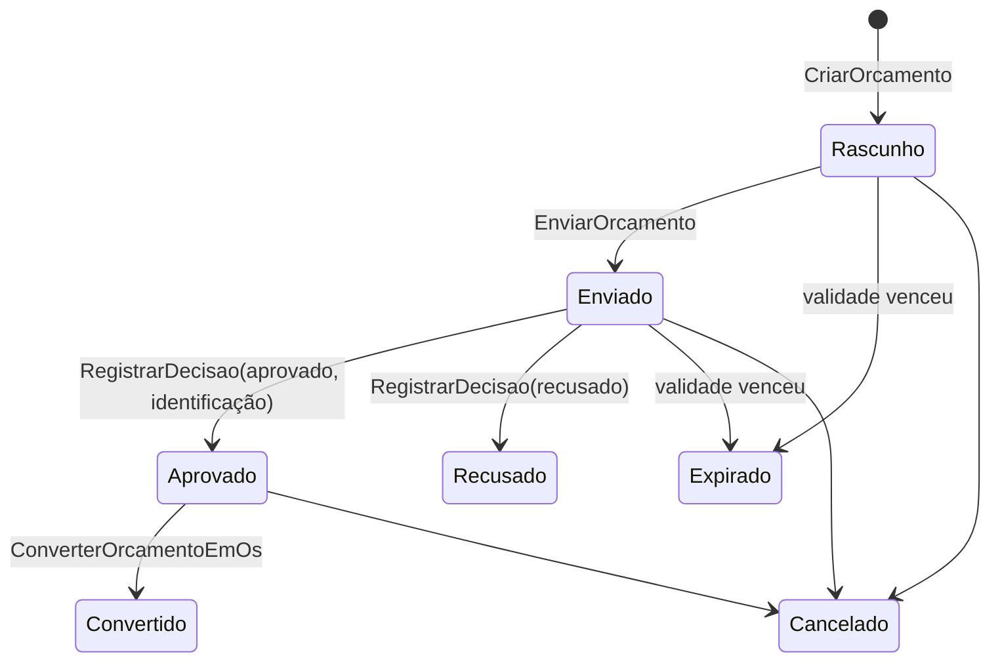

# Módulo Orçamentos

> O **orçamento comercial** como documento próprio — assunto, itens livres com preço e desconto,
> validade, condições de pagamento e um **PDF profissional** com a marca da empresa. Um orçamento
> aprovado pode virar uma OS.

## 1. Escopo

### Faz

- Mantém o **orçamento comercial**: cabeçalho (cliente cadastrado **ou avulso**, assunto,
  descrição, validade, condições, desconto de cabeçalho) + **itens livres** (descrição, quantidade,
  unidade, preço, desconto de linha).
- Ciclo de vida próprio: `Rascunho → Enviado → Aprovado | Recusado | Expirado`; e
  `Rascunho/Enviado/Aprovado → Cancelado`; `Aprovado → Convertido` (virou OS).
- **Filtra e organiza**: por estado, cliente, texto (assunto/cliente) e período.
- Gera os dados do **PDF** (o desenho A4 fica em `cardeal-pdf`, chamado pela camada de
  apresentação com a identidade da empresa — `MotorLocal::identidade_visual`).
- **Converte** um orçamento aprovado numa OS (`ConverterOrcamentoEmOs`): abre a OS para o cliente,
  com o assunto como equipamento e os itens lançados como mão de obra.

### Não faz

- **Não é o orçamento interno da OS.** O `mod-os` tem seu próprio "orçamento" (peça + mão de obra
  amarrado à máquina de estados da OS, permissões `os.orcamento.*`). Aqui o orçamento é um
  documento comercial autônomo, com numeração e ciclo próprios.
- **Não lança nada no Razão.** Um orçamento não é fato contábil — só a OS (ou a venda) gerada dele
  fatura.
- **Não reserva estoque nem consome produto.** Os itens são texto livre; o vínculo com produto do
  estoque acontece só depois, na OS.
- **Não é o cadastro do cliente.** Referencia `clientes_pessoa` quando o cliente é cadastrado;
  guarda um *snapshot* de nome/documento/contato para o cliente avulso.

## 2. Submódulos

| id | nome | essencial | depende de | o que some da UI quando desligado |
|---|---|---|---|---|
| `orcamento` | Orçamento comercial | sim | — | Não pode ser desligado (o módulo inteiro sai). |

## 3. Entidades

| Entidade | Campos principais | Observações |
|---|---|---|
| **Orcamento** | `id`, `empresa`, `numero`, `cliente`(Id? — `NULL` = avulso), `cliente_nome`, `cliente_documento`, `cliente_contato`, `assunto`, `descricao`, `data_emissao`(Data), `validade`(Data), `condicoes_pagamento`, `prazo_entrega`, `observacoes`, `desconto_percentual`(Percentual), `estado`, `responsavel`, `aprovado_por`, `os_gerada`(Id?), `criado_em`(Instante), `versao` | `cliente_nome` sempre presente (snapshot mesmo com cliente cadastrado) |
| **ItemOrcamento** | `id`, `orcamento`, `ordem`(u32), `descricao`, `quantidade`(Quantidade), `unidade`, `preco_unitario`(Preco), `desconto_percentual`(Percentual), `total`(Dinheiro) | `total` congelado no item: `qtd × preço − desconto` |

**Totais:** `subtotal` = Σ (qtd × preço); `desconto_total` = Σ descontos de linha + desconto de
cabeçalho (incide sobre a soma líquida das linhas); `total` = líquido − desconto de cabeçalho.

## 4. Máquina de estados



`aceita_edicao()` = `Rascunho` ou `Enviado` — só nesses estados o cabeçalho e os itens mudam.

## 5. Comandos

| Comando | Permissão | Risco | O que faz | Erros possíveis |
|---|---|---|---|---|
| `CriarOrcamento` ✅ | `orcamentos.orcamento.criar` | Baixo | Numera e cria em `Rascunho` (cabeçalho + itens iniciais opcionais) | `AssuntoVazio`, `ClienteSemNome`, `ValidadeAnteriorAEmissao`, `DescricaoDeItemVazia`, `QuantidadeInvalida` |
| `EditarOrcamento` ✅ | `orcamentos.orcamento.editar` | Baixo | Regrava o cabeçalho — só `aceita_edicao()` | `EstadoInvalido`, idem `CriarOrcamento` |
| `DefinirItensOrcamento` ✅ | `orcamentos.orcamento.editar` | Baixo | Substitui a lista inteira de itens (a tela manda o vetor final) | `EstadoInvalido`, `DescricaoDeItemVazia`, `QuantidadeInvalida` |
| `EnviarOrcamento` ✅ | `orcamentos.orcamento.enviar` | Baixo | `Rascunho → Enviado` — exige ≥1 item e validade não vencida | `EstadoInvalido`, `OrcamentoVazio`, `OrcamentoVencido` |
| `RegistrarDecisaoOrcamento` ✅ | `orcamentos.orcamento.decidir` | Médio | `Enviado → Aprovado | Recusado`; aprovar exige `identificacao` não vazia (nunca implícita); publica `orcamentos.orcamento_aprovado.v1` | `OrcamentoJaDecidido`, `OrcamentoVencido`, `DecisaoSemIdentificacao` |
| `CancelarOrcamento` ✅ | `orcamentos.orcamento.cancelar` | Baixo | Terminal, a partir de `Rascunho`/`Enviado`/`Aprovado` | `EstadoInvalido` |
| `DuplicarOrcamento` ✅ | `orcamentos.orcamento.criar` | Baixo | Clona como novo `Rascunho` (nova numeração, nova validade, mesmos itens) | — |
| `ConverterOrcamentoEmOs` ✅ | `orcamentos.orcamento.converter` | Médio | Só `Aprovado` **e** cliente cadastrado. Chama `mod_os` **direto, na mesma transação** (ver §11.2): abre a OS (`assunto` → equipamento), lança cada item como `ItemMaoDeObra`, marca o orçamento `Convertido` com `os_gerada`; publica `orcamentos.orcamento_convertido.v1` | `ClienteAvulsoNaoConverte`, `ModuloOsInativo`, `EstadoInvalido` |

## 6. Consultas

| Consulta | Permissão | Uso na UI |
|---|---|---|
| `OrcamentosRecentes { estado?, cliente?, texto?, desde?, ate? }` | `orcamentos.orcamento.ver` | A grade da aba (teto de 500 linhas, como `os.OrdensAbertas`) |
| `BuscarOrcamento { orcamento }` | `orcamentos.orcamento.ver` | O dialog de detalhe (cabeçalho + itens + totais) e a geração do PDF |
| `ResumoOrcamentos` | `orcamentos.orcamento.ver` | Os 3 KPIs da aba (em aberto, aprovados nos últimos 30 dias, taxa de conversão) |

## 7. Receituário contábil

Nenhum. Um orçamento não posta no Razão — a receita entra pela OS (`os.md` §7) ou pela venda
geradas a partir dele.

## 8. Eventos

**Publicados:** `orcamentos.orcamento_aprovado.v1` (`{ orcamento, cliente?, total }`),
`orcamentos.orcamento_convertido.v1` (`{ orcamento, ordem_servico }`).

**Assinados:** nenhum.

## 9. Permissões

| Chave | Descrição | Risco |
|---|---|---|
| `orcamentos.orcamento.ver` | Consultar orçamentos | Baixo |
| `orcamentos.orcamento.criar` | Criar / duplicar orçamento | Baixo |
| `orcamentos.orcamento.editar` | Editar cabeçalho e itens | Baixo |
| `orcamentos.orcamento.enviar` | Enviar ao cliente | Baixo |
| `orcamentos.orcamento.decidir` | Registrar aprovação / recusa | Médio |
| `orcamentos.orcamento.cancelar` | Cancelar orçamento | Baixo |
| `orcamentos.orcamento.converter` | Converter aprovado em OS | Médio |

## 10. Telas

Não tem entrada de menu própria: é a **2ª aba da tela de Ordens de Serviço**
(`crates/cardeal-desktop/src/tela_orcamentos.rs`), ao lado de "Ordens de serviço".

```
┌─────────────────────────────────────────────────────────────────────────────────────┐
│  [ Ordens de serviço | Orçamentos ]                              [+ Novo orçamento]  │
├─────────────────────────────────────────────────────────────────────────────────────┤
│  Em aberto: 5 · R$ 12.300     Aprovados (30d): 3 · R$ 8.100     Conversão: 60%       │
│  [Todos][Rascunho][Enviado][Aprovado]…   [Sempre][30d][90d][12m]   Cliente ▾  Busca  │
├─────────────────────────────────────────────────────────────────────────────────────┤
│  Nº    Cliente        Assunto                Emissão   Validade  Total      Estado    │
│  0007  João Silva     Rebobinamento motor    07/09     22/09     R$ 1.190   ● Enviado │
│  0006  Maria Souza    Troca de compressor    05/09     20/09     R$ 3.240   ● Aprovado│
└─────────────────────────────────────────────────────────────────────────────────────┘
```

O dialog serve os três modos (criar / editar / ver-e-agir). No detalhe, os botões seguem o
estado: **Enviar**, **Registrar aprovação/recusa**, **Editar**, **Cancelar**, **Duplicar**,
**Converter em OS** e **Gerar PDF**.

O PDF (`cardeal-pdf`) usa a **identidade da empresa** — logo, telefone, e-mail, site e endereço —
cadastrada em **Configurações → Empresa → "Identidade para documentos"** (guardada em
`nucleo_configuracao` sob as chaves `empresa.*`; a logo em base64).

## 11. Regras de negócio críticas

1. **Aprovação sempre identificada** (nome + documento, ou "assinatura em anexo"), nunca implícita —
   espelha `os.md` §11.2.
2. **`ConverterOrcamentoEmOs` chama `mod-os` na mesma transação**, não por evento — atomicidade
   importa mais que desacoplamento aqui (`docs/contratos-internos.md` §7 regra 2), como
   `os::FaturarOrdemServico` chama `mod_financeiro`. A dependência é só num sentido: `mod-os` **não**
   conhece `mod-orcamentos`. Por isso `mod-orcamentos` tem `mod-os` no `Cargo.toml` (a mesma
   exceção sancionada que `mod-os` usa para `mod-financeiro`/`mod-estoque`).
3. **Cliente avulso não converte.** Para virar OS o orçamento precisa de um cliente cadastrado —
   a OS referencia `clientes_pessoa`.
4. **Editar só antes da decisão** (`Rascunho`/`Enviado`). Depois de aprovado/recusado, um ajuste é
   uma nova negociação: duplique.
5. **Desconto de cabeçalho incide sobre a soma líquida das linhas** (depois dos descontos de item),
   nunca sobre o bruto.

## 12. Comportamento offline

Tudo funciona offline (criar, editar, enviar, decidir, converter, gerar PDF) — o orçamento é local
e não depende de verificação externa. A conversão em OS segue a política de `os` para o que a OS
gerada precisar (limite de crédito etc.).

## 13. Tabelas

```sql
CREATE TABLE orcamentos_orcamento (
    id                   BLOB PRIMARY KEY,
    empresa              BLOB    NOT NULL REFERENCES nucleo_empresa(id),
    numero               INTEGER NOT NULL,
    cliente              BLOB,
    cliente_nome         TEXT    NOT NULL,
    cliente_documento    TEXT,
    cliente_contato      TEXT,
    assunto              TEXT    NOT NULL,
    descricao            TEXT,
    data_emissao         INTEGER NOT NULL,
    validade             INTEGER NOT NULL,
    condicoes_pagamento  TEXT,
    prazo_entrega        TEXT,
    observacoes          TEXT,
    desconto_percentual  INTEGER NOT NULL DEFAULT 0,
    estado               TEXT    NOT NULL CHECK (estado IN
                           ('Rascunho','Enviado','Aprovado','Recusado','Expirado','Cancelado','Convertido')),
    responsavel          BLOB    NOT NULL,
    aprovado_por         TEXT,
    os_gerada            BLOB,
    criado_em            INTEGER NOT NULL,
    versao               INTEGER NOT NULL DEFAULT 1,
    UNIQUE (empresa, numero)
) STRICT;
CREATE INDEX orcamentos_orcamento_empresa_estado ON orcamentos_orcamento(empresa, estado);
CREATE INDEX orcamentos_orcamento_cliente ON orcamentos_orcamento(cliente);

CREATE TABLE orcamentos_item (
    id                   BLOB PRIMARY KEY,
    orcamento            BLOB    NOT NULL REFERENCES orcamentos_orcamento(id),
    ordem                INTEGER NOT NULL,
    descricao            TEXT    NOT NULL,
    quantidade           INTEGER NOT NULL,
    unidade              TEXT    NOT NULL DEFAULT '',
    preco_unitario       INTEGER NOT NULL,
    desconto_percentual  INTEGER NOT NULL DEFAULT 0,
    total                INTEGER NOT NULL
) STRICT;
CREATE INDEX orcamentos_item_orcamento ON orcamentos_item(orcamento);
```

A numeração usa `nucleo_sequencia` (chave `orcamentos.orcamento`), via
`UnidadeDeTrabalho::proximo_numero` — mesmo mecanismo de `os`.
