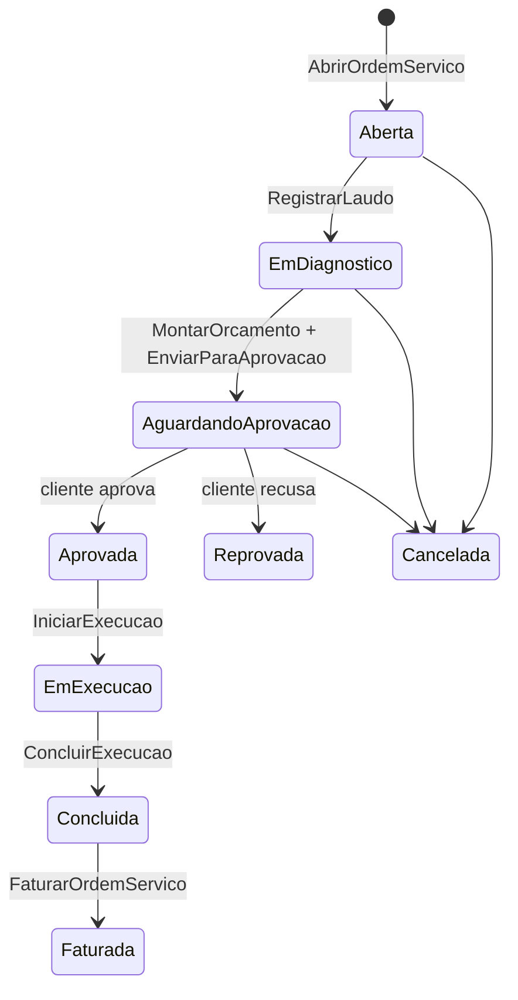

# Módulo OS (Ordem de Serviço)

> Abertura, laudo, orçamento aprovado pelo cliente, execução com peças e mão de obra, garantia e
> reincidência — o ciclo completo da assistência técnica.

## 1. Escopo

### Faz

- Mantém a **ordem de serviço**: abertura, **laudo técnico**, **orçamento** (peças + mão de obra),
  **aprovação do cliente**, execução e faturamento.
- Controla **peças aplicadas** (consumo de estoque) e **mão de obra** (valor por serviço).
- Controla **garantia** por prazo e **reincidência** — uma nova OS do mesmo equipamento dentro do
  prazo de garantia não cobra peça/mão de obra cobertas.
- Reserva o horário do técnico chamando `agenda.CriarCompromisso`.

### Não faz

- **Não controla saldo de estoque nem custo médio.** Aplicar peça é um comando que chama
  `estoque.RegistrarSaida`; o custo vem de lá.
- **Não é a agenda do técnico.** Disponibilidade, conflito e lembrete são de `agenda`; `os` só cria o
  compromisso.
- **Não cobra nem recebe.** `FaturarOrdemServico` gera o `Lancamento` e delega a criação do `Titulo`
  ao financeiro pelo mesmo evento de sempre.
- **Não é o cadastro do cliente.** Referencia `clientes_pessoa`.

## 2. Submódulos

| id | nome | essencial | depende de | o que some da UI quando desligado |
|---|---|---|---|---|
| `ordem` | Ordem de Serviço | sim | — | Não pode ser desligado. |
| `laudo` | Laudo Técnico | não | `ordem` | Aba "Laudo" some; OS vai direto para orçamento. |
| `garantia` | Garantia e Reincidência | não | `ordem` | Campo "Prazo de garantia" e alerta de reincidência somem. |
| `apontamento` | Apontamento de Tempo | não | `ordem` | Botão "Iniciar/Encerrar apontamento" e o tempo acumulado somem do detalhe da OS. |

## 3. Entidades

| Entidade | Campos principais | Observações |
|---|---|---|
| **OrdemServico** | `id`, `empresa`, `numero`, `cliente`, `equipamento`(String, **opcional**), `defeito_relatado`(String, **obrigatório**), `data_abertura`(Data), `tecnico_responsavel`, `compromisso`(Id de `agenda_compromisso`), `estado`, `garantia_dias`(Quantidade inteiro), `valor_total`(Dinheiro), `versao` | ver §4 para `estado`. `defeito_relatado` ✅ (2026-09-11, pedido explícito do usuário) é o que o cliente relatou querer resolver, capturado **na recepção** — junto do nome do cliente, o único texto obrigatório para abrir a OS; `equipamento` virou opcional (completável depois via `EditarDadosDaOrdem`) |
| **LaudoTecnico** | `id`, `ordem_servico`, `descricao_problema`(String), `diagnostico`(String), `tecnico`, `criado_em`(Instante) | `descricao_problema` foi **mantido como está** na sessão de 2026-09-11 mesmo com `OrdemServico.defeito_relatado` cobrindo o mesmo papel — ver nota ao fim de §5 |
| **ItemPeca** | `id`, `ordem_servico`, `produto`, `quantidade`(Quantidade), `preco_unitario`(Preco), `custo_unitario`(Preco), `coberto_garantia`(enum) | `coberto_garantia = Sim` não gera receita |
| **ItemMaoDeObra** | `id`, `ordem_servico`, `descricao`(String), `valor`(Dinheiro), `tecnico`, `horas`(Quantidade) | isto é a mão de obra **orçada/cobrada** do cliente — não confundir com `ApontamentoDeTempo`, o relógio de ponto real |
| **Reincidencia** | `id`, `ordem_nova`, `ordem_anterior`, `dias_entre`(Quantidade inteiro), `coberto_garantia`(enum) | vincula OS repetida do mesmo equipamento — ainda não implementada (`AcionarGarantia`) |
| **ApontamentoDeTempo** ✅ (novo) | `id`, `ordem_servico`, `tecnico`, `inicio`(Instante), `fim`(Option\<Instante\>), `ajustado`(bool), `motivo_ajuste`(Option\<String\>), `versao` | `fim = None` = cronômetro rodando. Alimenta produtividade e o custo real de mão de obra em `cardeal-analytics` — completamente separado de `ItemMaoDeObra.horas` (aquele é o orçado/cobrado; isto é o tempo real gasto, que pode divergir) |

## 4. Máquinas de estado



## 5. Comandos

| Comando | Permissão | Risco | O que faz | Erros possíveis |
|---|---|---|---|---|
| `AbrirOrdemServico` ✅ | `os.ordem.criar` | Baixo | Numera e abre a OS. **Só `cliente` + `defeito_relatado` são obrigatórios** (2026-09-11); `equipamento` pode vir vazio. Valida que `cliente` existe em `clientes_pessoa` (via `mod_clientes::pessoa_por_id`, 2026-09-12 — `mod-clientes` é dependência normal do crate). O vínculo com `agenda.CriarCompromisso` fica para quando o módulo `agenda` existir — `compromisso` não é gravado ainda | `DefeitoRelatadoVazio`, `ClienteInexistente` |
| `EditarDadosDaOrdem` ✅ (novo, 2026-09-11) | `os.ordem.editar_dados` | Baixo | Completa/corrige `equipamento` e/ou complementa `defeito_relatado` (nunca sobrescreve — soma ao relato original) depois da abertura, em qualquer estado não-terminal | `NadaParaAtualizar`, `OrdemFinalizada`, `DefeitoRelatadoVazio` |
| `RegistrarLaudo` ✅ | `os.laudo.registrar` | Baixo | Chamável de novo enquanto `EmDiagnostico`, para corrigir um laudo digitado errado — sobrescreve o texto, não transiciona de novo; a consulta sempre lê o laudo mais recente | — |
| `MontarOrcamentoOs` ✅ | `os.orcamento.montar` | Baixo | Chamado uma vez por item (`ItemOrcamentoNovo::Peca`/`MaoDeObra`); soma ao `valor_total` e incrementa `itens_orcamento`. Aceita `Aberta`/`EmDiagnostico`/`EmExecucao` (2026-09-12 — peça nova identificada só depois de abrir o equipamento pode ser orçada sem reabrir o diagnóstico, mesma brecha que `OrdemServico::adicionar_ao_orcamento` já concedia a `RegistrarMaoDeObra`) | `EstadoInvalido` |
| `RemoverItemOrcamento` ✅ (não estava no spec original) | `os.orcamento.montar` | Baixo | Remove um item digitado errado antes da aprovação, sem precisar cancelar a OS inteira | `EstadoInvalido` |
| `EnviarParaAprovacao` ✅ | `os.orcamento.enviar` | Baixo | | `OrcamentoVazio` |
| `AprovarOrcamentoOs` ✅ | `os.orcamento.aprovar` | Médio | Exige `identificacao_aprovador` não vazia (`aprovado_por`, coluna nova) | `OrcamentoJaDecidido`, `AprovacaoSemIdentificacao` |
| `ReprovarOrcamentoOs` ✅ | `os.orcamento.aprovar` | Baixo | | `OrcamentoJaDecidido` |
| `IniciarExecucao` ✅ | `os.execucao.iniciar` | Baixo | | `OrcamentoNaoAprovado` |
| `AplicarPeca` ✅ | `os.peca.aplicar` | Médio | Chama `mod_estoque::registrar_saida_comum` **direto, na mesma transação** (não via despacho — ver `docs/contratos-internos.md` §7 regra 2); grava `custo_unitario` devolvido e propaga `gerou_divergencia` (2026-09-12 — o sinal de saldo negativo que `registrar_saida_comum` já apurava não era mais repassado; agora vai no retorno `PecaFoiAplicada`, para a tela avisar na hora) | `ItemNaoPertenceAOrdem`, `PecaJaAplicada` |
| `RegistrarMaoDeObra` ✅ | `os.execucao.registrar_mao_de_obra` | Baixo | | — |
| `ConcluirExecucao` ✅ | `os.execucao.concluir` | Baixo | | `PecaPendenteDeAplicacao` |
| `FaturarOrdemServico` ✅ | `os.faturar` | Alto | Monta **um único lançamento combinado** (D Clientes a receber/C Receita de serviços — pulado se `valor_total` for zero — + D Custo de serviço/C Estoque quando há peça aplicada) e grava o título a receber vinculado a ele, **só se houve cobrança**, com `mod_financeiro::ConstrutorTitulo` + `RepositorioFinanceiro::inserir_titulo` — **não** usa `mod_financeiro::lancar_titulo_comum` (que criaria um segundo lançamento e duplicaria a receita; ver `src/comandos/faturar_ordem_servico.rs`) | `OsNaoConcluida`, `OsJaFaturada` |
| `CancelarOrdemServico` ✅ | `os.ordem.cancelar` | Médio | Só a partir de `Aberta`/`EmDiagnostico`/`AguardandoAprovacao` (§4, §11 regra 5) — terminal, como `Reprovada` | `EstadoInvalido` |
| `IniciarApontamento` ✅ (novo) | `os.apontamento.iniciar` | Baixo | Abre um `ApontamentoDeTempo` para o técnico na OS informada — recusa se o técnico já tem outro apontamento aberto **em qualquer OS** (ele não trabalha em duas ao mesmo tempo) | `TecnicoJaTemApontamentoAberto` |
| `EncerrarApontamento` ✅ (novo) | `os.apontamento.encerrar` | Baixo | Fecha o apontamento aberto (`fim = agora`); devolve a duração em segundos | `ApontamentoJaEncerrado`, `FimAntesDoInicio` |
| `AjustarApontamento` ✅ (novo) | `os.apontamento.ajustar` | Médio | Corrige manualmente início/fim de um apontamento (aberto ou já encerrado) — para quando o técnico esquece de parar o cronômetro. Sempre exige motivo; marca `ajustado = true` | `MotivoDeAjusteObrigatorio`, `FimAntesDoInicio` |
| `AcionarGarantia` | `os.garantia.acionar` | Médio | Ainda não implementado — `ItemPeca.coberto_garantia` nunca é `true` nesta versão | `ForaDoPrazoDeGarantia` |

> **Nota (2026-09-05):** as linhas ✅ estão implementadas com teste de integração de ponta a
> ponta (`crates/modulos/mod-os/tests/comandos.rs`): cliente → peça em estoque → OS aberta →
> laudo → orçamento → aprovação → execução (consumindo estoque de verdade) → faturamento com
> título real no financeiro. `os_ordem_servico` ganhou a coluna `aprovado_por` (não estava no
> §13 original) para que a aprovação nunca seja implícita, conforme a regra §11.2.
>
> **Nota (2026-09-06) — auditoria de produção:** encontrou e corrigiu três lacunas reais. (1)
> Um reparo em garantia (peça a custo zero para o cliente) não conseguia sair de
> `AguardandoAprovacao`, porque `enviar_para_aprovacao` exigia `valor_total > 0` — agora exige
> só ter algum item (`os_ordem_servico` ganhou a coluna `itens_orcamento`, v2). Isso por sua
> vez revelou um bug latente mais sério: `FaturarOrdemServico` sempre debitava/creditava
> `valor_total` incondicionalmente, e o Razão recusa qualquer partida de valor zero — faturar
> uma OS de garantia genuína teria **entrado em pânico** (`ConstrutorLancamento::construir`
> retornando `ValorZerado`, contra um `.expect()` que assumia isso "nunca acontece na
> prática"); corrigido para pular a partida de cobrança quando `valor_total` é zero, e não
> gerar lançamento nenhum quando não há cobrança **nem** custo de peça. (2) Não havia como
> corrigir um item de orçamento digitado errado sem cancelar a OS inteira
> (`RemoverItemOrcamento`, novo). (3) Um laudo não podia ser corrigido depois de registrado
> (`RegistrarLaudo` agora aceita ser chamado de novo enquanto `EmDiagnostico`).
>
> **Nota (2026-09-11):** pedido explícito do usuário — apontamento de tempo real por OS, para
> alimentar produtividade e custo real de mão de obra em `cardeal-analytics` (novo crate, ver
> §14). `IniciarApontamento`/`EncerrarApontamento`/`AjustarApontamento` são novos, junto com a
> tabela `os_apontamento_tempo` (migração v3) e o domínio `ApontamentoDeTempo` (§3). Também
> fechados os dois gaps de consulta conhecidos (`OrdensAguardandoAprovacao`,
> `HistoricoDoEquipamento` — este por similaridade de texto do equipamento, limiar 0,5) e
> adicionada `financeiro.titulo_da_origem.v1` (novo, em `mod-financeiro`) para a UI de OS
> mostrar qual título foi gerado ao faturar, sem `os` nunca ler `financeiro_titulo` direto.
>
> **Nota (2026-09-11, sessão seguinte) — abertura mínima e visibilidade de estoque:** pedido
> explícito do usuário — "de obrigatório só o nome, [...] problema relatado" — abrir uma OS
> passou a exigir só `cliente` + `defeito_relatado` (migração v4, `os_ordem_servico.
> defeito_relatado TEXT NOT NULL DEFAULT ''`, aditiva); `equipamento` virou opcional. Decisão
> registrada: `LaudoTecnico.descricao_problema` **não** foi removido/renomeado — o parecer
> técnico continua um campo separado, sem invariante nova, e mexer nele tocaria a tela de
> detalhe da OS fora do escopo desta sessão; a duplicação latente não causa dano (o campo só
> deixou de ser a única fonte do relato do cliente). `EditarDadosDaOrdem` (novo) completa
> equipamento/defeito relatado depois, em qualquer estado não-terminal. Auditoria de
> integração também fechou uma lacuna real: **`PecasAguardandoEstoque`** (§6) cruza os itens
> de peça orçados e ainda não aplicados contra o saldo real do estoque (via a porta pública
> `mod_estoque::saldo_disponivel_do_produto`, nova) — antes, só dava para descobrir que uma OS
> estava parada esperando peça abrindo a OS e o produto em telas separadas.

## 6. Consultas

| Consulta | Permissão | Uso na UI | Índice que a sustenta |
|---|---|---|---|
| `OrdensEmAberto` ✅ | `os.ordem.ver` | Painel de OS (lista principal) | `os_ordem_servico(empresa, estado)` |
| `OrdensAguardandoAprovacao` ✅ | `os.ordem.ver` | Fila de aprovação | `os_ordem_servico(estado) WHERE estado = 'AguardandoAprovacao'` |
| `HistoricoDoEquipamento` ✅ | `os.ordem.ver` | Aba "Histórico" na abertura de nova OS | `os_ordem_servico(cliente, equipamento)` — filtro por similaridade de texto (limiar 0,5) em memória, não índice |
| `BuscarDetalheOrdem` ✅ | `os.ordem.ver` | Dialog de detalhe da OS | `os_ordem_servico(id)` |
| `ApontamentosDaOrdem` ✅ (novo) | `os.ordem.ver` | Histórico de apontamento no detalhe da OS | `os_apontamento_tempo(ordem_servico)` |
| `TempoTotalDaOrdem` ✅ (novo) | `os.ordem.ver` | Tempo acumulado no detalhe da OS — só soma apontamentos **encerrados** | idem |
| `TempoPorTecnicoNoPeriodo` ✅ (novo) | `os.ordem.ver` | Produtividade por técnico (`cardeal-analytics`) | `os_apontamento_tempo(tecnico, inicio)` |
| `PecasAguardandoEstoque` ✅ (novo, 2026-09-11 — auditoria de integração) | `os.ordem.ver` | Radar de "OS parada esperando peça": peça orçada, ainda não aplicada, cujo saldo disponível no estoque não cobre a quantidade pedida — cruza `os_item_peca`/`os_ordem_servico` com `mod_estoque::saldo_disponivel_do_produto` (porta pública nova, nunca lê `estoque_saldo_local` direto) | varredura de `os_item_peca(aplicada)` por ordem não finalizada, uma consulta de saldo por produto |
| `TaxaDeReincidencia` | `os.garantia.ver` | Relatório de qualidade técnica | `os_reincidencia(ordem_anterior)` — ainda não implementada, depende de `AcionarGarantia` |

## 7. Receituário contábil

| Evento de negócio | Débito | Crédito | Estado |
|---|---|---|---|
| Ordem de serviço faturada | Clientes a receber (1.2.01) | Receita de serviços (4.2) | Confirmado |
| Peça aplicada e cobrada do cliente | Custo de serviço (5.2) | Estoque (1.3.01) | igual ao lançamento acima |
| Peça aplicada sob garantia (não cobrada) | Despesas comerciais/Garantia (5.5, subconta) | Estoque | Confirmado, no momento da aplicação |
| Comissão de técnico apurada sobre OS faturada | Despesas com pessoal (5.3) | Comissões a pagar (2.1.03, subconta) | Confirmado |
| Pagamento de comissão de técnico | Comissões a pagar | Bancos | Realizado |

## 8. Eventos

**Publicados:** `os.ordem_aberta.v1`, `os.orcamento_aprovado.v1`, `os.ordem_faturada.v1` (assinado
por `financeiro` e por `crm`, quando ativos), `os.garantia_acionada.v1`.

**Assinados:** `agenda.conflito_detectado.v1` → alerta na tela de abertura quando o técnico sugerido
está ocupado.

## 9. Permissões

| Chave | Descrição | Risco |
|---|---|---|
| `os.ordem.ver` / `.criar` | Consultar/abrir OS | Baixo |
| `os.ordem.editar_dados` | Completar/corrigir equipamento e defeito relatado | Baixo |
| `os.laudo.registrar` | Registrar laudo técnico | Baixo |
| `os.orcamento.montar` / `.enviar` | Montar e enviar orçamento | Baixo |
| `os.orcamento.aprovar` | Registrar aprovação/reprovação do cliente | Médio |
| `os.execucao.iniciar` / `.concluir` | Ciclo de execução | Baixo |
| `os.peca.aplicar` | Aplicar peça (consome estoque) | Médio |
| `os.execucao.registrar_mao_de_obra` | Registrar mão de obra | Baixo |
| `os.faturar` | Faturar ordem de serviço | Alto |
| `os.garantia.acionar` | Acionar garantia | Médio |
| `os.garantia.ver` | Ver relatório de reincidência | Baixo |
| `os.apontamento.iniciar` / `.encerrar` | Iniciar/encerrar apontamento de tempo | Baixo |
| `os.apontamento.ajustar` | Corrigir manualmente um apontamento de tempo | Médio |

## 10. Telas

```
┌───────────────────────────────────────────────────────────────────────────────────────┐
│  OS #331 · João Silva · Notebook Dell XPS 13         Em execução     [Ctrl+S Salvar]  │
├───────────────────────────────────────────────────────────────────────────────────────┤
│  [Laudo] [Orçamento] [Execução] [Faturamento]                                          │
├───────────────────────────────────────────────────────────────────────────────────────┤
│  Peça                          Qtd   Preço      Coberto por garantia                   │
│  Bateria original 6 células      1   R$ 320,00   ☐                                     │
│  Mão de obra: Diagnóstico + troca de bateria      R$ 80,00                             │
│                                                                                        │
│  Total: R$ 400,00     Garantia: 90 dias sobre a peça                                  │
│                                                          [F2 Concluir execução]        │
└───────────────────────────────────────────────────────────────────────────────────────┘
```

```
┌─────────────────────────────────────────────────────────┐
│  Aprovação do orçamento — OS #331                          │
│  Total: R$ 400,00 — válido por 5 dias                       │
│  Cliente: [João Silva__________]  Documento: [___________] │
│                    [Aprovar]  [Reprovar]                    │
└─────────────────────────────────────────────────────────┘
```

**Apontamento de tempo** (`cardeal-desktop::tela_os`, seção "Apontamento de tempo" no rodapé
do detalhe): tempo total acumulado + botão "Iniciar apontamento"/"Encerrar apontamento" para
o técnico logado, conforme ele já tenha (ou não) um apontamento aberto nesta OS. **Título
gerado** (mesmo dialog, seção "Financeiro", só quando `Faturada`): mostra o título a receber
que `FaturarOrdemServico` gerou (via `financeiro.titulo_da_origem.v1`), ou deixa explícito
"faturada sem cobrança" numa OS de garantia/cortesia — o usuário nunca precisa abrir a tela de
financeiro só para confirmar que o título nasceu.

**Comprovante em PDF** (`cardeal-pdf::gerar_comprovante_os`, botão "Comprovante (PDF)" no
rodapé do dialog de detalhe): documento único que cobre as duas pontas do atendimento — cabeçalho
com a marca da empresa, cliente, equipamento, defeito relatado, diagnóstico, itens de peça/mão
de obra com totais, garantia e quem aprovou o orçamento. Gerável em QUALQUER estado da OS: recém-
aberta (sem laudo/itens ainda) vira o comprovante de entrada que o cliente leva ao deixar o
equipamento; faturada leva o documento completo para a retirada. Mesmo motor de composição do
PDF de orçamento (`cardeal_pdf::layout`) — cabeçalho, tabela de itens, totais e aceite são o
mesmo código, só o bloco de identificação muda.

## 11. Regras de negócio críticas

1. **Peça só é aplicada com orçamento aprovado**, salvo emergência com permissão explícita —
   impede consumir estoque de um serviço que o cliente ainda pode recusar.
2. **Aprovação do cliente é sempre identificada** (nome + documento, ou assinatura), nunca implícita
   por "o técnico disse que ele topou".
3. **Faturar exige `Concluida`.** Não existe fatura parcial de OS em andamento.
4. **Reincidência dentro do prazo de garantia nunca cobra peça/mão de obra cobertas** — a nova OS
   nasce vinculada e o item correspondente já entra com `coberto_garantia = Sim`.
5. **Cancelamento de OS não fatura, mas peça já aplicada precisa de estorno explícito** (devolução ao
   estoque) — nunca fica um consumo órfão sem contrapartida.

## 12. Comportamento offline

**Funciona:** abrir OS, registrar laudo, montar orçamento, aplicar peça, registrar mão de obra —
tudo com dados do último sincronismo.
**Não funciona:** aprovação do cliente por link remoto (depende de conectividade externa); faturar
com verificação de limite de crédito do cliente em tempo real (segue a política geral: aceita e
sinaliza `AcimaDoLimite`).
**Conflito na reconciliação:** peça aplicada offline segue a política de `estoque` (saldo pode ficar
negativo, é aceito e sinalizado). Reincidência detectada apenas na reconexão gera alerta retroativo
se duas OS do mesmo equipamento foram abertas em terminais diferentes na mesma janela offline.

## 13. Tabelas

```sql
CREATE TABLE os_ordem_servico (
    id                   BLOB PRIMARY KEY,
    empresa              BLOB    NOT NULL,
    numero               INTEGER NOT NULL,
    cliente              BLOB    NOT NULL,
    equipamento          TEXT    NOT NULL,
    defeito_relatado     TEXT    NOT NULL DEFAULT '',  -- migração v4, ver nota abaixo
    data_abertura        INTEGER NOT NULL,
    tecnico_responsavel  BLOB    NOT NULL,
    compromisso          BLOB,
    estado               TEXT    NOT NULL CHECK (estado IN ('Aberta','EmDiagnostico','AguardandoAprovacao','Aprovada','EmExecucao','Concluida','Faturada','Cancelada','Reprovada')),
    aprovado_por         TEXT,
    garantia_dias        INTEGER NOT NULL DEFAULT 90,
    valor_total          INTEGER NOT NULL DEFAULT 0,
    versao               INTEGER NOT NULL DEFAULT 1,
    UNIQUE (empresa, numero)
) STRICT;
CREATE INDEX os_ordem_estado ON os_ordem_servico(empresa, estado);
CREATE INDEX os_ordem_cliente_equip ON os_ordem_servico(cliente, equipamento);

CREATE TABLE os_laudo_tecnico (
    id                  BLOB PRIMARY KEY,
    ordem_servico       BLOB    NOT NULL REFERENCES os_ordem_servico(id),
    descricao_problema  TEXT    NOT NULL,
    diagnostico         TEXT,
    tecnico             BLOB    NOT NULL,
    criado_em           INTEGER NOT NULL
) STRICT;

CREATE TABLE os_item_peca (
    id                BLOB PRIMARY KEY,
    ordem_servico     BLOB    NOT NULL REFERENCES os_ordem_servico(id),
    produto           BLOB    NOT NULL,
    quantidade        INTEGER NOT NULL,
    preco_unitario    INTEGER NOT NULL,
    custo_unitario    INTEGER NOT NULL,
    coberto_garantia  INTEGER NOT NULL DEFAULT 0 CHECK (coberto_garantia IN (0,1))
) STRICT;
CREATE INDEX os_item_peca_ordem ON os_item_peca(ordem_servico);

CREATE TABLE os_item_mao_de_obra (
    id             BLOB PRIMARY KEY,
    ordem_servico  BLOB    NOT NULL REFERENCES os_ordem_servico(id),
    descricao      TEXT    NOT NULL,
    valor          INTEGER NOT NULL,
    tecnico        BLOB    NOT NULL,
    horas          INTEGER
) STRICT;
CREATE INDEX os_item_mao_de_obra_ordem ON os_item_mao_de_obra(ordem_servico);

CREATE TABLE os_reincidencia (
    id                BLOB PRIMARY KEY,
    ordem_nova        BLOB    NOT NULL REFERENCES os_ordem_servico(id),
    ordem_anterior    BLOB    NOT NULL REFERENCES os_ordem_servico(id),
    dias_entre        INTEGER NOT NULL,
    coberto_garantia  INTEGER NOT NULL CHECK (coberto_garantia IN (0,1))
) STRICT;
CREATE INDEX os_reincidencia_anterior ON os_reincidencia(ordem_anterior);

-- Migração v3 (2026-09-11): apontamento de tempo real por técnico/OS.
CREATE TABLE os_apontamento_tempo (
    id             BLOB PRIMARY KEY,
    ordem_servico  BLOB    NOT NULL REFERENCES os_ordem_servico(id),
    tecnico        BLOB    NOT NULL,
    inicio         INTEGER NOT NULL,
    fim            INTEGER,
    ajustado       INTEGER NOT NULL DEFAULT 0 CHECK (ajustado IN (0,1)),
    motivo_ajuste  TEXT,
    versao         INTEGER NOT NULL DEFAULT 1
) STRICT;
CREATE INDEX os_apontamento_ordem ON os_apontamento_tempo(ordem_servico);
CREATE INDEX os_apontamento_tecnico_aberto ON os_apontamento_tempo(tecnico, fim);

-- Migração v4 (2026-09-11): defeito relatado pelo cliente, capturado na recepção — pedido
-- explícito do usuário. Aditiva (DEFAULT '' preenche as linhas existentes); nunca altere as
-- migrações v1-v3 acima, o usuário já tem um banco local de verdade rodando.
ALTER TABLE os_ordem_servico ADD COLUMN defeito_relatado TEXT NOT NULL DEFAULT '';
```

## 14. Apontamento de tempo e lucratividade (`cardeal-analytics`)

Pedido explícito do usuário (2026-09-11): saber quanto tempo cada técnico gasta em cada
trabalho, e a partir disso, onde a assistência está ganhando ou perdendo dinheiro de verdade.

**`ApontamentoDeTempo`** é o relógio de ponto real — `iniciar`/`encerrar`/`ajustar` — e é
propositalmente **diferente** de `ItemMaoDeObra.horas` (a mão de obra orçada/cobrada do
cliente): o mesmo conserto pode ser orçado em 1h de mão de obra e o apontamento real mostrar
2h30 — a divergência em si é dado útil. Um técnico só pode ter **um** apontamento aberto por
vez, em qualquer OS (`IniciarApontamento` recusa um segundo). `AjustarApontamento` cobre o
caso do dia a dia de esquecer o cronômetro ligado — sempre com motivo obrigatório, nunca uma
edição silenciosa.

**`cardeal-analytics`** (novo crate, antes um stub) consome só as consultas públicas de `os`
(`BuscarDetalheOrdem`, `ApontamentosDaOrdem` — nunca lê `os_*` direto,
`docs/contratos-internos.md` §7 regra 2) e calcula, em domínio puro e testado:

- **`MargemDeOs`**: receita (peça + mão de obra cobradas), custo real de peça
  (`ItemPeca::custo_unitario`, o valor real do estoque, não o orçado), margem bruta (sempre
  calculável) e margem líquida — que depende de custo/hora por técnico. Sem essa tabela
  cadastrada ainda no sistema, `custo_mao_de_obra`/`margem_liquida` vêm `None` — "não
  calculável" de forma explícita, nunca um número inventado.
- **`MargemAgregada`**: soma de várias `MargemDeOs` (ex.: todas as OS de um mês) — a base de
  um dashboard futuro (`docs/17-roadmap.md` Fase 4).

A tela (`cardeal-desktop::tela_os`) ganhou uma aba "Lucratividade" com a margem calculada sob
demanda para as ordens carregadas — sem uma consulta de "OS faturadas no período" ainda (gap
conhecido, ver §6), o cálculo hoje roda sobre a mesma lista de `OrdensEmAberto` da aba
principal. `cardeal-analytics` em si não tem UI própria — é consumida diretamente pela tela.
