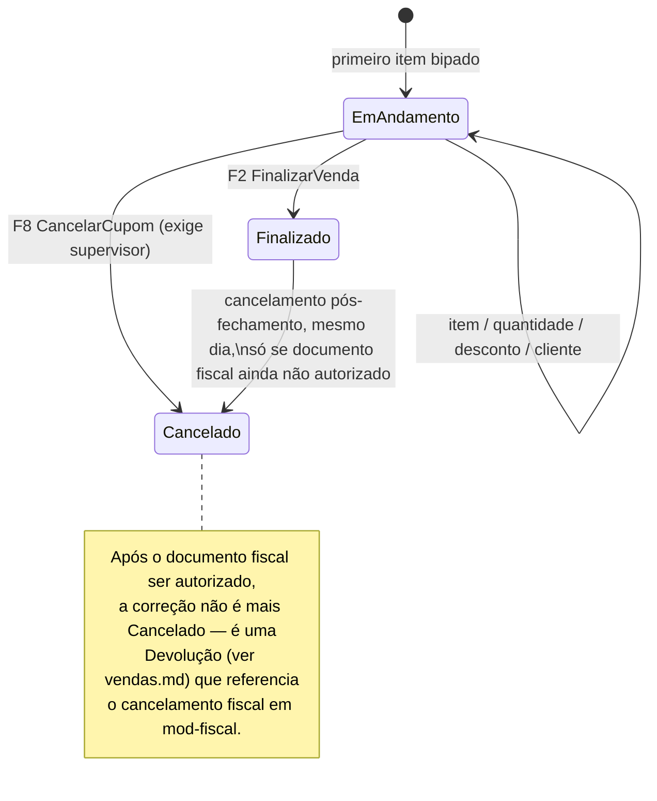

# Módulo PDV

> A frente de caixa: teclado nas duas mãos, cupom impresso em menos de 400 ms, e a garantia de que
> nenhuma venda se perde mesmo que a energia caia no meio dela.

## 1. Escopo

### Faz

- Implementa a **venda de balcão** com fluxo 100% orientado a teclado (ver §1 do
  [doc 12](../12-ui-ux.md#1-princípios-de-interface), princípio 3).
- Mantém o **diário durável do carrinho** — recuperação de venda em andamento após queda de energia.
- Opera **sessão de caixa, sangria e suprimento** como camada de teclas rápidas sobre os comandos do
  `financeiro` (não duplica a entidade `SessaoCaixa`).
- Gerencia **faixas de numeração por terminal** para venda em modo autônomo, sem conflito entre PDVs.
- Integra **TEF**, **balança** e **impressora** como portas (traits), nunca como código acoplado a
  um fabricante.
- Suporta o layout de **pista** (posto de combustível, tela do frentista) e **delivery** (cupom com
  endereço e status de entrega).

### Não faz

- **Não é o dono da sessão de caixa.** `SessaoCaixa`, `MovimentoCaixa`, sangria e suprimento são
  entidades e comandos de `financeiro`; o PDV só oferece `F9`/`F12` como atalho que despacha os
  mesmos comandos (`financeiro.RegistrarSangria`, `financeiro.AbrirCaixa`...) — ver `financeiro.md`.
- **Não decide preço nem regra de desconto.** Lê `TabelaPreco`/`RegraPreco` de `vendas` pela mesma
  porta que o pedido de balcão usa; o PDV apenas aplica o resultado rapidamente.
- **Não controla estoque físico.** Consome saldo através da porta `PortaCatalogo` (implementada por
  `estoque`), com saldo consultado offline como estimativa do último sincronismo.
- **Não emite o documento fiscal.** `FinalizarVenda` fecha a operação comercial e imprime o cupom
  operacional; a NFC-e segue assíncrona por `mod-fiscal` (princípio central do
  [doc 10 §3](../10-modulo-fiscal.md#3-o-princípio-que-governa-tudo-fiscal-é-assíncrono) — a venda
  nunca espera a SEFAZ).
- **Não processa cartão.** Toda comunicação com a maquininha passa por `PortaTef`; o PDV só manda o
  valor e recebe autorização ou recusa.

## 2. Submódulos

| id | nome | essencial | depende de | o que some da UI quando desligado |
|---|---|---|---|---|
| `frente_caixa` | Frente de Caixa | sim | — | Não pode ser desligado: é a razão de existir do módulo. |
| `sangria` | Sangria e Suprimento | sim | — | `F9` some da tela de venda. |
| `turno` | Turno de Caixa | sim | — | `F12` some; caixa fica sempre "aberto" tecnicamente (não recomendado, existe só para telas de teste). |
| `tef` | TEF | não | — | Cartão sai da tela de pagamento; só dinheiro, Pix manual e carteira. |
| `balanca` | Balança | não | — | `F4` deixa de oferecer leitura automática de peso; quantidade é sempre digitada. |
| `pista` | Pista (posto) | não | `combustivel` | Tela de bico/frentista some; PDV vira só loja de conveniência. |
| `delivery` | Delivery | não | `frente_caixa` | Campo de endereço e status de entrega somem do cupom. |

## 3. Entidades

### Cupom

| Campo | Tipo | Obrigatório | Regra |
|---|---|---|---|
| `id` | Id | sim | UUIDv7, gerado no terminal — funciona offline |
| `empresa` | Id | sim | |
| `sessao_caixa` | Id | sim | referencia `financeiro_sessao_caixa`, precisa estar `Aberta` |
| `terminal` | Id | sim | dispositivo que originou a venda |
| `numero_terminal` | Quantidade (inteiro) | sim | sequencial dentro da faixa reservada do terminal |
| `serie_fiscal` | Quantidade (inteiro) | sim | série NFC-e do terminal |
| `cliente` | Id | não | opcional — venda sem identificação é o padrão |
| `operador` | Id | sim | |
| `abertura` | Instante | sim | quando o primeiro item foi bipado |
| `finalizado_em` | Instante | não | |
| `subtotal` | Dinheiro | sim | soma dos itens antes de desconto |
| `desconto` | Dinheiro | sim | |
| `total` | Dinheiro | sim | |
| `estado` | enum(`EmAndamento`,`Finalizado`,`Cancelado`) | sim | ver §4 |
| `entrega_endereco` | String | não | só com submódulo `delivery` |
| `entrega_estado` | enum(`EmPreparo`,`EmRota`,`Entregue`) | não | idem |
| `documento_fiscal` | Id | não | preenchido quando `mod-fiscal` cria o documento correspondente |
| `versao` | Quantidade (inteiro) | sim | |

### ItemCupom

| Campo | Tipo | Obrigatório | Regra |
|---|---|---|---|
| `id` | Id | sim | |
| `cupom` | Id | sim | |
| `produto`, `variacao` | Id | produto sim | |
| `quantidade` | Quantidade | sim | pode vir da balança (`PortaBalanca`) |
| `preco_unitario` | Preco | sim | congelado no momento da inclusão |
| `desconto_percentual` | Percentual | não | |
| `total_item` | Dinheiro | sim | |
| `cancelado` | enum(`Sim`,`Nao`) | sim | `F7` marca `Sim`, item some da tela mas não da tabela |
| `motivo_cancelamento` | String | não | |
| `autorizado_por` | Id | não | preenchido se o cancelamento exigiu supervisor (item já pago parcialmente) |

### PagamentoCupom

| Campo | Tipo | Obrigatório | Regra |
|---|---|---|---|
| `id` | Id | sim | |
| `cupom` | Id | sim | |
| `forma_pagamento` | Id | sim | referencia `financeiro_forma_pagamento` |
| `valor` | Dinheiro | sim | |
| `autorizacao_tef` | String | não | código devolvido por `PortaTef` |
| `bandeira` | String | não | |
| `parcelas_cartao` | Quantidade (inteiro) | não | |

### FaixaNumeracao

| Campo | Tipo | Obrigatório | Regra |
|---|---|---|---|
| `id` | Id | sim | |
| `terminal` | Id | sim | |
| `serie_fiscal` | Quantidade (inteiro) | sim | uma série por terminal — nunca compartilhada |
| `numero_inicial` / `numero_final` | Quantidade (inteiro) | sim | intervalo reservado na abertura de caixa |
| `proximo` | Quantidade (inteiro) | sim | |
| `reservada_em` | Instante | sim | |

## 4. Máquinas de estado



## 5. Comandos

| Comando | Permissão | Risco | O que faz | Erros possíveis |
|---|---|---|---|---|
| `AdicionarItem` | `pdv.venda.editar` | Baixo | Bipe/código → resolve produto e preço, cria `Cupom` se não existir | `ProdutoNaoEncontrado`, `SaldoInsuficiente` (aviso) |
| `AlterarQuantidade` | `pdv.venda.editar` | Baixo | `F4` — abre o campo, aceita leitura de `PortaBalanca` | `PesoInstavel` |
| `AplicarDesconto` | `pdv.desconto.aplicar` | Médio | `F5` — valida contra `vendas.desconto_maximo`; acima disso pede supervisor | `DescontoAcimaDoLimite` |
| `IdentificarCliente` | `pdv.venda.editar` | Baixo | `F6` — busca ou cadastro rápido (delega a `clientes.CriarPessoa`) | — |
| `CancelarItem` | `pdv.item.cancelar` | Baixo | `F7` — remove item do total, mantém linha auditável | `ItemInexistente` |
| `CancelarCupom` | `pdv.cupom.cancelar` | Alto | `F8` — exige senha/crachá de supervisor, motivo obrigatório | `SemAutorizacaoSupervisor`, `CupomJaFinalizado` |
| `ConsultarPreco` | `pdv.preco.consultar` | Baixo | `F10` — não abre `Cupom`, só mostra preço e saldo | — |
| `IniciarPagamentoTef` | `pdv.tef.operar` | Médio | Envia valor à `PortaTef`, aguarda resposta | `TefIndisponivel`, `TefRecusado` |
| `FinalizarVenda` | `pdv.venda.finalizar` | Alto | `F2` — valida soma dos pagamentos = total, consome estoque, monta `LancamentoBalanceado`, imprime, publica evento | `SomaDePagamentosDivergente`, `CaixaFechado`, `FaixaEsgotada` |
| `AbrirCaixaPdv` | `financeiro.caixa.abrir` | Baixo | `F12` (caixa fechado) — delega a `financeiro.AbrirCaixa`, reserva `FaixaNumeracao` | `CaixaJaAberto` |
| `FecharCaixaPdv` | `financeiro.caixa.fechar` | Médio | `F12` (caixa aberto) — delega a `financeiro.FecharCaixa` (fechamento cego) | `VendaEmAndamento` |
| `RegistrarSangriaPdv` | `financeiro.caixa.sangria` | Médio | `F9` — delega a `financeiro.RegistrarSangria` | `CaixaFechado` |
| `RecuperarCupomEmAndamento` | (automático no boot do terminal) | Baixo | Lê o diário durável, reapresenta o carrinho | `DiarioCorrompido` (descarta só o registro truncado) |

## 6. Consultas

| Consulta | Permissão | Uso na UI | Índice que a sustenta |
|---|---|---|---|
| `CupomAtual` | `pdv.venda.editar` | Tela de venda | leitura em memória do diário local, não do banco |
| `PrecoDoProduto` | `pdv.preco.consultar` | `F3`/`F10`, item bipado | `PortaCatalogo::buscar_por_codigo` (implementada por `estoque`) |
| `SaldoEstimado` | `pdv.preco.consultar` | Rodapé da tela de venda | `PortaCatalogo::saldo_disponivel`, rotulado "estimado" offline |
| `HistoricoDeCupons` | `pdv.venda.ver` | Tela de consulta de vendas do turno | `pdv_cupom(sessao_caixa, abertura DESC)` |
| `FaixaAtual` | `pdv.venda.ver` | Faixa de estoque do FaixaEstado (topo da tela) | `pdv_faixa_numeracao(terminal) WHERE proximo <= numero_final` |

## 7. Receituário contábil

`FinalizarVenda` é quem monta o `Lancamento` — na mesma transação que a baixa de estoque — porque é
o comando que sabe, no instante da venda, a combinação exata de formas de pagamento. Isto reproduz o
exemplo canônico do [doc 01 §3](../01-arquitetura-geral.md#3-o-caminho-de-um-comando).

| Evento de negócio | Débito | Crédito | Estado |
|---|---|---|---|
| Venda em dinheiro | Caixa (1.1.01) | Receita de vendas (4.1) | Realizado |
| Venda no cartão de débito | Cartões a receber (1.2.02) | Receita de vendas | Realizado |
| Venda no cartão de crédito | Cartões a receber | Receita de vendas | Realizado |
| Venda por Pix | Caixa/Bancos (conforme conciliação) | Receita de vendas | Realizado |
| Venda com múltiplas formas (dinheiro + cartão) | Caixa (parte) + Cartões a receber (parte) | Receita de vendas (total) | Realizado |
| Baixa de estoque do cupom | CMV (5.1) | Estoque (1.3.01) | igual ao lançamento acima |
| Desconto aplicado no cupom | Descontos concedidos (4.4) | Receita de vendas | igual ao lançamento acima |
| Cancelamento de cupom antes de finalizar | *(nenhum lançamento — nada foi postado ainda)* | | — |
| Cancelamento de cupom após finalizado, mesmo dia | Receita de vendas + Estoque | Caixa/Cartões a receber + CMV (estorno completo) | Realizado (estorno) |
| Sangria/suprimento a partir da tela do PDV | Ver `financeiro.md` §7 — mesmo lançamento, só a tecla muda | | |

## 8. Eventos

**Publicados**

- `pdv.venda_finalizada.v1` — `{ cupom, terminal, total, pagamentos }` — assinado por `financeiro`
  (registra `MovimentoCaixa`), por `mod-fiscal` (emite NFC-e) e por `crm`/`clientes` quando ativos.
- `pdv.cupom_cancelado.v1` — `{ cupom, motivo, autorizado_por }`
- `pdv.item_cancelado.v1` — `{ cupom, item, motivo }`
- `pdv.cupom_recuperado.v1` — `{ cupom, itens, origem: "queda_de_energia" }`
- `pdv.faixa_numeracao_quase_esgotada.v1` — `{ terminal, restantes: 100 }`

**Assinados**

- `estoque.saldo_alterado.v1` → atualiza o cache local de saldo estimado.
- `clientes.credito_bloqueado.v1` → impede venda "na carteira" (a prazo) para o cliente identificado.

## 9. Permissões

| Chave | Descrição | Risco |
|---|---|---|
| `pdv.venda.editar` | Adicionar/alterar item, identificar cliente | Baixo |
| `pdv.venda.finalizar` | Finalizar venda (`F2`) | Médio |
| `pdv.venda.ver` | Consultar cupons do turno | Baixo |
| `pdv.item.cancelar` | Cancelar item antes de finalizar (`F7`) | Baixo |
| `pdv.cupom.cancelar` | Cancelar cupom inteiro (`F8`) | Alto |
| `pdv.desconto.aplicar` | Aplicar desconto (`F5`) | Médio |
| `pdv.preco.consultar` | Consulta de preço sem abrir venda (`F10`) | Baixo |
| `pdv.tef.operar` | Iniciar pagamento por TEF | Médio |

`F12` (abrir/fechar caixa) e `F9` (sangria) usam as permissões de `financeiro` diretamente
(`financeiro.caixa.abrir`, `financeiro.caixa.fechar`, `financeiro.caixa.sangria`) — o PDV não
duplica permissão para uma ação que já pertence a outro módulo.

## 10. Telas

### Venda

```
┌───────────────────────────────────────────────────────────────────────────────────────┐
│ 🟢 Fiscal em dia          Caixa 1 · Carlos · aberto 08:02        Cupom #4087 (série 1) │
├───────────────────────────────────────────────────────────────────────────────────────┤
│  Código        Produto                    Qtd      Unit.       Desc.      Total       │
│  7891234567... Refrigerante Cola 2L         2      6,90 UN               13,80        │
│  7891234568... Pão Francês (balança)      0,450    18,90 KG              8,51         │
│  7891234569... Achocolatado 400g            1      9,50 UN      5%       9,03         │
│                                                                                        │
│  ▸ [bipe o próximo item ou digite o código_______________]                            │
├───────────────────────────────────────────────────────────────────────────────────────┤
│  Cliente: — não identificado (F6)                            Itens: 3    Qtd: 3,45    │
│                                                                     TOTAL: R$ 31,34    │
├───────────────────────────────────────────────────────────────────────────────────────┤
│ F2 Finalizar F3 Buscar F4 Qtd F5 Desconto F6 Cliente F7 Canc.item F8 Canc.cupom       │
│ F9 Sangria  F10 Consulta preço  F12 Abrir/Fechar caixa                                │
└───────────────────────────────────────────────────────────────────────────────────────┘
```

### Pagamento (múltiplas formas)

```
┌───────────────────────────────────────────────────────────────────────────────────────┐
│  Pagamento · Cupom #4087                                          Total: R$ 31,34    │
├───────────────────────────────────────────────────────────────────────────────────────┤
│  Forma                    Valor            Status                                     │
│  [1] Dinheiro             R$ 20,00         ✓ recebido                                 │
│  [2] Cartão débito        R$ 11,34         ⏳ aguardando TEF...                       │
│                                                                                        │
│  Restante: R$ 0,00                                                                    │
│                                                                                        │
│  [1..9 escolhe a forma]   [Enter confirma o valor]   [F2 Finalizar]   [Esc Cancelar]  │
└───────────────────────────────────────────────────────────────────────────────────────┘
```

Se o valor em dinheiro exceder o total, o troco é calculado e mostrado automaticamente — nunca exige
conta de cabeça do operador nem do cliente.

### Recuperação de venda após queda de energia

```
┌─────────────────────────────────────────────────────────┐
│  Venda em andamento recuperada                            │
│                                                             │
│  7 itens, R$ 84,10 — última atualização há 8 segundos      │
│                                                             │
│              [Continuar a venda]  [Cancelar (F8, supervisor)]│
└─────────────────────────────────────────────────────────┘
```

### Cancelar cupom (supervisor)

```
┌─────────────────────────────────────────────────────────┐
│  Cancelar cupom #4087 — R$ 31,34                          │
│  Esta ação exige autorização de supervisor.                │
│                                                             │
│  Motivo:     [Cliente desistiu da compra_______________]  │
│  Supervisor: [________________]  Senha: [••••••••]        │
│                              [F2 Confirmar]  [Esc Voltar]  │
└─────────────────────────────────────────────────────────┘
```

### Sangria rápida

```
┌───────────────────────────────────────────┐
│  Sangria — Caixa 1                          │
│  Valor: [R$ ______]  Motivo: [___________]  │
│                    [F2 Confirmar] [Esc]     │
└───────────────────────────────────────────┘
```

## 11. Regras de negócio críticas

1. **O diário do carrinho grava a cada mutação, com `fsync`, antes de qualquer tela avançar.** Item
   bipado, quantidade alterada, desconto aplicado: cada evento é `append` num arquivo por terminal,
   com CRC32 por registro. Corte de energia perde no máximo o último evento não confirmado; o
   restante do carrinho volta inteiro (ver [doc 03 §2.1](../03-pilar-resiliencia.md#21-a-cadeia-de-durabilidade-de-uma-venda)).
2. **`F2` é o único caminho para fechar uma venda.** Não existe finalização automática por tempo
   ocioso nem por perda de foco — o operador decide o momento.
3. **Cancelar item é livre; cancelar cupom inteiro nunca é.** `F7` (item) usa a permissão do próprio
   operador; `F8` (cupom) sempre exige segunda identidade — senha ou crachá NFC de supervisor,
   registrada vinculando as duas pessoas.
4. **Cada terminal vende dentro da sua própria faixa de numeração.** Nunca dois terminais emitem o
   mesmo número na mesma série; a faixa é reservada na abertura de caixa e a UI avisa com 100 números
   de antecedência antes de esgotar (ver [doc 03 §3.2](../03-pilar-resiliencia.md#32-numeração-sem-conflito)).
5. **A soma dos pagamentos tem que fechar exatamente com o total antes de `F2` aceitar.** Não existe
   "arredondar e ajustar depois" — divergência de um centavo bloqueia a finalização com mensagem clara.
6. **O cupom operacional imprime antes do documento fiscal ser autorizado.** A venda nunca espera a
   SEFAZ — meta de produto de < 400 ms entre `F2` e cupom impresso
   ([doc 00 §6](../00-visao-produto.md#6-métricas-de-sucesso-do-produto)).
7. **Pagamento por TEF nunca finaliza a venda sozinho.** `IniciarPagamentoTef` só marca a forma como
   "aguardando"; `FinalizarVenda` só aceita quando todas as formas estão confirmadas ou o operador
   as removeu.
8. **Desconto acima do limite pré-autorizado em modo autônomo não é permitido**, mesmo com
   supervisor local — porque o teto de autorização em modo autônomo é fixo, sincronizado na abertura
   de caixa, e não pode ser ampliado sem o servidor (ver [doc 03 §3.1](../03-pilar-resiliencia.md#31-como-funciona)).
9. **Preço e saldo mostrados offline são sempre rotulados como estimados.** A UI nunca apresenta um
   número desatualizado como se fosse atual — transparência é parte do contrato de confiança do Pilar II.

## 12. Comportamento offline

**Funciona em modo autônomo:**
- Vender à vista e a prazo dentro do limite pré-autorizado.
- Consultar preço e saldo do último sincronismo (marcado como estimado).
- Abrir e fechar caixa, sangria, suprimento.
- Emitir NFC-e em contingência offline (`tpEmis=9`) e imprimir normalmente.
- Recuperar venda em andamento a partir do diário durável local.

**Não funciona em modo autônomo:**
- Alterar cadastro de produto, cliente ou tabela de preço.
- Conceder desconto acima do limite pré-autorizado.
- Consultar posição consolidada de outras lojas/filiais.
- Fechar o dia contábil (fechamento de período é ação do servidor).

**Política de conflito na reconciliação:** idêntica à política geral do produto — o físico ganha do
banco de dados. Se o preço mudou no servidor durante a janela offline, vale o praticado no cupom
impresso; se o estoque ficou negativo por uma venda offline, a venda é aceita e o sistema gera
`MovimentoDivergente` para conferência; se dois cupons de terminais diferentes tentam reservar o
mesmo número na reconexão, a idempotência por chave resolve — cada cupom já nasceu com número da
própria faixa, então esse conflito específico é estruturalmente impossível (ver
[doc 03 §3.2–3.3](../03-pilar-resiliencia.md#32-numeração-sem-conflito)).

## 13. Tabelas

```sql
CREATE TABLE pdv_faixa_numeracao (
    id              BLOB PRIMARY KEY,
    empresa         BLOB    NOT NULL,
    terminal        BLOB    NOT NULL,
    serie_fiscal    INTEGER NOT NULL,
    numero_inicial  INTEGER NOT NULL,
    numero_final    INTEGER NOT NULL,
    proximo         INTEGER NOT NULL,
    reservada_em    INTEGER NOT NULL,
    UNIQUE (empresa, terminal, serie_fiscal, reservada_em)
) STRICT;
CREATE INDEX pdv_faixa_terminal_ativa ON pdv_faixa_numeracao(terminal) WHERE proximo <= numero_final;

CREATE TABLE pdv_cupom (
    id                 BLOB PRIMARY KEY,
    empresa            BLOB    NOT NULL,
    sessao_caixa       BLOB    NOT NULL,
    terminal           BLOB    NOT NULL,
    numero_terminal    INTEGER NOT NULL,
    serie_fiscal       INTEGER NOT NULL,
    cliente            BLOB,
    operador           BLOB    NOT NULL,
    abertura           INTEGER NOT NULL,
    finalizado_em      INTEGER,
    subtotal           INTEGER NOT NULL DEFAULT 0,
    desconto           INTEGER NOT NULL DEFAULT 0,
    total              INTEGER NOT NULL DEFAULT 0,
    estado             TEXT    NOT NULL CHECK (estado IN ('EmAndamento','Finalizado','Cancelado')),
    entrega_endereco   TEXT,
    entrega_estado     TEXT    CHECK (entrega_estado IN ('EmPreparo','EmRota','Entregue')),
    documento_fiscal   BLOB,
    versao             INTEGER NOT NULL DEFAULT 1,
    UNIQUE (empresa, terminal, serie_fiscal, numero_terminal)
) STRICT;
CREATE INDEX pdv_cupom_sessao ON pdv_cupom(sessao_caixa, abertura);
CREATE INDEX pdv_cupom_em_andamento ON pdv_cupom(terminal) WHERE estado = 'EmAndamento';

CREATE TABLE pdv_item_cupom (
    id                   BLOB PRIMARY KEY,
    cupom                BLOB    NOT NULL REFERENCES pdv_cupom(id),
    produto              BLOB    NOT NULL,
    variacao             BLOB    NOT NULL DEFAULT (X''),
    quantidade           INTEGER NOT NULL,   -- Quantidade, escala 1e-4
    preco_unitario       INTEGER NOT NULL,   -- Preco, escala 1e-6
    desconto_percentual  INTEGER NOT NULL DEFAULT 0,
    total_item           INTEGER NOT NULL,
    cancelado            INTEGER NOT NULL DEFAULT 0 CHECK (cancelado IN (0,1)),
    motivo_cancelamento  TEXT,
    autorizado_por       BLOB
) STRICT;
CREATE INDEX pdv_item_cupom_cupom ON pdv_item_cupom(cupom);

CREATE TABLE pdv_pagamento_cupom (
    id                BLOB PRIMARY KEY,
    cupom             BLOB    NOT NULL REFERENCES pdv_cupom(id),
    forma_pagamento   BLOB    NOT NULL,
    valor             INTEGER NOT NULL,
    autorizacao_tef   TEXT,
    bandeira          TEXT,
    parcelas_cartao   INTEGER
) STRICT;
CREATE INDEX pdv_pagamento_cupom_cupom ON pdv_pagamento_cupom(cupom);
```

> O **diário durável do carrinho** não é uma tabela SQL: é um arquivo append-only por terminal, com
> CRC32 por registro, gravado antes de qualquer efeito ser considerado confirmado. Formato e política
> de recuperação em [doc 03 §2.1](../03-pilar-resiliencia.md#21-a-cadeia-de-durabilidade-de-uma-venda).
