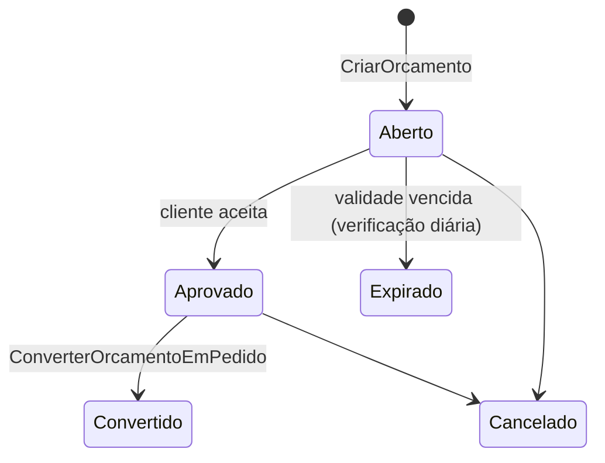
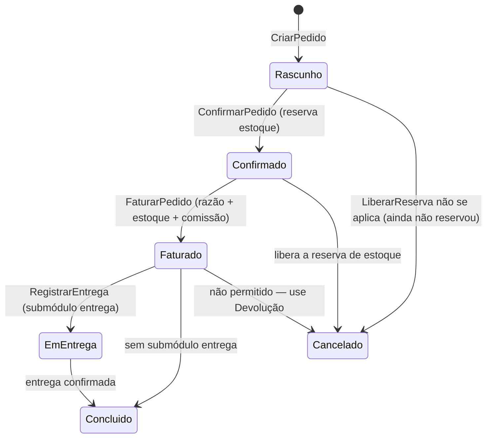
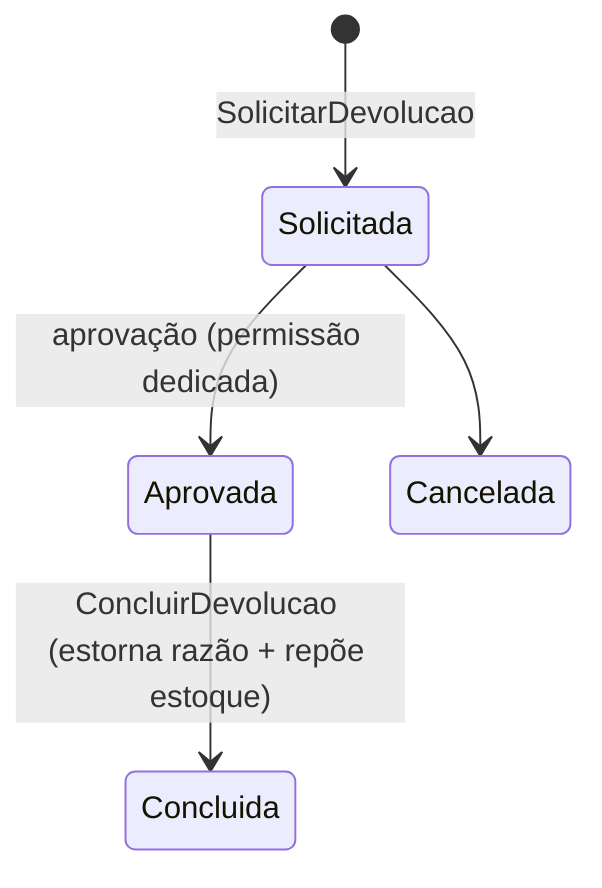

# Módulo Vendas

> O caminho comercial completo — orçamento, pedido, preço, comissão, entrega e devolução — que
> termina sempre no mesmo lugar: um lançamento balanceado no Razão.

## 1. Escopo

### Faz

- Mantém **orçamento** e **pedido**, com o fluxo orçamento → pedido → faturamento → entrega.
- Calcula **preço** por tabela, por faixa de quantidade, por promoção com vigência e respeita o
  **desconto máximo por papel** do vendedor.
- **Reserva estoque** no pedido confirmado (não no orçamento) e consome de verdade só no faturamento.
- Apura e paga **comissão** de vendedor.
- Processa **devolução** total e parcial, com estorno de venda, estoque e comissão coerentes.
- Suporta **contrato recorrente** (assinatura de produto/serviço), gerando pedidos periódicos que
  alimentam uma `Recorrencia` do financeiro.

### Não faz

- **Não é a frente de caixa.** `pdv` é quem finaliza venda de balcão em segundos; `vendas` é o fluxo
  de balcão consultivo, atacado e faturamento a prazo — os dois compartilham `TabelaPreco` e
  `RegraPreco`, mas `pdv` tem seu próprio comando de finalização (ver `pdv.md`).
- **Não controla saldo físico de estoque.** Reserva e consumo são comandos de `estoque`; `vendas`
  apenas os chama e usa o `custo_medio` devolvido para montar o CMV.
- **Não gera o título nem baixa o pagamento.** `FaturarPedido` cria o `Lancamento` e delega a
  criação do `Titulo`/`Parcela` ao financeiro pelo mesmo evento que qualquer outro módulo usa —
  `vendas` não lê nem escreve tabela do financeiro diretamente.
- **Não decide limite de crédito.** Consulta `LimiteDisponivel` em `clientes` e reage ao resultado;
  quem calcula o limite e o score é `clientes`.
- **Não entrega fisicamente.** `RegistrarEntrega` só marca o pedido como despachado/entregue; rota,
  motorista e rastreamento são responsabilidade de integração externa (fora do núcleo do produto).

## 2. Submódulos

| id | nome | essencial | depende de | o que some da UI quando desligado |
|---|---|---|---|---|
| `pedido` | Pedido | sim | — | Não pode ser desligado: é o agregado central do módulo. |
| `orcamento` | Orçamento | não | `pedido` | Etapa de orçamento some; venda vai direto para pedido. |
| `tabela_preco` | Tabela de Preço | sim | — | Sem ela não há preço; não pode ser desligado. |
| `comissao` | Comissão | não | `pedido` | Aba "Comissão" some da ficha do vendedor e do pedido. |
| `entrega` | Entrega | não | `pedido` | Estado `EmEntrega` e tela de expedição somem; pedido faturado vai direto a `Concluido`. |
| `devolucao` | Devolução | não | `pedido` | Botão "Devolver" some do pedido faturado. |
| `contrato_recorrente` | Contrato Recorrente | não | `pedido`, financeiro `recorrencia` | Tela de assinaturas some. |

## 3. Entidades

### Orcamento

| Campo | Tipo | Obrigatório | Regra |
|---|---|---|---|
| `id` | Id | sim | |
| `empresa` | Id | sim | |
| `cliente` | Id | sim | pessoa com papel `Cliente` |
| `vendedor` | Id | sim | pessoa com papel `Vendedor` |
| `data` | Data | sim | |
| `validade` | Data | sim | após essa data o orçamento expira sozinho |
| `condicao_pagamento` | Id | sim | referencia `financeiro_condicao_pagamento` |
| `tabela_preco` | Id | sim | |
| `desconto_total` | Dinheiro | sim | soma dos descontos de item + desconto de cabeçalho |
| `estado` | enum(`Aberto`,`Aprovado`,`Expirado`,`Convertido`,`Cancelado`) | sim | ver §4 |
| `observacao` | String | não | |
| `versao` | Quantidade (inteiro) | sim | |

### Pedido

| Campo | Tipo | Obrigatório | Regra |
|---|---|---|---|
| `id` | Id | sim | |
| `empresa` | Id | sim | |
| `orcamento_origem` | Id | não | preenchido se convertido de orçamento |
| `cliente` | Id | sim | |
| `vendedor` | Id | sim | |
| `data` | Data | sim | |
| `condicao_pagamento` | Id | sim | |
| `tabela_preco` | Id | sim | |
| `centro_custo` | Id | não | requer submódulo `financeiro.centro_custo` |
| `local_expedicao` | Id | sim | referencia `estoque_local` |
| `desconto_total` | Dinheiro | sim | |
| `total` | Dinheiro | sim | soma dos itens líquida de desconto |
| `estado` | enum(`Rascunho`,`Confirmado`,`Faturado`,`EmEntrega`,`Concluido`,`Cancelado`) | sim | ver §4 |
| `versao` | Quantidade (inteiro) | sim | |

### ItemPedido

| Campo | Tipo | Obrigatório | Regra |
|---|---|---|---|
| `id` | Id | sim | |
| `pedido` | Id | sim | (também usado por `Orcamento`, com `pedido` apontando ao orçamento) |
| `produto` | Id | sim | |
| `variacao` | Id | não | |
| `quantidade` | Quantidade | sim | > 0 |
| `preco_unitario` | Preco | sim | resolvido por `RegraPreco` no momento da adição, congelado depois |
| `desconto_percentual` | Percentual | não | limitado por `vendas.desconto_maximo` do papel |
| `desconto_valor` | Dinheiro | sim | calculado a partir do percentual, arredondado por item |
| `total_item` | Dinheiro | sim | `Dinheiro::de_preco(quantidade, preco_unitario, MeioAcima) - desconto_valor` |
| `reserva` | Id | não | id do `Movimento Reserva` em `estoque`, preenchido ao confirmar o pedido |

### TabelaPreco / RegraPreco

| Campo | Tipo | Obrigatório | Regra |
|---|---|---|---|
| **TabelaPreco** `id`, `nome`, `tipo`, `vigente_de`, `vigente_ate`, `ativa` | Id/String/enum(`Venda`,`Atacado`,`Promocional`)/Data/Data/enum | sim exceto `vigente_ate` | |
| **RegraPreco** `id`, `tabela_preco`, `produto`, `grupo_produto`, `quantidade_minima`, `preco`, `periodo_de`, `periodo_ate` | Id/Id/Id/Id/Quantidade/Preco/Data/Data | sim: `tabela_preco`, `preco` | `produto` **xor** `grupo_produto`; `periodo_*` só em `TabelaPreco` do tipo `Promocional`; regras com `quantidade_minima` maior vencem a de menor quando a quantidade pedida atinge a faixa |

### Comissao

| Campo | Tipo | Obrigatório | Regra |
|---|---|---|---|
| `id` | Id | sim | |
| `vendedor` | Id | sim | |
| `pedido` | Id | sim | |
| `base_calculo` | Dinheiro | sim | total do pedido, líquido de devolução |
| `percentual` | Percentual | sim | da tabela de comissão do vendedor |
| `valor` | Dinheiro | sim | |
| `competencia` | Data | sim | mês de apuração |
| `estado` | enum(`Apurada`,`Paga`,`Cancelada`) | sim | ver §4 |
| `lancamento` | Id | não | preenchido quando `Paga` |

### Devolucao

| Campo | Tipo | Obrigatório | Regra |
|---|---|---|---|
| `id` | Id | sim | |
| `pedido_origem` | Id | sim | |
| `cliente` | Id | sim | |
| `data` | Data | sim | |
| `motivo` | String | sim | |
| `tipo` | enum(`Total`,`Parcial`) | sim | |
| `valor_total` | Dinheiro | sim | soma dos itens devolvidos |
| `estado` | enum(`Solicitada`,`Aprovada`,`Concluida`,`Cancelada`) | sim | ver §4 |
| `estorno_lancamento` | Id | não | preenchido em `Concluida` |

## 4. Máquinas de estado







## 5. Comandos

| Comando | Permissão | Risco | O que faz | Erros possíveis |
|---|---|---|---|---|
| `CriarOrcamento` | `vendas.orcamento.criar` | Baixo | Ainda não implementado — orçamento ficou fora desta fatia (domínio pronto, ver §1.2 do doc 19) | `ProdutoInativo` |
| `AprovarOrcamento` | `vendas.orcamento.aprovar` | Baixo | Ainda não implementado | `OrcamentoExpirado` |
| `ConverterOrcamentoEmPedido` | `vendas.pedido.criar` | Baixo | Ainda não implementado | `OrcamentoJaConvertido` |
| `CriarPedido` ✅ | `vendas.pedido.criar` | Baixo | Abre um `Pedido Rascunho` sem itens | — |
| `AdicionarItemPedido` ✅ | `vendas.pedido.editar` | Baixo | Resolve preço vigente na `TabelaPreco` do pedido (produto/grupo via `mod-estoque`), congela no item; recusa desconto acima de `vendas.desconto_maximo` na hora (não escala para autorização de supervisor ainda) | `PrecoNaoEncontrado`, `DescontoAcimaDoLimite` |
| `AplicarDesconto` | `vendas.pedido.descontar` | Médio | Ainda não implementado como comando separado — o desconto é parâmetro de `AdicionarItemPedido` | `DescontoAcimaDoLimite` |
| `ConfirmarPedido` ✅ | `vendas.pedido.confirmar` | Médio | Só a transição `Rascunho → Confirmado` (§11.2) — **não** reserva estoque nem consulta `LimiteDisponivel` ainda (`ReservarEstoque`/`LimiteDisponivel` não existem em `mod-estoque`/`mod-clientes`) | `PedidoEmEstadoInvalido`, `PedidoSemItens` |
| `FaturarPedido` ✅ | `vendas.pedido.faturar` | Alto | Consome estoque item a item (`mod_estoque::registrar_saida_comum`, somando o CMV), monta o lançamento combinado (D CMV/C Estoque + D Caixa-Clientes/C Receita) e, só a prazo, cria um título a receber de parcela única vinculado a esse lançamento; publica `vendas.pedido_faturado.v1` | `PedidoEmEstadoInvalido`, `PedidoSemItens` |
| `CancelarPedido` ✅ | `vendas.pedido.cancelar` | Médio | Só antes de `Faturado` | `PedidoJaFaturado` |
| `RegistrarEntrega` | `vendas.entrega.registrar` | Baixo | Ainda não implementado | `PedidoNaoFaturado` |
| `SolicitarDevolucao` | `vendas.devolucao.solicitar` | Médio | Ainda não implementado | `PedidoNaoFaturado` |
| `AprovarDevolucao` | `vendas.devolucao.aprovar` | Alto | Ainda não implementado | `DevolucaoJaAprovada` |
| `ConcluirDevolucao` | `vendas.devolucao.concluir` | Alto | Ainda não implementado (domínio pronto: `Devolucao` + `receituario::concluir_devolucao`) | `ValorSuperaOriginal` |
| `CriarTabelaPreco` ✅ | `vendas.tabela_preco.criar` | Baixo | | `NomeDuplicado` |
| `CriarRegraPreco` ✅ | `vendas.tabela_preco.editar` | Baixo | Recusa regra que mira produto **e** grupo, ou nenhum dos dois | `RegraPrecoAmbigua` |
| `ApurarComissao` | (tarefa agendada, mensal) | Baixo | Ainda não implementado (domínio pronto: `Comissao::apurar` + `receituario::apurar_comissao`) | — |
| `PagarComissao` | `vendas.comissao.pagar` | Médio | Ainda não implementado (domínio pronto: `receituario::pagar_comissao`) | `ComissaoJaPaga` |
| `CriarContratoRecorrente` | `vendas.contrato_recorrente.criar` | Baixo | Ainda não implementado | `ClienteSemCadastro` |

> **Nota (2026-09-05):** as linhas ✅ estão implementadas com teste de integração de ponta a
> ponta (`tests/comandos.rs`, `Despachante` real contra SQLite) — cliente + produto/estoque
> reais → tabela e regra de preço → pedido criado, item adicionado com preço resolvido,
> confirmado, faturado à vista (sem título) e a prazo (título vinculado ao lançamento). O
> restante desta tabela (orçamento, devolução, comissão, contrato recorrente, e a reserva de
> estoque real em `ConfirmarPedido`) fica para quando tiver consumidor — mesmo critério que
> `mod-compras` usou para cotação/pedido formal.

## 6. Consultas

| Consulta | Permissão | Uso na UI | Índice que a sustenta |
|---|---|---|---|
| `PrecoVigente` | (interna, síncrona) | Cálculo de item no orçamento/pedido | `vendas_regra_preco(tabela_preco, produto, periodo_de, periodo_ate)` |
| `OrcamentosAbertos` | `vendas.orcamento.ver` | Fila de orçamentos | `vendas_orcamento(empresa, estado, validade)` |
| `PedidosPorEstado` | `vendas.pedido.ver` | Painel de pedidos | `vendas_pedido(empresa, estado, data)` |
| `ItensDoPedido` | `vendas.pedido.ver` | Detalhe do pedido | `vendas_item_pedido(pedido)` |
| `ComissaoDoVendedor` | `vendas.comissao.ver` | Painel do vendedor, fechamento mensal | `vendas_comissao(vendedor, competencia)` |
| `DevolucoesPendentes` | `vendas.devolucao.ver` | Fila de aprovação | `vendas_devolucao(empresa, estado)` |
| `HistoricoDeComprasDoCliente` | `vendas.pedido.ver` | Aba "Histórico" da ficha do cliente | `vendas_pedido(cliente, data DESC)` |

## 7. Receituário contábil

| Evento de negócio | Débito | Crédito | Estado |
|---|---|---|---|
| Pedido faturado à vista | Caixa | Receita de vendas (4.1) | Realizado |
| Pedido faturado a prazo | Clientes a receber (1.2.01) | Receita de vendas | Confirmado |
| Baixa de estoque do pedido faturado | CMV (5.1) | Estoque (1.3.01) | igual ao lançamento acima |
| Desconto concedido no pedido | Descontos concedidos (4.4) | Receita de vendas | igual ao lançamento acima |
| Devolução total | Devoluções de venda (4.5) + Estoque | Caixa/Clientes a receber + CMV (estorno) | Realizado |
| Devolução parcial | Devoluções de venda (proporcional) + Estoque (itens devolvidos) | Caixa/Clientes a receber (proporcional) + CMV (proporcional) | Realizado |
| Comissão apurada | Despesas comerciais (5.5) | Comissões a pagar (2.1.03, subconta) | Confirmado |
| Pagamento de comissão | Comissões a pagar | Bancos | Realizado |
| Contrato recorrente faturado no ciclo | Clientes a receber | Receita de vendas/serviços | Confirmado |

## 8. Eventos

**Publicados**

- `vendas.orcamento_aprovado.v1` — `{ orcamento, cliente }`
- `vendas.pedido_confirmado.v1` — `{ pedido, itens_reservados }`
- `vendas.pedido_faturado.v1` — `{ pedido, cliente, total, competencia }` — assinado por `financeiro`
  (gera `Titulo`) e por `crm` (registra interação de compra), quando ativos.
- `vendas.pedido_cancelado.v1` — `{ pedido, motivo }`
- `vendas.devolucao_concluida.v1` — `{ devolucao, pedido_origem, valor_total }`
- `vendas.comissao_apurada.v1` — `{ comissao, vendedor, valor }`

**Assinados**

- `estoque.saldo_alterado.v1` → recalcula viabilidade de itens em orçamentos abertos (aviso de
  ruptura, não bloqueio).
- `clientes.credito_bloqueado.v1` → impede `ConfirmarPedido` a prazo para o cliente até liberação.

## 9. Permissões

| Chave | Descrição | Risco |
|---|---|---|
| `vendas.orcamento.ver` | Consultar orçamentos | Baixo |
| `vendas.orcamento.criar` | Criar orçamento | Baixo |
| `vendas.orcamento.aprovar` | Aprovar orçamento | Baixo |
| `vendas.pedido.ver` | Consultar pedidos | Baixo |
| `vendas.pedido.criar` | Criar pedido | Baixo |
| `vendas.pedido.editar` | Editar itens do pedido | Baixo |
| `vendas.pedido.descontar` | Aplicar desconto | Médio |
| `vendas.pedido.confirmar` | Confirmar pedido (reserva estoque) | Médio |
| `vendas.pedido.faturar` | Faturar pedido | Alto |
| `vendas.pedido.cancelar` | Cancelar pedido não faturado | Médio |
| `vendas.entrega.registrar` | Registrar entrega | Baixo |
| `vendas.devolucao.ver` | Ver devoluções | Baixo |
| `vendas.devolucao.solicitar` | Solicitar devolução | Baixo |
| `vendas.devolucao.aprovar` | Aprovar devolução | Alto |
| `vendas.devolucao.concluir` | Concluir devolução (estorno) | Alto |
| `vendas.tabela_preco.ver` | Consultar tabelas de preço | Baixo |
| `vendas.tabela_preco.criar` | Criar tabela de preço | Médio |
| `vendas.tabela_preco.editar` | Editar regra de preço | Médio |
| `vendas.comissao.ver` | Ver apuração de comissão | Baixo |
| `vendas.comissao.pagar` | Pagar comissão | Médio |
| `vendas.contrato_recorrente.criar` | Criar contrato recorrente | Médio |

As permissões de leitura `vendas.devolucao.ver` e `vendas.tabela_preco.ver` foram
acrescentadas junto do manifesto (`mod-vendas`): a §6 já pressupunha as consultas e toda
entrada de menu precisa de uma permissão declarada.

## 10. Telas

### Pedido (montagem)

```
┌───────────────────────────────────────────────────────────────────────────────────────┐
│  Pedido #10482 · Mercado Bom Preço LTDA          Tabela: Atacado    Rascunho          │
├───────────────────────────────────────────────────────────────────────────────────────┤
│  🔍 [buscar produto_____________________]                            Ctrl+N Item novo │
├──────────┬──────────────────────────┬─────────┬────────────┬──────────┬──────────────┤
│ Código   │ Produto                  │ Qtd     │ Preço unit.│ Desc.    │ Total         │
├──────────┼──────────────────────────┼─────────┼────────────┼──────────┼──────────────┤
│ 78912...  │ Refrigerante Cola 2L     │  120 UN │    4,90    │   5,0%   │    558,60    │
│ 78913...  │ Refrigerante Guaraná 2L  │   60 UN │    4,90    │   5,0%   │    279,30    │
├──────────┴──────────────────────────┴─────────┴────────────┴──────────┴──────────────┤
│  Condição: [30/60/90 ▾]     Centro de custo: [Loja ▾]         Total: R$ 837,90        │
│                                              [F2 Confirmar pedido]  [F8 Cancelar]      │
└───────────────────────────────────────────────────────────────────────────────────────┘
```

### Autorização de desconto acima do limite

```
┌─────────────────────────────────────────────────────────┐
│  Desconto acima do seu limite (5%)                        │
│  Solicitado: 12% — requer autorização de supervisor       │
│                                                             │
│  Supervisor: [________________]  Senha: [••••••••]        │
│                              [F2 Autorizar]  [Esc Cancelar]│
└─────────────────────────────────────────────────────────┘
```

### Devolução

```
┌───────────────────────────────────────────────────────────────────────────────────────┐
│  Devolução do Pedido #10482                                     [Total] [Parcial ●]   │
├───────────────────────────────────────────────────────────────────────────────────────┤
│  ☑ Refrigerante Cola 2L        120 UN → devolver [ 20] UN     valor: R$ 93,10         │
│  ☐ Refrigerante Guaraná 2L      60 UN → devolver [  0] UN                             │
├───────────────────────────────────────────────────────────────────────────────────────┤
│  Motivo: [Avaria no transporte________________]                                       │
│                                            [F2 Solicitar devolução]  [Esc Cancelar]   │
└───────────────────────────────────────────────────────────────────────────────────────┘
```

## 11. Regras de negócio críticas

1. **Preço é congelado no item no momento em que é adicionado.** Alterar a `RegraPreco` depois não
   muda pedidos já criados — só afeta pedidos novos ou itens adicionados depois da mudança.
2. **Reserva de estoque acontece na confirmação, nunca na criação do pedido.** Um `Rascunho` não
   compromete saldo — o vendedor pode montar um pedido grande sem travar estoque de outros clientes
   até de fato confirmar a intenção.
3. **Faturar é irreversível; a correção é devolução.** `FaturarPedido` não tem `Cancelar` depois —
   simetricamente à regra do Razão (nada é `UPDATE`, é estorno), a correção de um pedido faturado é
   sempre uma `Devolucao`, nunca uma edição.
4. **Desconto acima do limite do papel sempre exige autorização de supervisor na hora**, nunca fica
   pendente para aprovação posterior — ou o vendedor sabe o preço final ao fechar com o cliente, ou
   não fecha.
5. **Devolução parcial rateia proporcionalmente, sem perder centavo.** O valor estornado de cada
   item usa `Dinheiro::ratear`, e a soma dos itens devolvidos bate exatamente com `valor_total`.
6. **Comissão nunca é apurada sobre pedido cancelado ou totalmente devolvido**, e é recalculada
   (não editada) quando há devolução parcial após a apuração — gera um lançamento de ajuste, nunca
   sobrescreve o valor apurado original.
7. **`vendas` nunca decide se um cliente pode comprar a prazo.** Ele só lê `LimiteDisponivel` de
   `clientes` e, se negativo, oferece as opções que a permissão do usuário autoriza (autorizar
   mesmo assim, mudar para à vista, ou recusar).
8. **Contrato recorrente nunca duplica a `Recorrencia`.** `CriarContratoRecorrente` cria exatamente
   uma `Recorrencia` no financeiro por contrato; o financeiro é quem decide quando ela vira `Titulo`.

## 12. Comportamento offline

**Funciona em modo autônomo:**
- Criar orçamento e pedido, adicionar itens com preço do último sincronismo da tabela.
- Confirmar e faturar pedido à vista (reserva e baixa de estoque locais, como qualquer venda).
- Consultar histórico de pedidos do cliente já sincronizado.

**Não funciona em modo autônomo:**
- Faturar pedido a prazo acima do limite de crédito sincronizado sem confirmação humana explícita
  (a venda é aceita conforme a política geral, mas fica marcada `AcimaDoLimite` — ver
  [doc 03 §3.3](../03-pilar-resiliencia.md#33-reconciliação)).
- Aprovar devolução (permissão de risco alto costuma exigir papel de gerência com acesso ao servidor).
- Apurar e pagar comissão (é processo em lote, mensal, coordenado no servidor).
- Editar tabela de preço e regra de preço.

**Política de conflito na reconciliação:** um pedido faturado offline nunca é desfeito ao reconectar.
Se o preço mudou no servidor durante a janela offline, vale o preço praticado no terminal — é o que
foi cobrado do cliente — e o sistema gera relatório de divergência de preço para conferência, sem
jamais alterar retroativamente o valor já cobrado.

## 13. Tabelas

> **Nota (2026-09-05):** este é o esquema-alvo completo. A fatia implementada
> (`crates/modulos/mod-vendas/src/migracoes.rs`) tem só `vendas_tabela_preco`/
> `vendas_regra_preco`/`vendas_pedido`/`vendas_item_pedido` — os únicos submódulos
> essenciais são `pedido` e `tabela_preco` (§2). `vendas_orcamento` e as tabelas de
> devolução/comissão/contrato recorrente estão adiadas, então não existem ainda; `criado_em`
> também não está na versão implementada de `vendas_pedido` (só `criado_por`).

```sql
CREATE TABLE vendas_tabela_preco (
    id           BLOB PRIMARY KEY,
    empresa      BLOB    NOT NULL,
    nome         TEXT    NOT NULL,
    tipo         TEXT    NOT NULL CHECK (tipo IN ('Venda','Atacado','Promocional')),
    vigente_de   INTEGER NOT NULL,
    vigente_ate  INTEGER,
    ativa        INTEGER NOT NULL DEFAULT 1 CHECK (ativa IN (0,1)),
    versao       INTEGER NOT NULL DEFAULT 1
) STRICT;

CREATE TABLE vendas_regra_preco (
    id                  BLOB PRIMARY KEY,
    empresa             BLOB    NOT NULL,
    tabela_preco        BLOB    NOT NULL REFERENCES vendas_tabela_preco(id),
    produto             BLOB,
    grupo_produto       BLOB,
    quantidade_minima   INTEGER,     -- Quantidade, escala 1e-4
    preco               INTEGER NOT NULL,   -- Preco, escala 1e-6
    periodo_de          INTEGER,
    periodo_ate         INTEGER,
    CHECK ((produto IS NULL) <> (grupo_produto IS NULL))
) STRICT;
CREATE INDEX vendas_regra_preco_busca ON vendas_regra_preco(tabela_preco, produto);
CREATE INDEX vendas_regra_preco_grupo ON vendas_regra_preco(tabela_preco, grupo_produto);

CREATE TABLE vendas_orcamento (
    id                  BLOB PRIMARY KEY,
    empresa             BLOB    NOT NULL,
    cliente             BLOB    NOT NULL,
    vendedor            BLOB    NOT NULL,
    data                INTEGER NOT NULL,
    validade            INTEGER NOT NULL,
    condicao_pagamento  BLOB    NOT NULL,
    tabela_preco        BLOB    NOT NULL REFERENCES vendas_tabela_preco(id),
    desconto_total      INTEGER NOT NULL DEFAULT 0,
    estado              TEXT    NOT NULL CHECK (estado IN ('Aberto','Aprovado','Expirado','Convertido','Cancelado')),
    observacao          TEXT,
    versao              INTEGER NOT NULL DEFAULT 1
) STRICT;
CREATE INDEX vendas_orcamento_estado ON vendas_orcamento(empresa, estado, validade);

CREATE TABLE vendas_pedido (
    id                  BLOB PRIMARY KEY,
    empresa             BLOB    NOT NULL,
    orcamento_origem    BLOB REFERENCES vendas_orcamento(id),
    cliente             BLOB    NOT NULL,
    vendedor            BLOB    NOT NULL,
    data                INTEGER NOT NULL,
    condicao_pagamento  BLOB    NOT NULL,
    tabela_preco        BLOB    NOT NULL REFERENCES vendas_tabela_preco(id),
    centro_custo        BLOB,
    local_expedicao     BLOB    NOT NULL,
    desconto_total      INTEGER NOT NULL DEFAULT 0,
    total               INTEGER NOT NULL DEFAULT 0,
    estado              TEXT    NOT NULL CHECK (estado IN ('Rascunho','Confirmado','Faturado','EmEntrega','Concluido','Cancelado')),
    versao              INTEGER NOT NULL DEFAULT 1,
    criado_em           INTEGER NOT NULL,
    criado_por          BLOB    NOT NULL
) STRICT;
CREATE INDEX vendas_pedido_estado ON vendas_pedido(empresa, estado, data);
CREATE INDEX vendas_pedido_cliente ON vendas_pedido(cliente, data DESC);

CREATE TABLE vendas_item_pedido (
    id                    BLOB PRIMARY KEY,
    pedido                BLOB    NOT NULL REFERENCES vendas_pedido(id),
    produto               BLOB    NOT NULL,
    variacao              BLOB    NOT NULL DEFAULT (X''),
    quantidade            INTEGER NOT NULL,   -- Quantidade
    preco_unitario        INTEGER NOT NULL,   -- Preco
    desconto_percentual   INTEGER NOT NULL DEFAULT 0,
    desconto_valor        INTEGER NOT NULL DEFAULT 0,
    total_item            INTEGER NOT NULL,
    reserva               BLOB
) STRICT;
CREATE INDEX vendas_item_pedido_pedido ON vendas_item_pedido(pedido);

CREATE TABLE vendas_comissao (
    id             BLOB PRIMARY KEY,
    empresa        BLOB    NOT NULL,
    vendedor       BLOB    NOT NULL,
    pedido         BLOB    NOT NULL REFERENCES vendas_pedido(id),
    base_calculo   INTEGER NOT NULL,
    percentual     INTEGER NOT NULL,   -- Percentual
    valor          INTEGER NOT NULL,
    competencia    INTEGER NOT NULL,
    estado         TEXT    NOT NULL CHECK (estado IN ('Apurada','Paga','Cancelada')),
    lancamento     BLOB
) STRICT;
CREATE INDEX vendas_comissao_vendedor ON vendas_comissao(vendedor, competencia);

CREATE TABLE vendas_devolucao (
    id                  BLOB PRIMARY KEY,
    empresa             BLOB    NOT NULL,
    pedido_origem       BLOB    NOT NULL REFERENCES vendas_pedido(id),
    cliente             BLOB    NOT NULL,
    data                INTEGER NOT NULL,
    motivo              TEXT    NOT NULL,
    tipo                TEXT    NOT NULL CHECK (tipo IN ('Total','Parcial')),
    valor_total         INTEGER NOT NULL,
    estado              TEXT    NOT NULL CHECK (estado IN ('Solicitada','Aprovada','Concluida','Cancelada')),
    estorno_lancamento  BLOB
) STRICT;
CREATE INDEX vendas_devolucao_estado ON vendas_devolucao(empresa, estado);
```
